# Foliocrew: informe maestro de producto y campaña de expectativa

*7 de octubre de 2026 · Documento para el equipo y para ChatGPT (campañas visuales y textos). Contenido ficticio en las capturas.*

## 0. Cómo usar este documento

**Para quién es.** Este informe explica, con ejemplos y capturas reales, qué hace cada función de Foliocrew. Está pensado para que ChatGPT (u otra herramienta) prepare las campañas visuales y los textos de la etapa de expectativa previa al lanzamiento, y para que el equipo tenga una sola fuente de verdad.

**Cómo está organizado.**
1. Resumen: qué es Foliocrew, para quién y qué problema resuelve (secciones 1 y 2).
2. La marca: tono, colores y reglas (sección 3).
3. El mapa de funciones con su estado (sección 4).
4. La ficha de cada función con capturas de escritorio y de celular (sección 5).
5. Los planes (sección 6).
6. El plan de campaña de expectativa, semana por semana (sección 7).
7. Qué decir y qué NO decir (sección 8) y el glosario (sección 9).

**Semáforo de estados (MUY IMPORTANTE para no prometer de más).**

| Estado | Qué significa | Cómo presentarlo |
| --- | --- | --- |
| 🟢 Disponible hoy | Está construida, probada y funcionando para las cuentas de Foliocrew. | Se puede mostrar y explicar como algo que existe. |
| 🟡 Lista, se enciende con la aprobación de las redes | El código está terminado, pero necesita que Meta (Instagram y Facebook) o TikTok aprueben permisos. | Presentarla como «próximamente». No decir que ya funciona para todo el mundo. |
| 🟡 Lista, la enciende el equipo | Está construida, pero falta una configuración del equipo (llaves, primeras sesiones o círculos, activar el mérito). | Presentarla como «próximamente» o «muy pronto». |

**Sobre las capturas.**
- Todas las capturas son de una **cuenta de demostración**. Los nombres de personas (Luna Ríos, Mateo Vega, Sofi Andrade, Dani Cruz, Vale Montes, Caro Pineda), las marcas (Glow Lab, Botánica Pura, Nube Skin, Sol & Mar, Casa Lúmina, Kiwi Kids, Moda Express), los correos, los números, los precios, los mensajes y las reseñas son **ficticios**. Las fotos son imágenes de bancos libres con licencia de uso.
- Las capturas salen de un entorno de pruebas: por eso algunas direcciones aparecen como `luna.localhost:3000`. En producción la dirección será `tunombre.foliocrew.pro`. Si una pieza muestra una dirección, retócala o tápala.
- **No presentes las cifras ni a las personas de las capturas como clientes o usuarias reales.** No inventes testimonios, resultados ni números de usuarias. Si falta un dato real, deja `[DATO]` para completarlo.
- Las capturas de escritorio sirven para publicaciones horizontales, carruseles, miniaturas y videos. Las de celular (390 × 844, formato vertical) sirven para historias y reels. Los «recortes por bloque» (nombre `tarjeta-…`) sirven para publicaciones cuadradas o 4:5 y para detalles.
- Cada captura tiene un nombre de archivo estable con este formato: `función-número-escena-dispositivo.jpg` (por ejemplo `facturas-4-pagina-de-la-marca-mob.jpg`). `desk` = escritorio, `mob` = celular.

**Reglas de lenguaje.** Habla de «tú», en español neutro, con formas inclusivas («personas creadoras», «quien crea», «tu talento»). Cercano, claro, sin jerga técnica. Máximo 1 o 2 emojis por pieza. Nunca condescendiente. Para inglés, usa inglés natural de EE. UU.

## 1. Foliocrew en 30 segundos

**Foliocrew es una plataforma web para personas creadoras de contenido y UGC.** En un solo lugar tienen:

1. **Un portafolio profesional y bilingüe** (español e inglés) que las marcas entienden en segundos, con su mejor contenido, sus números reales y su forma de trabajar.
2. **Un panel privado para manejar su negocio:** marcas y tratos, acuerdos, facturas, ingresos, calendario, captions con IA, métricas, reportes, mensajes y una comunidad de creadores.

Nombre: *folio* (la página de un portafolio) + *crew* (tu equipo, tu comunidad). Frase principal: **«Tu talento merece su espacio.»** Secundaria: **«Crea. Conecta. Crece.»**

**UGC** significa contenido generado por usuarios: videos y fotos que una persona creadora produce para que la marca los use en sus propias redes, su web o sus anuncios. La marca paga por el contenido, **no por la cantidad de seguidores**.

### El problema

Quien crea contenido usa **seis herramientas sueltas**: un portafolio en Canva o Drive, un servicio de enlaces, los tratos en notas y Excel, los pagos en WhatsApp, las ideas en el celular y las métricas en capturas de pantalla. Se ve poco profesional, se pierden seguimientos y pagos, y no sabe qué números mostrarle a una marca.

### La solución

Foliocrew junta todo y lo hace verse profesional:

| Lo que le pasa a la persona creadora | Cómo lo resuelve Foliocrew |
| --- | --- |
| «Mi portafolio en Canva se ve amateur y está desactualizado.» | Un sitio profesional que se actualiza desde el panel y se ve al instante. |
| «No sé qué números mostrar.» | Métricas por pieza, engagement calculado, media kit verificado y reporte mensual. |
| «Se me olvidan los seguimientos y los pagos.» | Un CRM con próximo paso, fecha, estado de pago y avisos de lo vencido; facturas con recordatorios. |
| «Tardo mucho escribiendo captions.» | Captions con IA, ganchos y reciclaje de contenido. |
| «No sé cuánto cobrar.» | La calculadora «¿Cuánto cobro?» con tus números reales. |
| «No sé cuándo publicar.» | El mejor día y horario según tus propias publicaciones. |
| «Pierdo mensajes de marcas entre tantas apps.» | Una bandeja única: formulario del sitio + comentarios de Instagram. |
| «Las marcas de EE. UU. no entienden mi sitio.» | Todo en español e inglés. |
| «Trabajo sola/o y me quemo.» | Comunidad, círculos, sesiones en vivo y herramientas de bienestar. |

### Qué nos hace diferentes

- **Hecho para UGC y creadores**, no para influencers en general: piezas con su marca, paquetes, reseñas, acuerdos y reportes.
- **En español, y bilingüe** para trabajar con marcas en inglés.
- **Portafolio y negocio en un solo lugar.** Otras herramientas hacen solo una cosa.
- **Datos reales** de las redes conectadas, con sello de verificación, en vez de capturas de pantalla.
- **IA que escribe con tu contexto:** tu nicho, tus marcas y tu tono, y tú decides qué publicar.
- **Privacidad por diseño:** los datos de tus tratos nunca se ven en el sitio público; las reseñas de marcas son anónimas; Foliocrew nunca toca tu dinero; todo lo importante lo puedes descargar.
- **Nació de un caso real:** el portafolio de una persona creadora UGC que usa el panel completo.

### Estado del lanzamiento

Estamos en **lanzamiento por invitación**, con lista de espera. La página de venta con lista de espera es la ruta `/foliocrew` (URL final: [DATO]). Hoy los pagos de planes son manuales (PayPal o transferencia). Instagram y TikTok se conectan en modo de prueba hasta que Meta y TikTok aprueben la aplicación.

## 2. Para quién es Foliocrew

1. **Quien está empezando.** Entre 1 000 y 15 000 seguidores, menos de un año haciendo UGC, portafolio en Canva o Drive. Quiere verse profesional y conseguir sus primeras marcas pagadas. *Mensaje:* «Que tu portafolio hable por ti.»
2. **Quien ya factura.** Entre 10 000 y 100 000 seguidores, de 3 a 10 marcas al mes, todo en notas y Excel. Quiere orden, reportes y subir sus tarifas. *Mensaje:* «Maneja tus marcas como un negocio.»
3. **Agencias y managers (más adelante).** Manejan varias personas creadoras y quieren reportes rápidos. El plan Crew ya permite hasta 5 perfiles.

Edad aproximada: de 20 a 38 años. Hispanohablantes de Latinoamérica y Estados Unidos. Nichos: belleza, skincare, lifestyle, moda, comida, fitness, familia, hogar, tecnología, viajes, mascotas y más.

## 3. La marca

- **Nombre:** Foliocrew (en el logo, «foliocrew» en minúsculas).
- **Frases:** «Tu talento merece su espacio.» · «Crea. Conecta. Crece.» · «Tu portafolio, tu media kit y tus marcas, en un solo lugar.» · «Hecho por creadores, para creadores.»
- **Tono:** cercano, de tú, como una colega que ya vive de crear contenido y te pasa sus trucos. Profesional pero cálido. Motivador con datos concretos, no con frases vacías.
- **Colores:** tinta `#251023`, crema `#FBF7F5`, ciruela `#7F207B`, lavanda `#B692E7`. Acento principal del producto: lila `#A866BE`.
- **Tipografías:** Fraunces para los títulos (con la palabra clave en cursiva, por ejemplo «Crea. Conecta. *Crece.*»), Outfit para subtítulos y botones, Inter para el texto.
- **Estilo visual:** personas creadoras reales y diversas trabajando (celular en trípode, escritorio, productos), luz natural, tonos crema y lavanda, y las páginas superpuestas del logo como decoración en línea fina.
- **Logo y piezas de marca:** carpeta `public/brand/` del repositorio (logo claro y oscuro, isotipo, íconos y piezas de campaña).
- **Redes:** @foliocrew (verificar disponibilidad en cada red).
- **Inclusión:** muestra personas diversas (géneros, edades y tonos de piel) y usa lenguaje neutro.

## 4. Mapa de funciones

| N.º | Función | Grupo | Estado | En una frase |
| --- | --- | --- | --- | --- |
| 1 | [Tu portafolio público (bilingüe)](#f01-sitio-publico) | Tu sitio | 🟢 Disponible hoy | Un sitio profesional, en español e inglés, que las marcas entienden en 5 segundos. |
| 2 | [Estudio de diseño](#f02-estudio-de-diseno) | Tu sitio | 🟢 Disponible hoy | Haz que el sitio se sienta tuyo en un minuto: estilo, color, tipografía y más. |
| 3 | [Link en bio](#f03-link-en-bio) | Tu sitio | 🟢 Disponible hoy | Una sola página para tu bio con tu media kit, tus enlaces y tu contenido reciente. |
| 4 | [Tu dirección, tu dominio y la vista previa](#f04-direccion-y-vista-previa) | Tu sitio | 🟢 Disponible hoy | Comparte tu dirección, conecta tu propio dominio y mira tu sitio como lo ve una marca. |
| 5 | [Editor de cada sección del sitio](#f05-editor-del-sitio) | Tu sitio | 🟢 Disponible hoy | Portada, números, servicios, paquetes, preguntas y contacto: cada parte, editable en segundos. |
| 6 | [Trabaja conmigo: solicitar un paquete](#f06-trabaja-conmigo) | Tu sitio | 🟢 Disponible hoy | Tus paquetes, con precio «desde» y un botón para que la marca te lo pida directo. |
| 7 | [Media kit verificado](#f07-media-kit-verificado) | Tu sitio | 🟢 Disponible hoy | Un media kit público que se actualiza solo y muestra datos verificados. |
| 8 | [Asistente de bienvenida: tu sitio en 10 minutos](#f08-asistente-de-bienvenida) | Tu sitio | 🟢 Disponible hoy | Cuatro pasos y tu sitio queda armado, con textos escritos para tu nicho. |
| 9 | [Resumen: tu panorama del día](#f09-resumen) | Crecer y contenido | 🟢 Disponible hoy | Lo que importa hoy en una sola pantalla. |
| 10 | [Metas, plan semanal y bitácora](#f10-metas-y-bitacora) | Crecer y contenido | 🟢 Disponible hoy | Ponle meta a tu crecimiento y celebra cada paso. |
| 11 | [Feed con métricas reales](#f11-feed-con-metricas) | Crecer y contenido | 🟢 Disponible hoy | Tu mejor contenido con sus números, listos para mostrar a las marcas. |
| 12 | [Calendario y publicación automática](#f12-calendario-y-publicacion-automatica) | Crecer y contenido | 🟡 Lista, se enciende con la aprobación de las redes | Planea tu mes y, cuando las redes lo aprueben, deja que salga solo. |
| 13 | [Crear publicaciones con IA](#f13-crear-con-ia) | Crecer y contenido | 🟢 Disponible hoy | Elige el tipo, las redes y la marca; la IA te propone 3 captions con tu estilo. |
| 14 | [Reciclar contenido con IA](#f14-reciclar-con-ia) | Crecer y contenido | 🟢 Disponible hoy | Convierte un video largo o una publicación que funcionó en ganchos, textos y un carrusel. |
| 15 | [Bienestar: carga, descanso y banco de contenido](#f15-bienestar) | Crecer y contenido | 🟢 Disponible hoy | Para que crear no te queme: Foliocrew te avisa y te deja descansar. |
| 16 | [Marcas y tratos (tu CRM)](#f16-marcas-y-tratos) | Negocio | 🟢 Disponible hoy | Cada marca, cada trato y cada próximo paso, en un solo lugar. |
| 17 | [Calculadora «¿Cuánto cobro?»](#f17-calculadora-cuanto-cobro) | Negocio | 🟢 Disponible hoy | Un rango de precio justo, con tus números reales. |
| 18 | [Propuestas a marcas escritas con IA](#f18-propuestas-con-ia) | Negocio | 🟢 Disponible hoy | El correo perfecto para una marca, con seguimientos a los 5 y 12 días. |
| 19 | [Bandeja: mensajes de marcas y comentarios de Instagram](#f19-bandeja) | Negocio | 🟢 Disponible hoy | Todo lo que te escriben, en un solo lugar. |
| 20 | [Acuerdos: contrato simple con aceptación en línea](#f20-acuerdos) | Negocio | 🟢 Disponible hoy | Un contrato claro que la marca lee y acepta con un enlace. |
| 21 | [Facturas y recordatorios de cobro](#f21-facturas) | Negocio | 🟢 Disponible hoy | Cobra con una factura profesional y recordatorios amables. |
| 22 | [Reportes de campaña para marcas](#f22-reportes-a-marcas) | Negocio | 🟢 Disponible hoy | Cierra cada trato con un reporte bonito y una pregunta: «¿repetimos?». |
| 23 | [Tienda sin comisión](#f23-tienda-sin-comision) | Negocio | 🟢 Disponible hoy | Vende plantillas, asesorías y recomienda productos, sin que Foliocrew cobre comisión. |
| 24 | [Mis ingresos e impuestos](#f24-ingresos-e-impuestos) | Negocio | 🟢 Disponible hoy | Cuánto ganaste, cuánto gastaste y cuánto apartar para impuestos. |
| 25 | [Comentario → DM](#f25-comentario-a-dm) | Negocio | 🟡 Lista, se enciende con la aprobación de las redes | Alguien comenta una palabra y recibe tu mensaje privado, solo. |
| 26 | [Reseñas de marcas (anónimas)](#f26-resenas-de-marcas) | Negocio | 🟡 Lista, la enciende el equipo | Antes de aceptar un trato, mira cómo les fue a otras personas creadoras. |
| 27 | [Conectar tus cuentas](#f27-conectar-cuentas) | Negocio | 🟡 Lista, se enciende con la aprobación de las redes | Conecta Instagram, Facebook, TikTok y YouTube con el inicio de sesión oficial. |
| 28 | [Reportes y mejor momento para publicar](#f28-reportes-y-metricas) | Negocio | 🟢 Disponible hoy | Entiende qué funciona y cuándo publicar, con tus propios datos. |
| 29 | [Prueba social: reseñas destacadas, testimonios y logos de marcas](#f29-prueba-social) | Negocio | 🟢 Disponible hoy | Lo que dicen de ti y las marcas con las que trabajaste, siempre a la vista. |
| 30 | [El muro de los creadores](#f30-comunidad-muro) | Comunidad | 🟢 Disponible hoy | Un lugar para preguntar, aprender y celebrar con otras personas creadoras. |
| 31 | [Buscar colaboradores](#f31-buscar-creadores) | Comunidad | 🟢 Disponible hoy | Encuentra personas creadoras para colaborar, por nicho, red, ciudad o idioma. |
| 32 | [Conexiones y mensajes privados](#f32-conexiones-y-mensajes) | Comunidad | 🟢 Disponible hoy | Conecta con otras personas creadoras y escríbanse en privado. |
| 33 | [Tu perfil de comunidad](#f33-perfil-de-comunidad) | Comunidad | 🟢 Disponible hoy | Tu presentación para otras personas creadoras: qué haces y si quieres colaborar. |
| 34 | [Círculos: grupos pequeños por nicho, red o nivel](#f34-circulos) | Comunidad | 🟡 Lista, la enciende el equipo | Grupos más chicos y cercanos dentro de la comunidad. |
| 35 | [Sesiones en vivo y mentorías](#f35-sesiones-en-vivo) | Comunidad | 🟡 Lista, la enciende el equipo | Charlas, talleres y mentorías en grupo, con cupo limitado. |
| 36 | [Programa de embajadoras](#f36-embajadoras) | Cuenta y crecimiento | 🟡 Lista, la enciende el equipo | Invita a otras personas creadoras y gana beneficios; las destacadas aparecen en la web de Foliocrew. |
| 37 | [Avisos en el celular, plan y cuenta](#f37-avisos-en-el-celular) | Cuenta y crecimiento | 🟡 Lista, la enciende el equipo | Instala Foliocrew como app y recibe avisos cortos de lo importante. |
| 38 | [Manual, soporte e ideas](#f38-ayuda-y-soporte) | Cuenta y crecimiento | 🟢 Disponible hoy | Ayuda dentro del panel, en español e inglés, y un canal directo para ideas. |
| 39 | [Panel completo en inglés](#f39-panel-en-ingles) | Cuenta y crecimiento | 🟢 Disponible hoy | Todo el panel funciona también en inglés, para trabajar con marcas de EE. UU. |
| 40 | [La web de Foliocrew, el registro y la lista de espera](#f40-web-de-foliocrew) | La marca Foliocrew | 🟢 Disponible hoy | La página de venta de Foliocrew, con lista de espera y acceso por invitación. |
| 41 | [Centro de mando (dueño de la plataforma)](#f41-centro-de-mando) | Para el equipo de Foliocrew | 🟢 Disponible hoy | Una vista de toda la plataforma: cuentas, contenido, nichos e inteligencia. |
| 42 | [Equipo: soporte, ideas, datos y comunidad](#f42-equipo-foliocrew) | Para el equipo de Foliocrew | 🟢 Disponible hoy | Los departamentos del equipo, cada uno con su espacio y sus permisos. |

## 5. Las funciones, una por una

*Cada ficha tiene: qué es, qué problema resuelve, cómo funciona, un ejemplo con la cuenta de demostración, mensajes y piezas sugeridas, lo que hay que cuidar y las capturas (mínimo 5 de escritorio y 5 de celular).*

### Tu sitio

#### 1. 🌐 Tu portafolio público (bilingüe)

**Estado:** 🟢 Disponible hoy

> Un sitio profesional, en español e inglés, que las marcas entienden en 5 segundos.

**Qué es.** Es la página que ve una marca cuando le mandas tu enlace. Reúne en un solo lugar tu foto, tu frase principal, tus números, tu mejor contenido con resultados reales, las marcas con las que trabajaste, tus reseñas, cómo trabajas, tus paquetes, tus testimonios, las preguntas frecuentes y un formulario de contacto. Todo lo editas desde tu panel y el cambio se ve al instante. No hay que saber de diseño ni de código.

**Qué problema resuelve.** El portafolio en Canva o Drive se ve improvisado, está desactualizado y no muestra números reales. Las marcas deciden en segundos y, si no entienden qué haces, siguen de largo.

**Cómo funciona.**

1. Creas tu cuenta y eliges el nombre de tu sitio (por ejemplo tunombre.foliocrew.pro).
2. Subes tu mejor contenido (de Instagram, TikTok o Facebook, o archivos propios).
3. Agregas tus marcas, servicios, paquetes y preguntas frecuentes.
4. Compartes tu enlace en tu bio, en tus correos y en tus propuestas.
5. Cada cambio que haces en el panel se ve al instante en el sitio.

**Ejemplo con la cuenta de demostración (Luna Ríos, datos ficticios).** Luna Ríos es creadora UGC de skincare en Miami. Su portada dice «Piel real, resultados reales», muestra 14+ marcas, 120+ videos y 2.4M de vistas. Debajo, sus videos aparecen con el diseño de TikTok o Instagram, con vistas, likes y el mejor comentario de su audiencia («¡Necesito este sérum ya!»). Una marca como Glow Lab entra, ve todo eso y le escribe desde el formulario sin pedirle un PDF.

**Mensajes cortos para campañas.**

- «Tu portafolio habla por ti, incluso cuando duermes.»
- «Deja de mandar capturas de pantalla: muestra tus números reales.»
- «Las marcas deciden en segundos. Que tu portafolio hable por ti.»

**Ideas de piezas.**

- Antes / después: portafolio en Canva → sitio Foliocrew en el celular (pantalla dividida).
- Carrusel: «5 cosas que una marca mira en tu portafolio» (cada una = una sección del sitio).
- Reel de 15 s: scroll del sitio completo de arriba abajo con texto en pantalla por sección.

**Cuidado con esto (honestidad).** La dirección tunombre.foliocrew.pro se activa con el lanzamiento del dominio; mientras tanto existe una dirección provisional. No prometer que las marcas van a responder: prometemos que te verás profesional.

**Capturas** (carpeta `capturas/01-sitio-publico/`): 7 de escritorio y 7 de celular.

*Escritorio*

| Archivo | Qué muestra | Tamaño | Uso sugerido |
| --- | --- | --- | --- |
| `sitio-publico-1-portada-desk.jpg` | Portada con foto, frase principal y tus números | 2160×1350 | Publicación horizontal, carrusel, miniatura o video de pantalla |
| `sitio-publico-2-contenido-desk.jpg` | Tu contenido con el diseño de cada red y sus resultados | 2160×1350 | Publicación horizontal, carrusel, miniatura o video de pantalla |
| `sitio-publico-3-colaboraciones-desk.jpg` | Colaboraciones agrupadas por marca | 2160×1350 | Publicación horizontal, carrusel, miniatura o video de pantalla |
| `sitio-publico-4-marcas-desk.jpg` | Cinta de marcas y reseñas destacadas | 2160×1350 | Publicación horizontal, carrusel, miniatura o video de pantalla |
| `sitio-publico-5-por-que-yo-desk.jpg` | Por qué trabajar contigo y preguntas frecuentes | 2160×1350 | Publicación horizontal, carrusel, miniatura o video de pantalla |
| `sitio-publico-6-contacto-desk.jpg` | Formulario de contacto y tus redes | 2160×1350 | Publicación horizontal, carrusel, miniatura o video de pantalla |
| `sitio-publico-7-ingles-desk.jpg` | El mismo sitio en inglés con un botón | 2160×1350 | Publicación horizontal, carrusel, miniatura o video de pantalla |

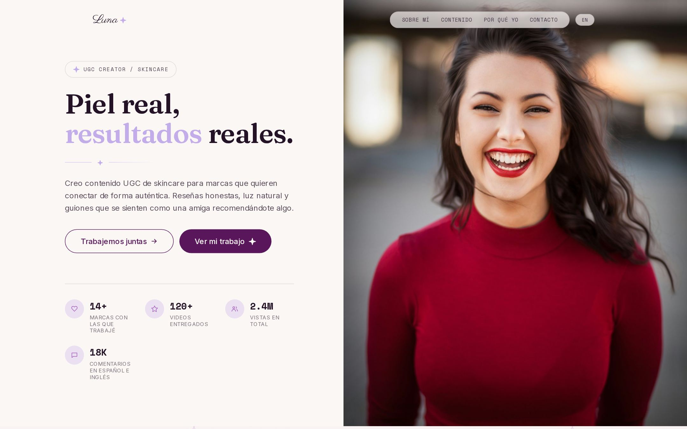 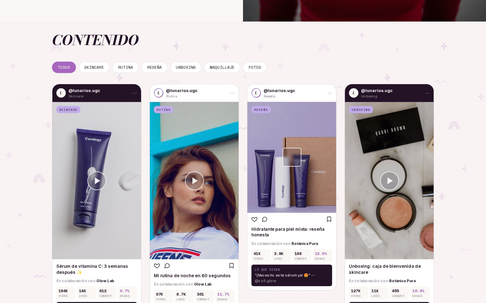 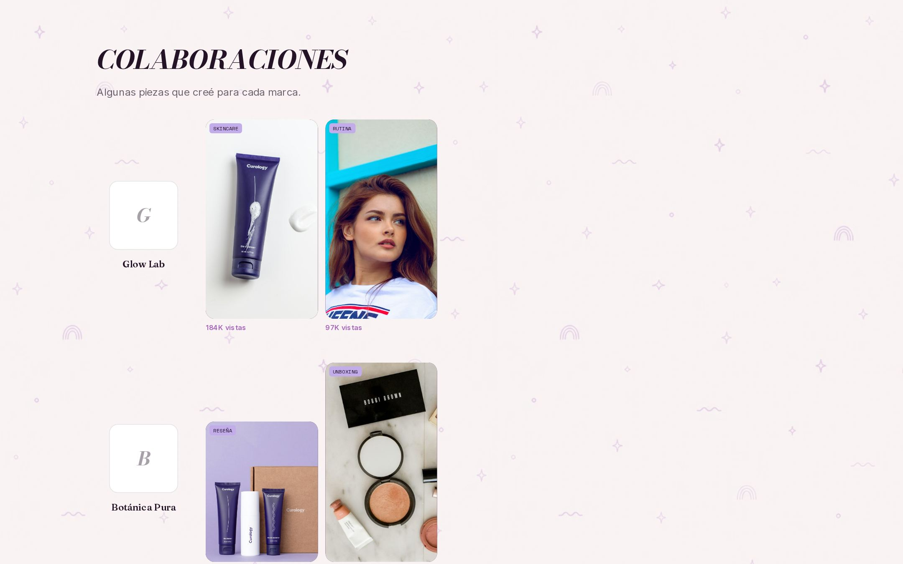 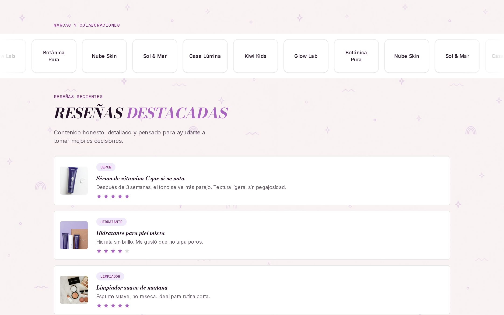 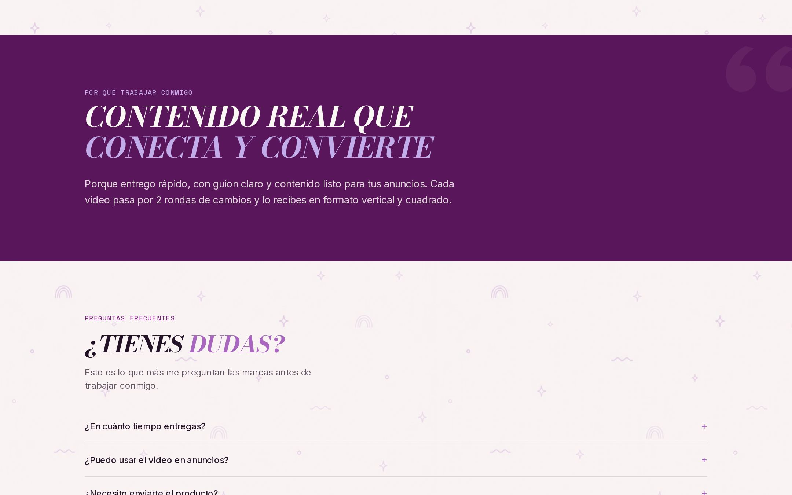 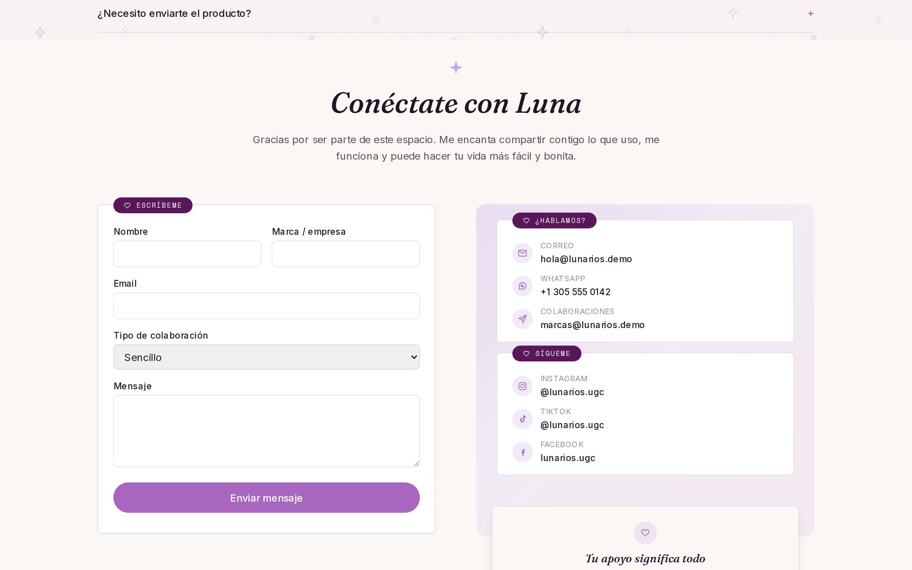 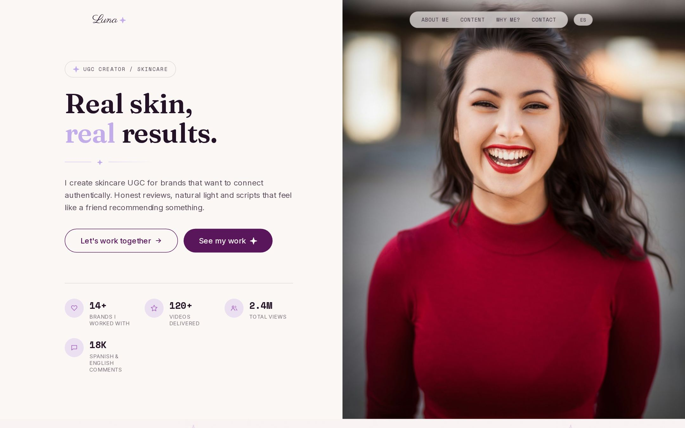

*Celular*

| Archivo | Qué muestra | Tamaño | Uso sugerido |
| --- | --- | --- | --- |
| `sitio-publico-1-portada-mob.jpg` | Portada con foto, frase principal y tus números | 780×1688 | Historia o reel vertical (9:16) |
| `sitio-publico-2-contenido-mob.jpg` | Tu contenido con el diseño de cada red y sus resultados | 780×1688 | Historia o reel vertical (9:16) |
| `sitio-publico-3-colaboraciones-mob.jpg` | Colaboraciones agrupadas por marca | 780×1688 | Historia o reel vertical (9:16) |
| `sitio-publico-4-marcas-mob.jpg` | Cinta de marcas y reseñas destacadas | 780×1688 | Historia o reel vertical (9:16) |
| `sitio-publico-5-por-que-yo-mob.jpg` | Por qué trabajar contigo y preguntas frecuentes | 780×1688 | Historia o reel vertical (9:16) |
| `sitio-publico-6-contacto-mob.jpg` | Formulario de contacto y tus redes | 780×1688 | Historia o reel vertical (9:16) |
| `sitio-publico-7-ingles-mob.jpg` | El mismo sitio en inglés con un botón | 780×1688 | Historia o reel vertical (9:16) |

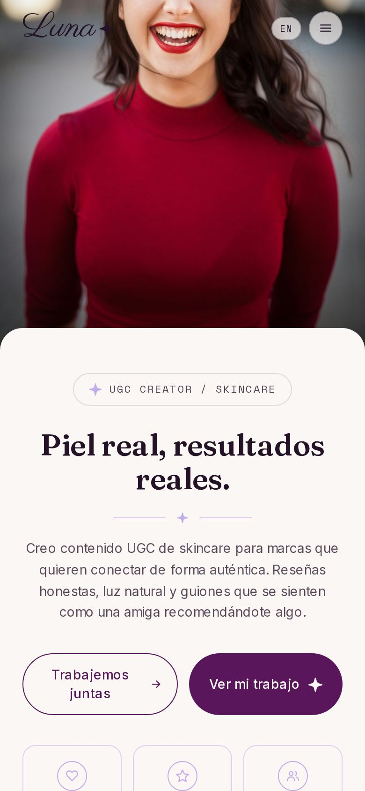 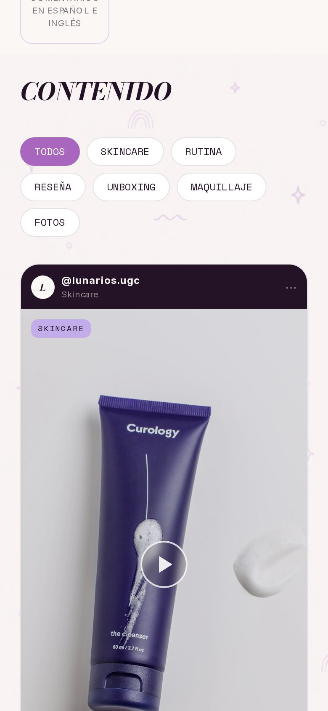 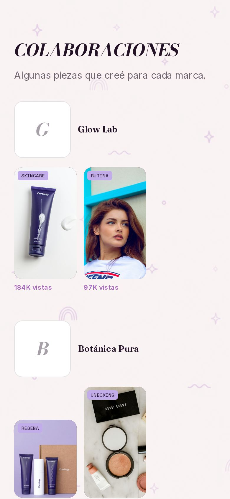  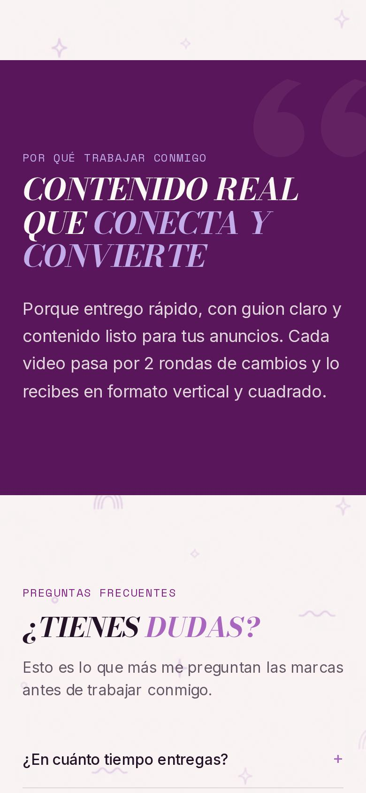 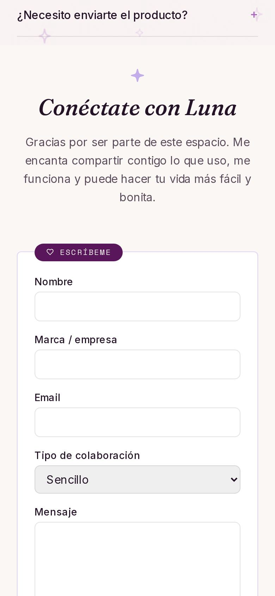 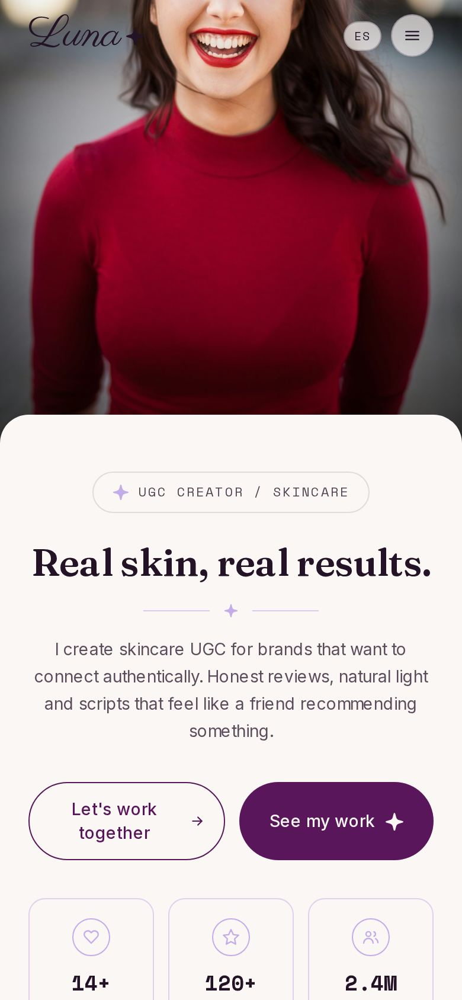

#### 2. 🎨 Estudio de diseño

**Estado:** 🟢 Disponible hoy

> Haz que el sitio se sienta tuyo en un minuto: estilo, color, tipografía y más.

**Qué es.** Un estudio visual dentro del panel. Eliges un estilo completo (Editorial, Minimal, Noche, Soft o Bold), un color de acento (lila, rosa, terracota, salvia, azul, dorado o un color propio), la combinación de tipografías, la forma de la portada, la redondez de los bordes y el fondo decorativo. También puedes ordenar u ocultar secciones. Si no sabes por dónde empezar, el botón «Diséñalo por mí» usa IA para proponerte una combinación y explicarte por qué te queda bien. Una vista previa en vivo muestra el resultado antes de guardar.

**Qué problema resuelve.** Muchas personas creadoras sienten que las plantillas se ven todas iguales o que necesitan a una diseñadora para personalizar su sitio.

**Cómo funciona.**

1. Abres «Estudio de diseño».
2. Eliges estilo, color, tipografía, portada, bordes y fondo (todo con un toque).
3. Opcional: tocas «Diséñalo por mí» y la IA te sugiere una combinación.
4. Miras la vista previa y guardas. El sitio cambia al instante.

**Ejemplo con la cuenta de demostración (Luna Ríos, datos ficticios).** Luna prueba su sitio en Noche (oscuro y elegante, las fotos resaltan), Soft rosa (pastel y redondeado) y Bold terracota (contraste fuerte). En tres toques tiene tres personalidades distintas con el mismo contenido.

**Mensajes cortos para campañas.**

- «Mismo contenido, 5 personalidades.»
- «Tu sitio, a tu estilo, en un minuto.»
- «Sin diseñadora, sin código, sin plantillas iguales.»

**Ideas de piezas.**

- Carrusel «Elige tu estilo»: una captura por estilo con la pregunta «¿Cuál eres tú?».
- Story con encuesta: Noche vs Soft.
- Reel de transición: el mismo sitio cambiando de estilo al ritmo de la música.

**Cuidado con esto (honestidad).** La sugerencia con IA cuenta dentro del límite mensual de IA de cada plan.

**Capturas** (carpeta `capturas/02-estudio-de-diseno/`): 8 de escritorio y 9 de celular.

*Escritorio*

| Archivo | Qué muestra | Tamaño | Uso sugerido |
| --- | --- | --- | --- |
| `estudio-de-diseno-1-estudio-desk.jpg` | El estudio de diseño completo | 2160×1350 | Publicación horizontal, carrusel, miniatura o video de pantalla |
| `estudio-de-diseno-2-estilos-desk.jpg` | Estilos y color de acento | 2160×1350 | Publicación horizontal, carrusel, miniatura o video de pantalla |
| `estudio-de-diseno-5-estilo-noche-desk.jpg` | El sitio en estilo Noche | 2160×1350 | Publicación horizontal, carrusel, miniatura o video de pantalla |
| `estudio-de-diseno-6-estilo-soft-rosa-desk.jpg` | El sitio en estilo Soft con acento rosa | 2160×1350 | Publicación horizontal, carrusel, miniatura o video de pantalla |
| `estudio-de-diseno-7-estilo-bold-desk.jpg` | El sitio en estilo Bold con acento terracota | 2160×1350 | Publicación horizontal, carrusel, miniatura o video de pantalla |
| `estudio-de-diseno-9-tarjeta-1-2-desk.jpg` | Detalle de la pantalla (bloque 2) | 813×447 | Publicación cuadrada o 4:5, detalle para carrusel |
| `estudio-de-diseno-11-tarjeta-1-4-desk.jpg` | Detalle de la pantalla (bloque 4) | 813×344 | Publicación cuadrada o 4:5, detalle para carrusel |
| `estudio-de-diseno-12-tarjeta-1-5-desk.jpg` | Detalle de la pantalla (bloque 5) | 813×333 | Publicación cuadrada o 4:5, detalle para carrusel |

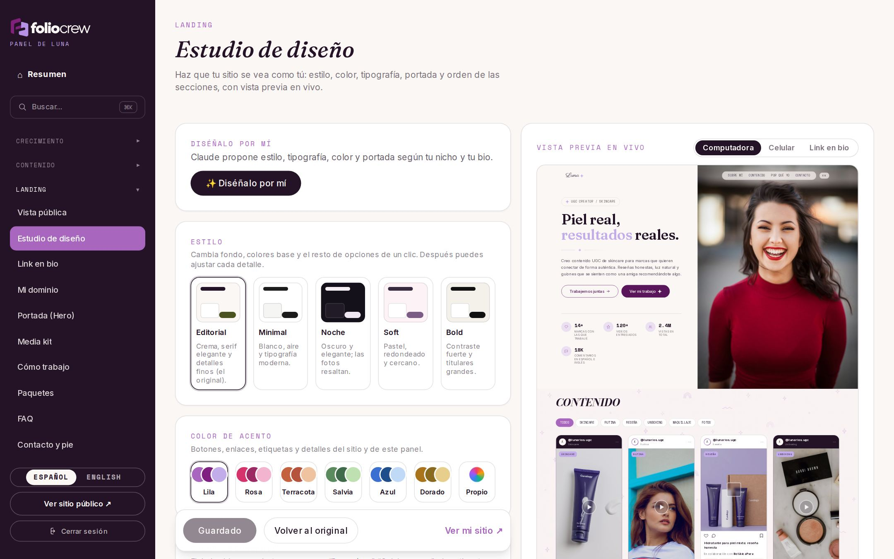 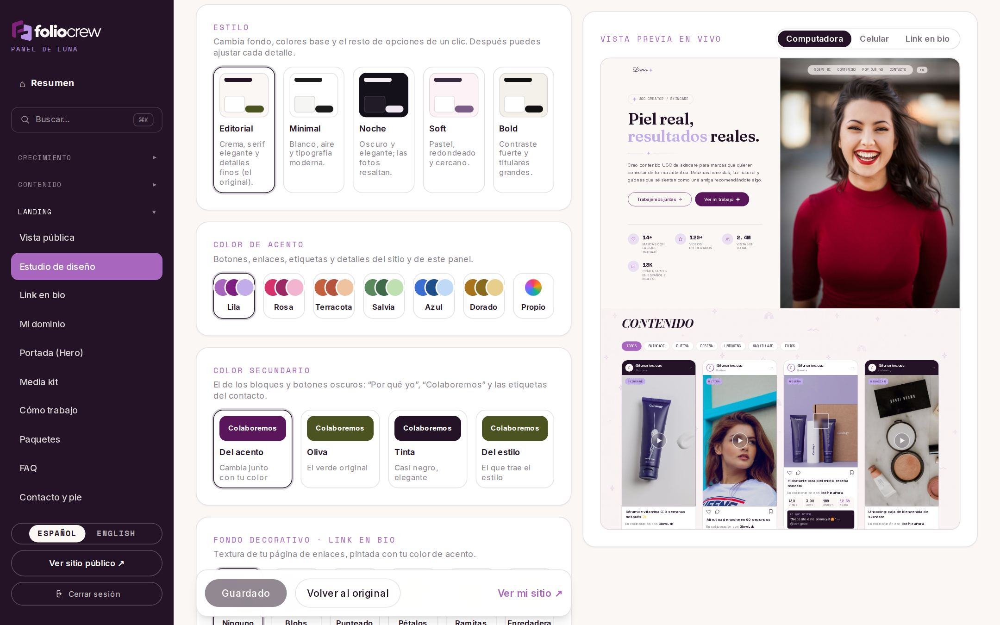  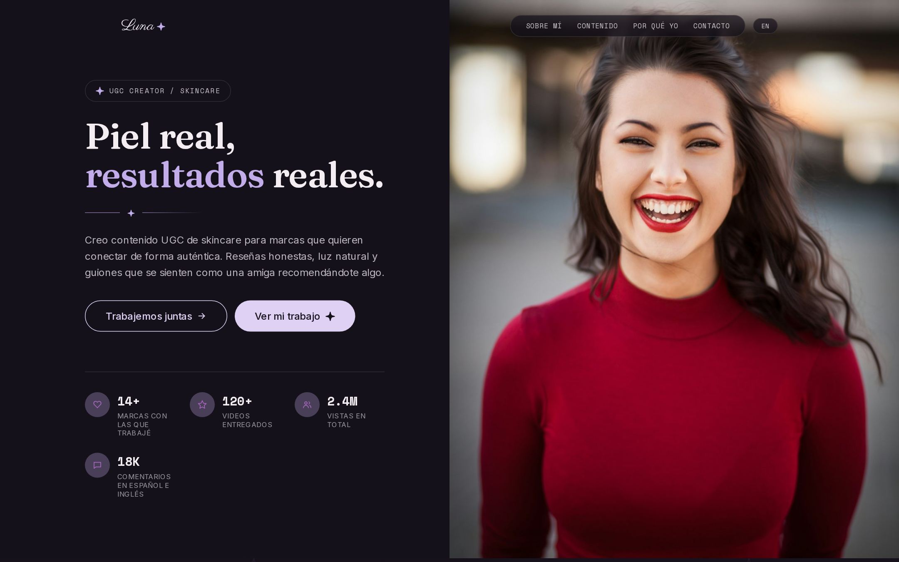 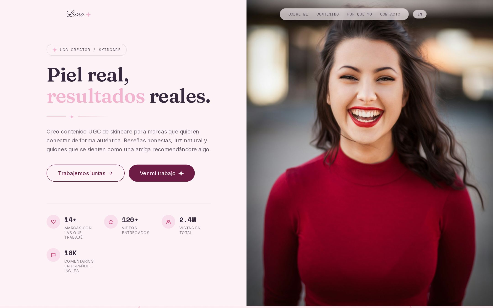 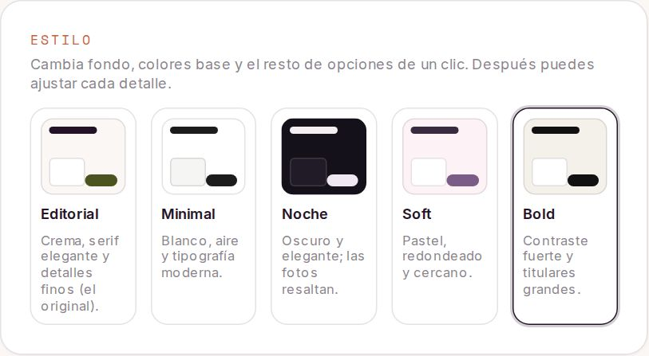 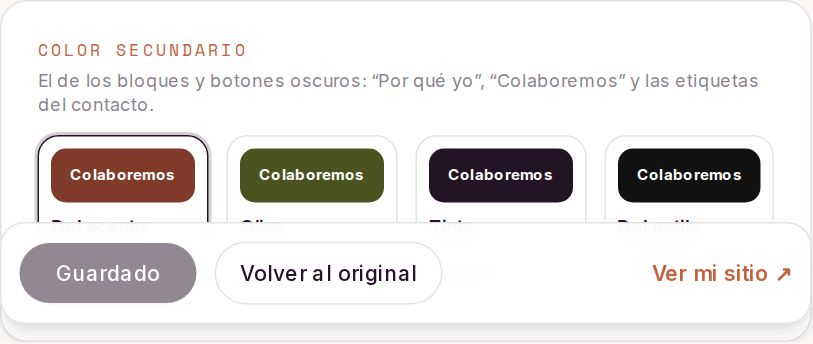 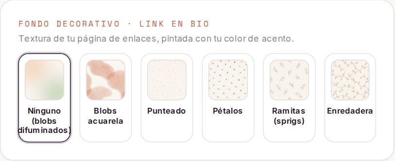

*Celular*

| Archivo | Qué muestra | Tamaño | Uso sugerido |
| --- | --- | --- | --- |
| `estudio-de-diseno-1-estudio-mob.jpg` | El estudio de diseño completo | 780×1688 | Historia o reel vertical (9:16) |
| `estudio-de-diseno-2-estilos-mob.jpg` | Estilos y color de acento | 780×1688 | Historia o reel vertical (9:16) |
| `estudio-de-diseno-5-estilo-noche-mob.jpg` | El sitio en estilo Noche | 780×1688 | Historia o reel vertical (9:16) |
| `estudio-de-diseno-6-estilo-soft-rosa-mob.jpg` | El sitio en estilo Soft con acento rosa | 780×1688 | Historia o reel vertical (9:16) |
| `estudio-de-diseno-7-estilo-bold-mob.jpg` | El sitio en estilo Bold con acento terracota | 780×1688 | Historia o reel vertical (9:16) |
| `estudio-de-diseno-9-tarjeta-1-2-mob.jpg` | Detalle de la pantalla (bloque 2) | 684×1188 | Historia o detalle vertical |
| `estudio-de-diseno-10-tarjeta-1-3-mob.jpg` | Detalle de la pantalla (bloque 3) | 684×520 | Historia o detalle vertical |
| `estudio-de-diseno-11-tarjeta-1-4-mob.jpg` | Detalle de la pantalla (bloque 4) | 684×682 | Historia o detalle vertical |
| `estudio-de-diseno-12-tarjeta-1-5-mob.jpg` | Detalle de la pantalla (bloque 5) | 684×720 | Historia o detalle vertical |

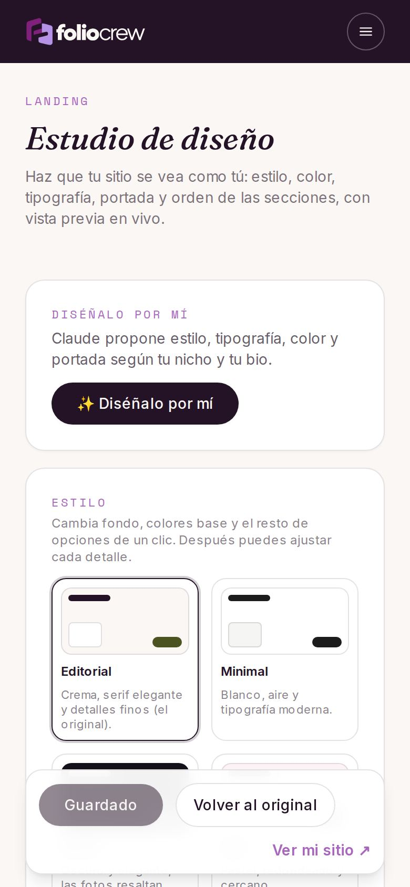 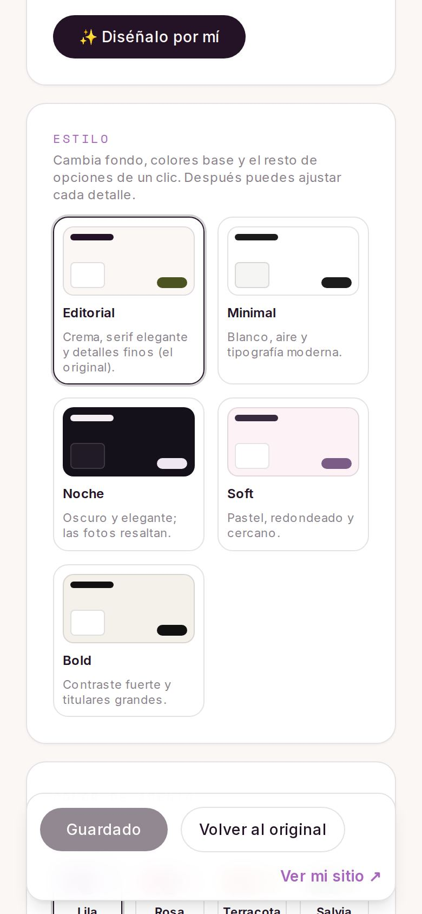  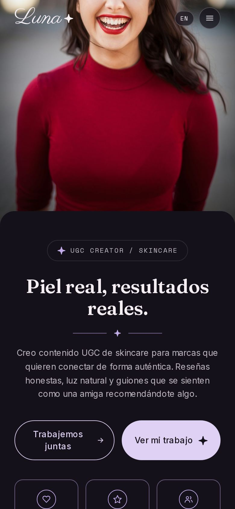 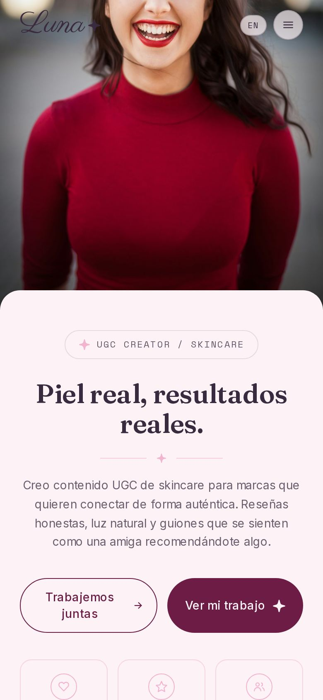 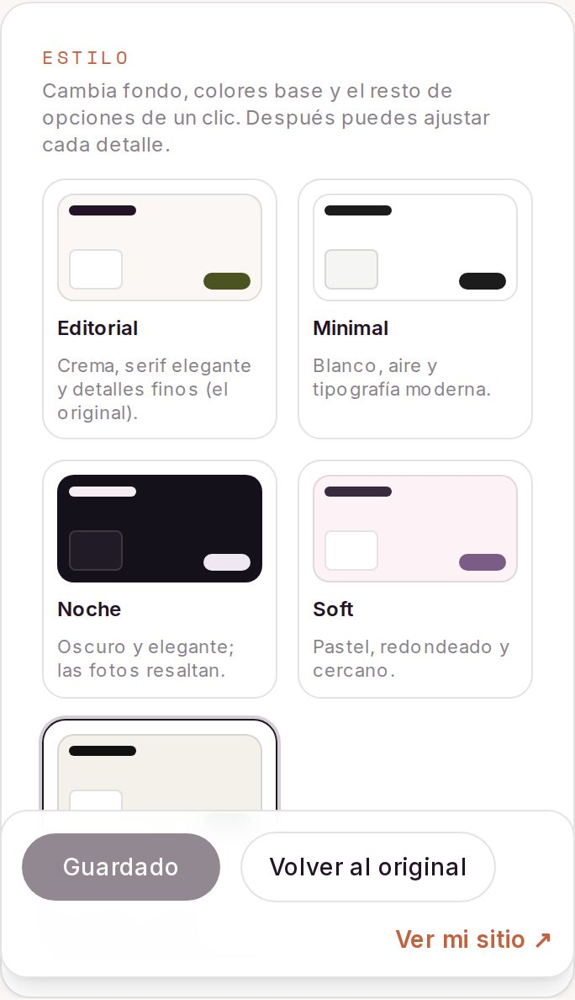 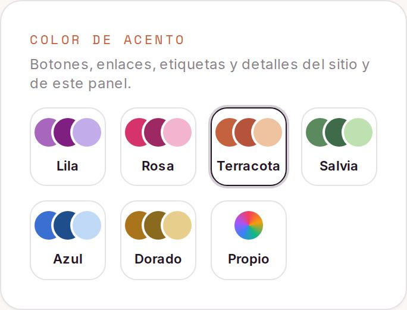 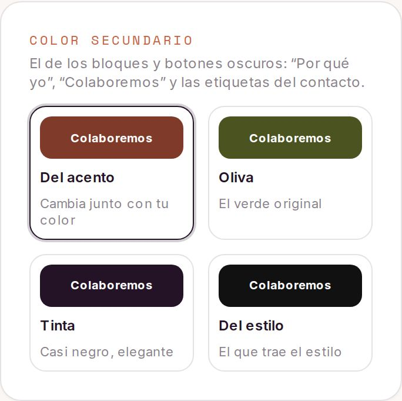 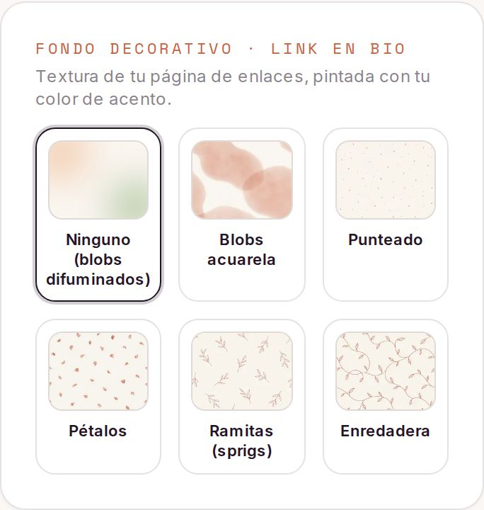

#### 3. 🔗 Link en bio

**Estado:** 🟢 Disponible hoy

> Una sola página para tu bio con tu media kit, tus enlaces y tu contenido reciente.

**Qué es.** Una página corta y bonita (como un Linktree, pero tuya y conectada con todo lo demás). Tiene una tarjeta principal hacia tu portafolio, grupos de enlaces con los nombres que quieras («Colabora conmigo», «Mis favoritos»), etiquetas como «10 % OFF» o «Abierto ahora», bloques automáticos con tu media kit y tu contenido reciente, y una fila de redes. El editor es visual: tocas lo que quieres cambiar en la vista previa. Cuenta los clics de cada enlace y marca el más visitado.

**Qué problema resuelve.** Los creadores usan un servicio de enlaces aparte que no conoce su portafolio ni sus números, y casi nunca se ve profesional.

**Cómo funciona.**

1. Abres «Link en bio».
2. Tocas cualquier parte de la vista previa para editarla.
3. Agregas enlaces, grupos, imágenes y etiquetas.
4. Copias tu enlace con un botón y lo pones en la bio.

**Ejemplo con la cuenta de demostración (Luna Ríos, datos ficticios).** Luna tiene un grupo «Colabora conmigo» (pide un paquete UGC, mi media kit) y otro «Mis favoritos» con tarjetas de producto con imagen y la etiqueta «10 % OFF». Su sérum favorito ya suma 112 clics.

**Mensajes cortos para campañas.**

- «Tu bio, pero con superpoderes.»
- «Un link. Todo tu negocio.»
- «Tu media kit siempre al día, dentro de tu link en bio.»

**Ideas de piezas.**

- Reel de «bio makeover»: el antes (un link genérico) y el después.
- Story mostrando el editor visual: «toca y cambia».
- Carrusel con 3 ideas de grupos de enlaces para creadores UGC.

**Cuidado con esto (honestidad).** Es parte de todas las cuentas. Foliocrew no cobra comisión por lo que vendes con tus enlaces.

**Capturas** (carpeta `capturas/03-link-en-bio/`): 6 de escritorio y 6 de celular.

*Escritorio*

| Archivo | Qué muestra | Tamaño | Uso sugerido |
| --- | --- | --- | --- |
| `link-en-bio-1-editor-desk.jpg` | Editor del link en bio con vista previa | 2160×1350 | Publicación horizontal, carrusel, miniatura o video de pantalla |
| `link-en-bio-2-editar-enlace-desk.jpg` | Editando un enlace con un toque | 2160×1350 | Publicación horizontal, carrusel, miniatura o video de pantalla |
| `link-en-bio-3-publico-arriba-desk.jpg` | La página pública: tarjeta principal y enlaces | 2160×1350 | Publicación horizontal, carrusel, miniatura o video de pantalla |
| `link-en-bio-4-publico-colabora-desk.jpg` | Grupo «Colabora conmigo» | 2160×1350 | Publicación horizontal, carrusel, miniatura o video de pantalla |
| `link-en-bio-5-publico-favoritos-desk.jpg` | Tarjetas de favoritos con imagen y etiqueta | 2160×1350 | Publicación horizontal, carrusel, miniatura o video de pantalla |
| `link-en-bio-8-tarjeta-1-2-desk.jpg` | Detalle de la pantalla (bloque 2) | 630×1199 | Publicación cuadrada o 4:5, detalle para carrusel |

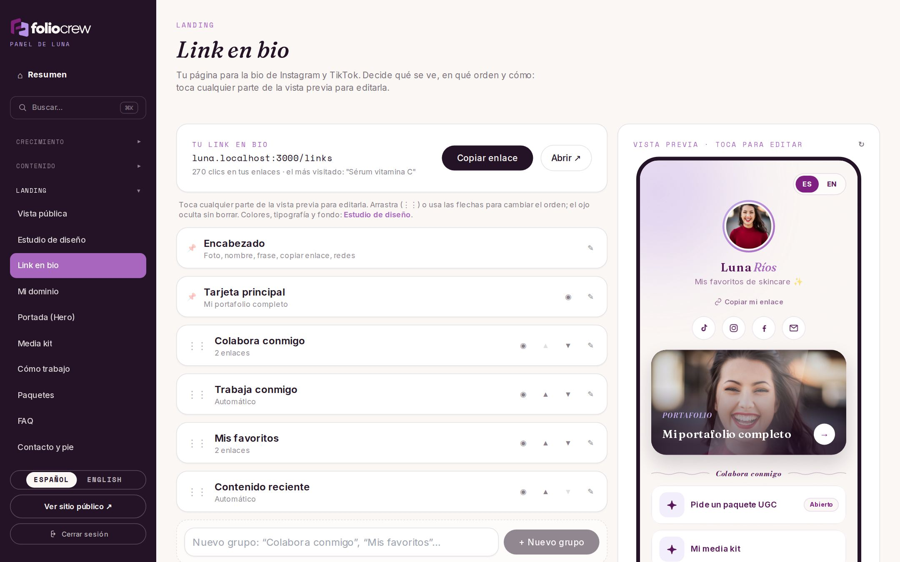 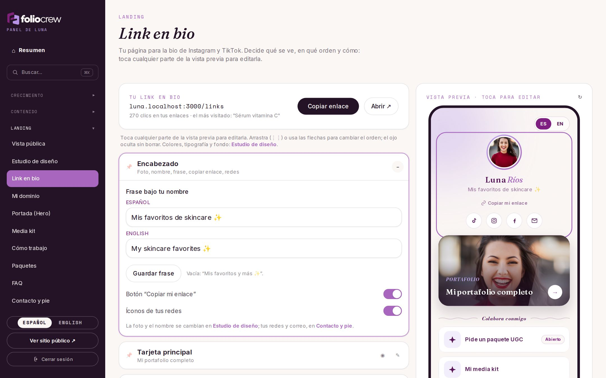 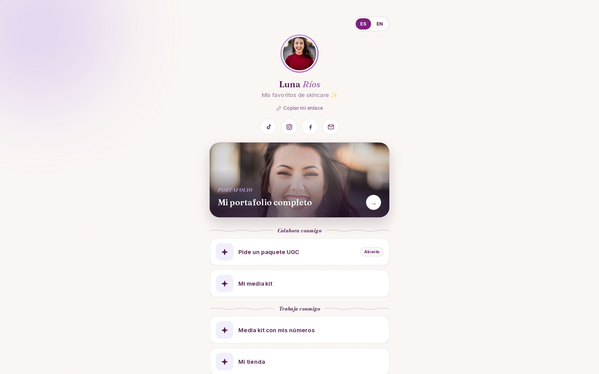 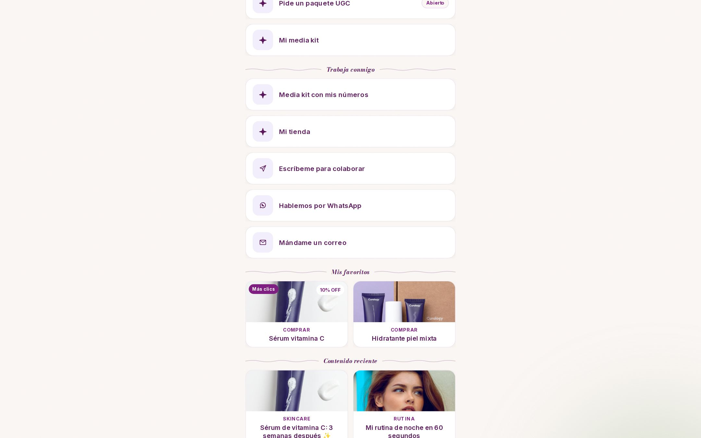 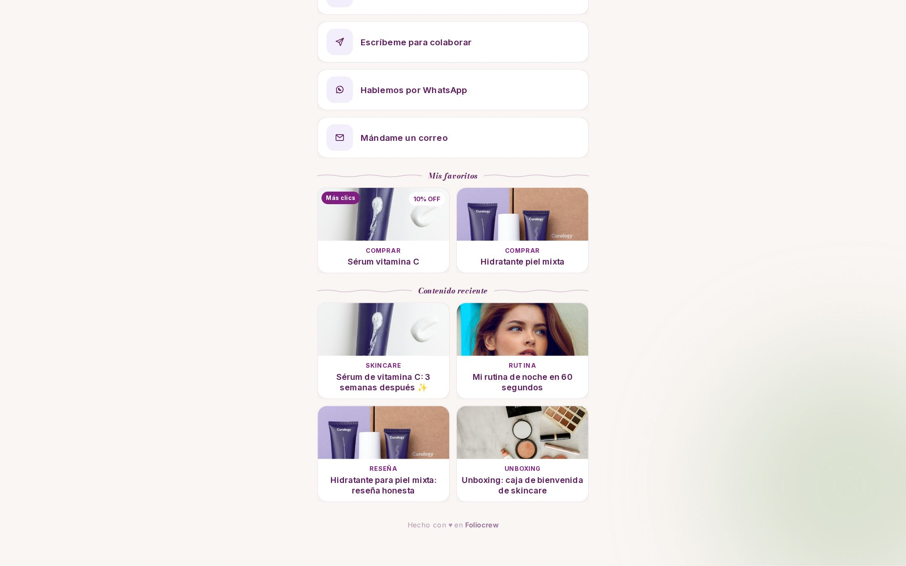 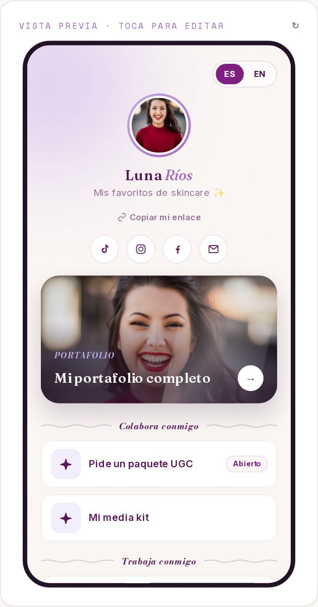

*Celular*

| Archivo | Qué muestra | Tamaño | Uso sugerido |
| --- | --- | --- | --- |
| `link-en-bio-1-editor-mob.jpg` | Editor del link en bio con vista previa | 780×1688 | Historia o reel vertical (9:16) |
| `link-en-bio-2-editar-enlace-mob.jpg` | Editando un enlace con un toque | 780×1688 | Historia o reel vertical (9:16) |
| `link-en-bio-3-publico-arriba-mob.jpg` | La página pública: tarjeta principal y enlaces | 780×1688 | Historia o reel vertical (9:16) |
| `link-en-bio-4-publico-colabora-mob.jpg` | Grupo «Colabora conmigo» | 780×1688 | Historia o reel vertical (9:16) |
| `link-en-bio-5-publico-favoritos-mob.jpg` | Tarjetas de favoritos con imagen y etiqueta | 780×1688 | Historia o reel vertical (9:16) |
| `link-en-bio-8-tarjeta-1-2-mob.jpg` | Detalle de la pantalla (bloque 2) | 820×1598 | Historia o detalle vertical |

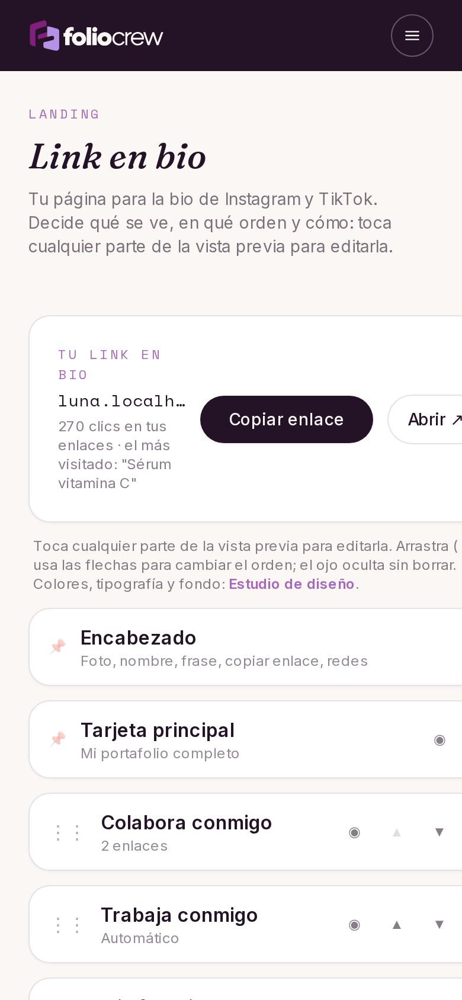 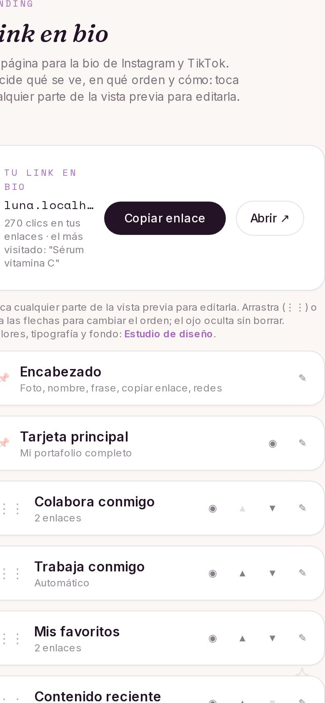 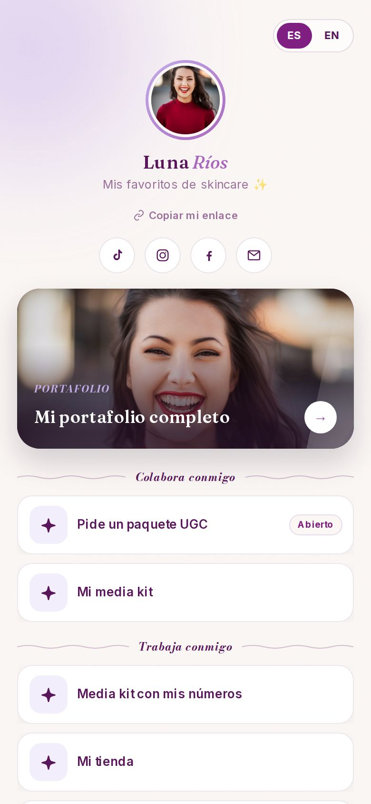 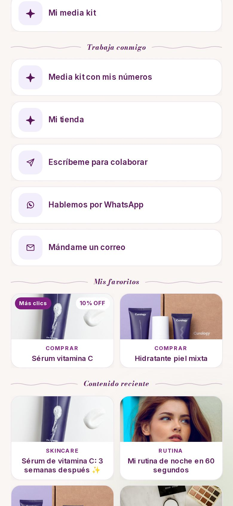 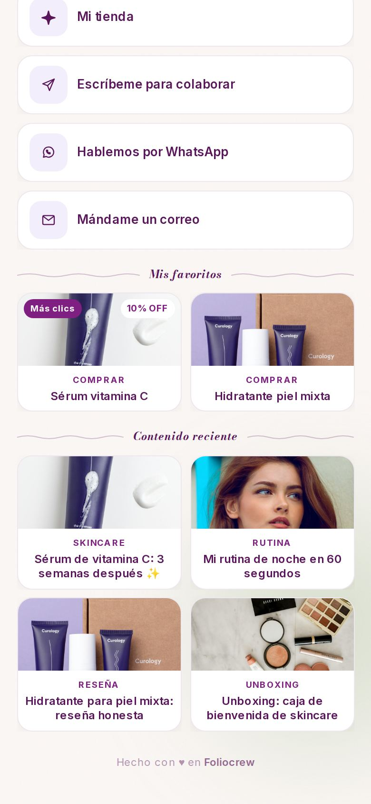 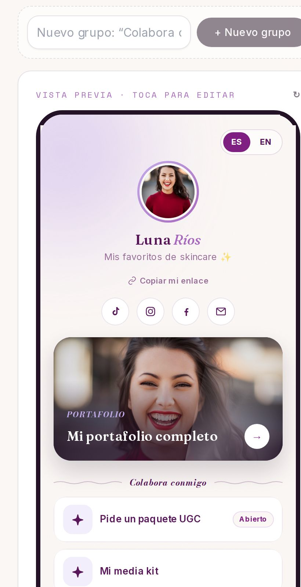

#### 4. 🧭 Tu dirección, tu dominio y la vista previa

**Estado:** 🟢 Disponible hoy

> Comparte tu dirección, conecta tu propio dominio y mira tu sitio como lo ve una marca.

**Qué es.** Aquí ves la dirección de tu sitio lista para copiar. Si quieres, conectas tu propio dominio (por ejemplo tunombre.com, que compras donde prefieras): el panel te dice exactamente qué registro poner, comprueba la conexión y tu sitio queda con HTTPS. La «Vista pública» te deja ver tu sitio en computadora o celular y en español o inglés antes de compartirlo.

**Qué problema resuelve.** Conectar un dominio suele dar miedo. Y es difícil saber cómo se ve tu sitio en el celular de una marca.

**Cómo funciona.**

1. Copias tu dirección con un clic.
2. Opcional: escribes tu dominio y sigues las instrucciones del panel (un solo registro).
3. En «Vista pública» alternas entre escritorio y celular, y entre ES y EN.

**Ejemplo con la cuenta de demostración (Luna Ríos, datos ficticios).** Luna ve su sitio en el celular, cambia a inglés para revisar cómo lo vería una marca de Texas y copia su dirección para ponerla en su bio.

**Mensajes cortos para campañas.**

- «Tu nombre, tu dirección.»
- «Míralo como lo ve una marca: en escritorio, celular, español e inglés.»

**Ideas de piezas.**

- Story: «Tu dominio en 3 pasos» con capturas.
- Reel: alternar escritorio ↔ celular con el sitio en pantalla.

**Cuidado con esto (honestidad).** El dominio propio lo compra y paga cada persona donde quiera. Tu dirección tunombre.foliocrew.pro se activa con el lanzamiento del dominio.

**Capturas** (carpeta `capturas/04-direccion-y-vista-previa/`): 7 de escritorio y 7 de celular.

*Escritorio*

| Archivo | Qué muestra | Tamaño | Uso sugerido |
| --- | --- | --- | --- |
| `direccion-y-vista-previa-1-tu-direccion-desk.jpg` | Tu dirección para compartir | 2160×1350 | Publicación horizontal, carrusel, miniatura o video de pantalla |
| `direccion-y-vista-previa-3-vista-escritorio-desk.jpg` | Vista pública en escritorio | 2160×1350 | Publicación horizontal, carrusel, miniatura o video de pantalla |
| `direccion-y-vista-previa-4-vista-celular-desk.jpg` | Vista pública en celular | 2160×1350 | Publicación horizontal, carrusel, miniatura o video de pantalla |
| `direccion-y-vista-previa-5-vista-ingles-desk.jpg` | Vista pública en celular y en inglés | 2160×1350 | Publicación horizontal, carrusel, miniatura o video de pantalla |
| `direccion-y-vista-previa-6-tarjeta-1-1-desk.jpg` | Detalle de la pantalla (bloque 1) | 1689×309 | Publicación cuadrada o 4:5, detalle para carrusel |
| `direccion-y-vista-previa-7-tarjeta-1-2-desk.jpg` | Detalle de la pantalla (bloque 2) | 1689×302 | Publicación cuadrada o 4:5, detalle para carrusel |
| `direccion-y-vista-previa-11-tarjeta-2-1-desk.jpg` | Detalle de la pantalla (bloque 1) | 1689×1092 | Publicación cuadrada o 4:5, detalle para carrusel |

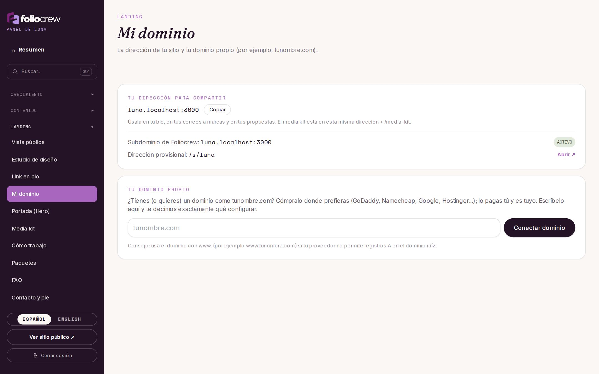 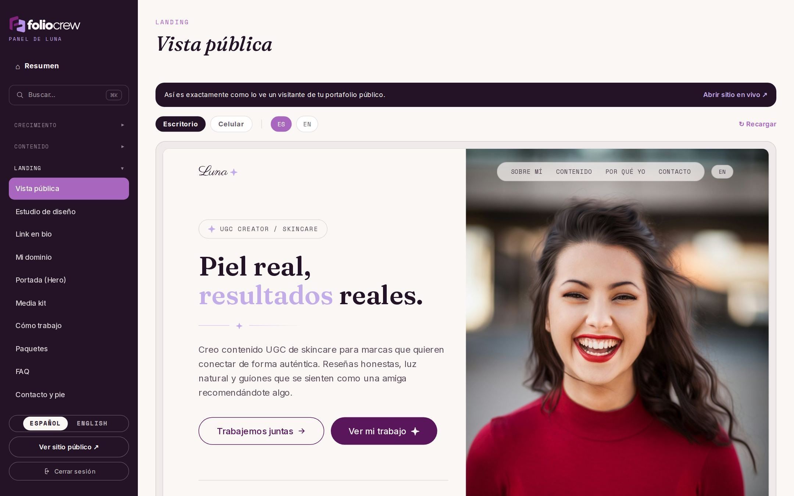 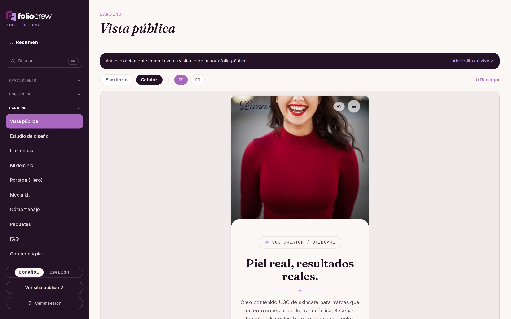 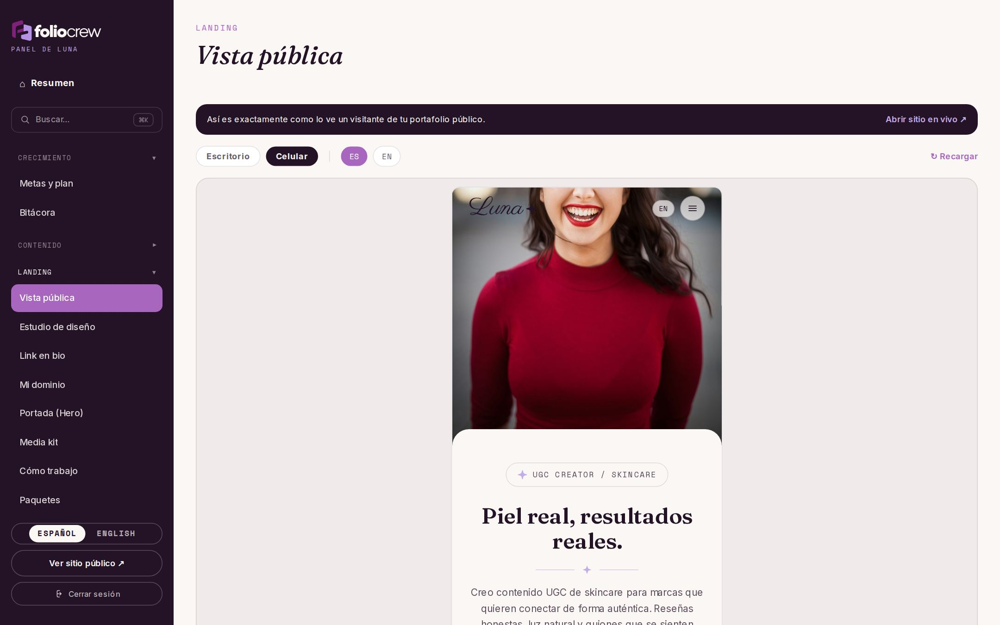 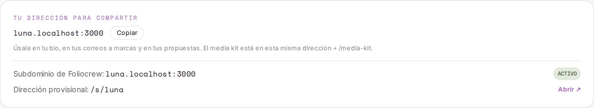 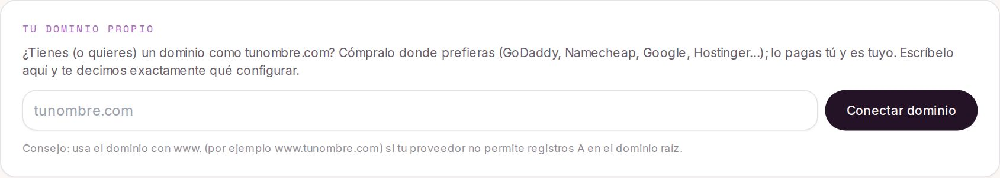 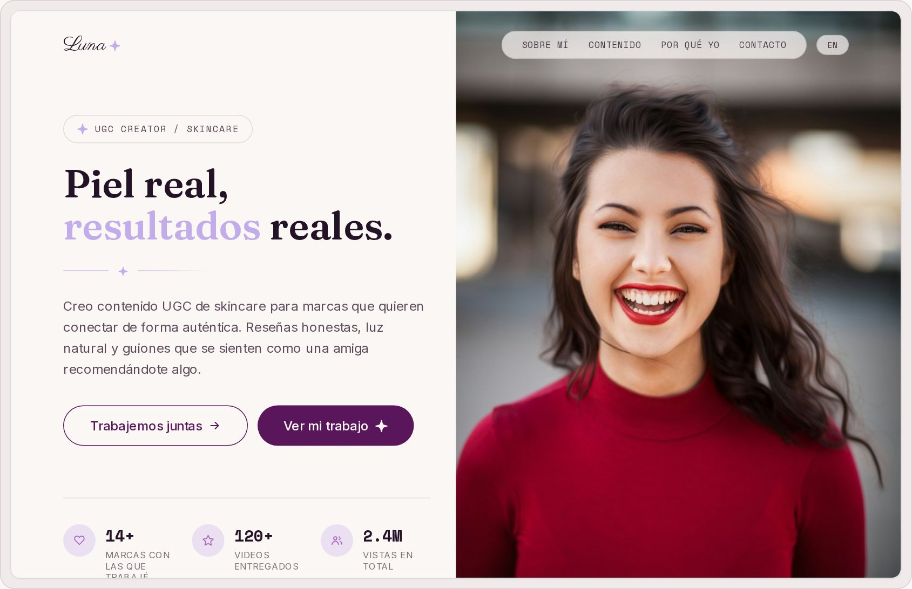

*Celular*

| Archivo | Qué muestra | Tamaño | Uso sugerido |
| --- | --- | --- | --- |
| `direccion-y-vista-previa-1-tu-direccion-mob.jpg` | Tu dirección para compartir | 780×1688 | Historia o reel vertical (9:16) |
| `direccion-y-vista-previa-3-vista-escritorio-mob.jpg` | Vista pública en escritorio | 780×1688 | Historia o reel vertical (9:16) |
| `direccion-y-vista-previa-4-vista-celular-mob.jpg` | Vista pública en celular | 780×1688 | Historia o reel vertical (9:16) |
| `direccion-y-vista-previa-5-vista-ingles-mob.jpg` | Vista pública en celular y en inglés | 780×1688 | Historia o reel vertical (9:16) |
| `direccion-y-vista-previa-6-tarjeta-1-1-mob.jpg` | Detalle de la pantalla (bloque 1) | 684×572 | Historia o detalle vertical |
| `direccion-y-vista-previa-7-tarjeta-1-2-mob.jpg` | Detalle de la pantalla (bloque 2) | 684×722 | Historia o detalle vertical |
| `direccion-y-vista-previa-11-tarjeta-2-1-mob.jpg` | Detalle de la pantalla (bloque 1) | 684×1370 | Historia o detalle vertical |

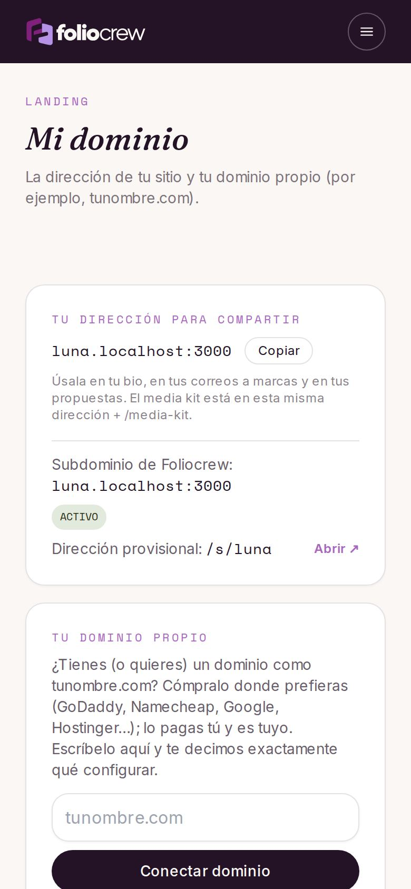 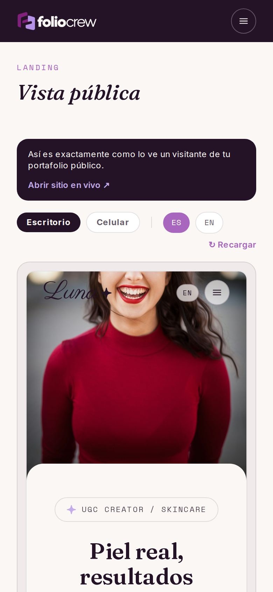 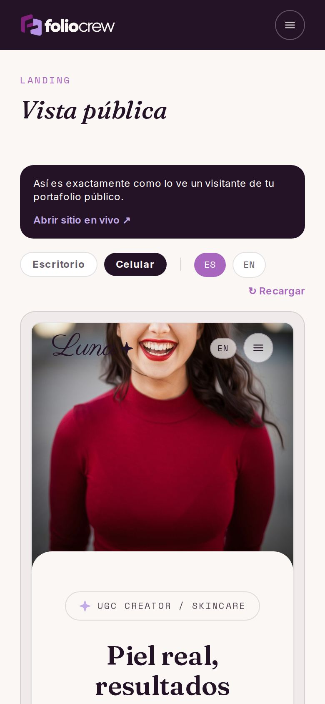    

#### 5. ✏️ Editor de cada sección del sitio

**Estado:** 🟢 Disponible hoy

> Portada, números, servicios, paquetes, preguntas y contacto: cada parte, editable en segundos.

**Qué es.** Cada sección del sitio tiene su propio editor sencillo: la portada (con vista previa en vivo y ajuste de encuadre de la foto), los números del media kit (hasta 4), «Cómo trabajo» (tus servicios), los paquetes (con precio «desde» opcional), las preguntas frecuentes y el contacto y redes con el pie de página. Todo en español e inglés.

**Qué problema resuelve.** Actualizar un portafolio tradicional toma horas y se deja para «después».

**Cómo funciona.**

1. Entras a la sección que quieres cambiar.
2. Escribes en español y, si quieres, en inglés.
3. Guardas. El sitio público se actualiza al instante.

**Ejemplo con la cuenta de demostración (Luna Ríos, datos ficticios).** Luna cambia su número de «Videos entregados» de 100+ a 120+ en 10 segundos, y su media kit público ya lo muestra.

**Mensajes cortos para campañas.**

- «Actualizar tu portafolio no debería tomar una tarde.»
- «10 segundos para actualizar un número. Sin PDF.»

**Ideas de piezas.**

- Reel de «cambié un número y mira el sitio».
- Carrusel «Qué poner en cada sección de tu portafolio UGC».

**Cuidado con esto (honestidad).** Los datos de tratos y pagos nunca aparecen en el sitio público.

**Capturas** (carpeta `capturas/05-editor-del-sitio/`): 7 de escritorio y 7 de celular.

*Escritorio*

| Archivo | Qué muestra | Tamaño | Uso sugerido |
| --- | --- | --- | --- |
| `editor-del-sitio-1-portada-desk.jpg` | Editor de la portada | 2160×1350 | Publicación horizontal, carrusel, miniatura o video de pantalla |
| `editor-del-sitio-3-numeros-media-kit-desk.jpg` | Números del media kit | 2160×1350 | Publicación horizontal, carrusel, miniatura o video de pantalla |
| `editor-del-sitio-4-servicios-desk.jpg` | Servicios («Cómo trabajo») | 2160×1350 | Publicación horizontal, carrusel, miniatura o video de pantalla |
| `editor-del-sitio-5-paquetes-desk.jpg` | Paquetes con precio desde | 2160×1350 | Publicación horizontal, carrusel, miniatura o video de pantalla |
| `editor-del-sitio-6-faq-desk.jpg` | Preguntas frecuentes | 2160×1350 | Publicación horizontal, carrusel, miniatura o video de pantalla |
| `editor-del-sitio-7-contacto-y-redes-desk.jpg` | Contacto, redes y pie de página | 2160×1350 | Publicación horizontal, carrusel, miniatura o video de pantalla |
| `editor-del-sitio-8-tarjeta-1-1-desk.jpg` | Detalle de la pantalla (bloque 1) | 1101×2759 | Publicación cuadrada o 4:5, detalle para carrusel |

      

*Celular*

| Archivo | Qué muestra | Tamaño | Uso sugerido |
| --- | --- | --- | --- |
| `editor-del-sitio-1-portada-mob.jpg` | Editor de la portada | 780×1688 | Historia o reel vertical (9:16) |
| `editor-del-sitio-3-numeros-media-kit-mob.jpg` | Números del media kit | 780×1688 | Historia o reel vertical (9:16) |
| `editor-del-sitio-4-servicios-mob.jpg` | Servicios («Cómo trabajo») | 780×1688 | Historia o reel vertical (9:16) |
| `editor-del-sitio-5-paquetes-mob.jpg` | Paquetes con precio desde | 780×1688 | Historia o reel vertical (9:16) |
| `editor-del-sitio-6-faq-mob.jpg` | Preguntas frecuentes | 780×1688 | Historia o reel vertical (9:16) |
| `editor-del-sitio-7-contacto-y-redes-mob.jpg` | Contacto, redes y pie de página | 780×1688 | Historia o reel vertical (9:16) |
| `editor-del-sitio-8-tarjeta-1-1-mob.jpg` | Detalle de la pantalla (bloque 1) | 684×5084 | Historia o detalle vertical |

      

#### 6. 🤝 Trabaja conmigo: solicitar un paquete

**Estado:** 🟢 Disponible hoy

> Tus paquetes, con precio «desde» y un botón para que la marca te lo pida directo.

**Qué es.** Cada paquete de tu sitio puede mostrar un precio «desde» y un botón «Solicitar este paquete». La marca llena un formulario corto (empresa, nombre, correo, fechas ideales, presupuesto aproximado y qué necesita). La solicitud llega a tu Bandeja y a tu correo, y la marca se guarda sola en tu CRM como «Negociando» con la próxima acción «Responder la solicitud del paquete». Foliocrew no cobra comisión.

**Qué problema resuelve.** Las marcas escriben «¿cuánto cobras?» y la conversación se pierde entre mensajes sueltos.

**Cómo funciona.**

1. Activas «solicitudes» en los paquetes que quieras.
2. La marca elige un paquete y llena el formulario.
3. Te llega a la Bandeja y por correo.
4. La marca ya está en tu CRM con tarea de seguimiento.

**Ejemplo con la cuenta de demostración (Luna Ríos, datos ficticios).** Marina, de Glow Lab, entra al sitio de Luna, elige «Pack de lanzamiento» (desde $480), indica que lo quiere para noviembre y escribe su brief. Luna lo ve en su Bandeja con la etiqueta del paquete.

**Mensajes cortos para campañas.**

- «Que las marcas te pidan lo que ofreces, no «una cotización».»
- «Del «¿cuánto cobras?» al «quiero este paquete».»

**Ideas de piezas.**

- Carrusel «Cómo armar 3 paquetes UGC que se vendan solos» (usa la captura de paquetes).
- Reel mostrando el botón → formulario → mensaje en la Bandeja.

**Cuidado con esto (honestidad).** El precio es «desde» y es opcional. No garantizamos solicitudes: ayudamos a recibirlas de forma ordenada.

**Capturas** (carpeta `capturas/06-trabaja-conmigo/`): 10 de escritorio y 10 de celular.

*Escritorio*

| Archivo | Qué muestra | Tamaño | Uso sugerido |
| --- | --- | --- | --- |
| `trabaja-conmigo-1-paquetes-publicos-desk.jpg` | Paquetes con precio «desde» en tu sitio | 2160×1350 | Publicación horizontal, carrusel, miniatura o video de pantalla |
| `trabaja-conmigo-2-solicitar-paquete-desk.jpg` | La marca toca «Solicitar este paquete» | 2160×1350 | Publicación horizontal, carrusel, miniatura o video de pantalla |
| `trabaja-conmigo-3-formulario-lleno-desk.jpg` | Formulario de solicitud lleno | 2160×1350 | Publicación horizontal, carrusel, miniatura o video de pantalla |
| `trabaja-conmigo-4-paquetes-admin-desk.jpg` | Editor de paquetes en el panel | 2160×1350 | Publicación horizontal, carrusel, miniatura o video de pantalla |
| `trabaja-conmigo-5-llega-a-bandeja-desk.jpg` | La solicitud llega a tu Bandeja | 2160×1350 | Publicación horizontal, carrusel, miniatura o video de pantalla |
| `trabaja-conmigo-6-tarjeta-1-1-desk.jpg` | Detalle de la pantalla (bloque 1) | 1689×356 | Publicación cuadrada o 4:5, detalle para carrusel |
| `trabaja-conmigo-7-tarjeta-1-2-desk.jpg` | Detalle de la pantalla (bloque 2) | 1689×416 | Publicación cuadrada o 4:5, detalle para carrusel |
| `trabaja-conmigo-8-tarjeta-1-3-desk.jpg` | Detalle de la pantalla (bloque 3) | 1689×356 | Publicación cuadrada o 4:5, detalle para carrusel |
| `trabaja-conmigo-9-tarjeta-1-4-desk.jpg` | Detalle de la pantalla (bloque 4) | 768×1160 | Publicación cuadrada o 4:5, detalle para carrusel |
| `trabaja-conmigo-11-tarjeta-2-1-desk.jpg` | Detalle de la pantalla (bloque 1) | 1689×1943 | Publicación cuadrada o 4:5, detalle para carrusel |

         

*Celular*

| Archivo | Qué muestra | Tamaño | Uso sugerido |
| --- | --- | --- | --- |
| `trabaja-conmigo-1-paquetes-publicos-mob.jpg` | Paquetes con precio «desde» en tu sitio | 780×1688 | Historia o reel vertical (9:16) |
| `trabaja-conmigo-2-solicitar-paquete-mob.jpg` | La marca toca «Solicitar este paquete» | 780×1688 | Historia o reel vertical (9:16) |
| `trabaja-conmigo-3-formulario-lleno-mob.jpg` | Formulario de solicitud lleno | 780×1688 | Historia o reel vertical (9:16) |
| `trabaja-conmigo-4-paquetes-admin-mob.jpg` | Editor de paquetes en el panel | 780×1688 | Historia o reel vertical (9:16) |
| `trabaja-conmigo-5-llega-a-bandeja-mob.jpg` | La solicitud llega a tu Bandeja | 780×1688 | Historia o reel vertical (9:16) |
| `trabaja-conmigo-6-tarjeta-1-1-mob.jpg` | Detalle de la pantalla (bloque 1) | 684×584 | Historia o detalle vertical |
| `trabaja-conmigo-7-tarjeta-1-2-mob.jpg` | Detalle de la pantalla (bloque 2) | 684×664 | Historia o detalle vertical |
| `trabaja-conmigo-8-tarjeta-1-3-mob.jpg` | Detalle de la pantalla (bloque 3) | 684×624 | Historia o detalle vertical |
| `trabaja-conmigo-9-tarjeta-1-4-mob.jpg` | Detalle de la pantalla (bloque 4) | 684×1756 | Historia o detalle vertical |
| `trabaja-conmigo-11-tarjeta-2-1-mob.jpg` | Detalle de la pantalla (bloque 1) | 684×3346 | Historia o detalle vertical |

         

#### 7. ✅ Media kit verificado

**Estado:** 🟢 Disponible hoy

> Un media kit público que se actualiza solo y muestra datos verificados.

**Qué es.** Una página aparte (/media-kit), bilingüe y lista para mandar por correo. Tus números salen de tus redes conectadas y llevan el sello «Datos verificados por Foliocrew» (el sello caduca a los 30 días si no se actualizan, para que nunca mientan). También puede mostrar «Casos de éxito» tomados de tus reportes de campaña, si decides publicarlos.

**Qué problema resuelve.** Los PDF de media kit se desactualizan al día siguiente y nadie sabe si los números son reales.

**Cómo funciona.**

1. Conectas tus redes.
2. Tus seguidores y tu engagement se actualizan solos.
3. Eliges qué reportes de campaña mostrar como casos de éxito.
4. Compartes un enlace que siempre está al día.

**Ejemplo con la cuenta de demostración (Luna Ríos, datos ficticios).** Luna manda el enlace de su media kit a Kiwi Kids. Ellos ven 18.4K seguidores en Instagram y 31.2K en TikTok con el sello de verificado, y el caso de éxito de Glow Lab con el video que superó 5 veces su promedio.

**Mensajes cortos para campañas.**

- «Tu media kit nunca vuelve a estar desactualizado.»
- «Números reales, no capturas de pantalla.»
- «El sello que las marcas sí creen.»

**Ideas de piezas.**

- Carrusel «Qué debe tener un media kit en 2026».
- Story: «Mi media kit se actualiza solo» con la captura del sello.

**Cuidado con esto (honestidad).** El sello solo aparece en números que vienen de redes conectadas. Si conectas redes depende de las aprobaciones de Meta y TikTok (hoy en modo de prueba).

**Capturas** (carpeta `capturas/07-media-kit-verificado/`): 5 de escritorio y 6 de celular.

*Escritorio*

| Archivo | Qué muestra | Tamaño | Uso sugerido |
| --- | --- | --- | --- |
| `media-kit-verificado-1-arriba-desk.jpg` | Media kit público: arriba | 2160×1350 | Publicación horizontal, carrusel, miniatura o video de pantalla |
| `media-kit-verificado-2-numeros-desk.jpg` | Tus números | 2160×1350 | Publicación horizontal, carrusel, miniatura o video de pantalla |
| `media-kit-verificado-3-sellos-desk.jpg` | Sellos de datos verificados | 2160×1350 | Publicación horizontal, carrusel, miniatura o video de pantalla |
| `media-kit-verificado-6-en-el-panel-desk.jpg` | En el panel | 2160×1350 | Publicación horizontal, carrusel, miniatura o video de pantalla |
| `media-kit-verificado-8-en-espanol-abajo-desk.jpg` | En espanol abajo | 2160×1350 | Publicación horizontal, carrusel, miniatura o video de pantalla |

    

*Celular*

| Archivo | Qué muestra | Tamaño | Uso sugerido |
| --- | --- | --- | --- |
| `media-kit-verificado-1-arriba-mob.jpg` | Media kit público: arriba | 780×1688 | Historia o reel vertical (9:16) |
| `media-kit-verificado-2-numeros-mob.jpg` | Tus números | 780×1688 | Historia o reel vertical (9:16) |
| `media-kit-verificado-3-sellos-mob.jpg` | Sellos de datos verificados | 780×1688 | Historia o reel vertical (9:16) |
| `media-kit-verificado-4-casos-de-exito-mob.jpg` | Casos de éxito | 780×1688 | Historia o reel vertical (9:16) |
| `media-kit-verificado-6-en-el-panel-mob.jpg` | En el panel | 780×1688 | Historia o reel vertical (9:16) |
| `media-kit-verificado-8-en-espanol-abajo-mob.jpg` | En espanol abajo | 780×1688 | Historia o reel vertical (9:16) |

     

#### 8. 🚀 Asistente de bienvenida: tu sitio en 10 minutos

**Estado:** 🟢 Disponible hoy

> Cuatro pasos y tu sitio queda armado, con textos escritos para tu nicho.

**Qué es.** Cuando creas tu cuenta, un asistente te guía en 4 pasos: tu perfil (foto, nombre, nicho), tus textos (portada, bio, servicios, paquetes y preguntas frecuentes escritos según tu nicho, en español e inglés), tu mejor contenido (pegas hasta 3 enlaces) y tu contacto y color. Al final te da tu enlace listo para compartir y una lista «Completa tu sitio».

**Qué problema resuelve.** Empezar de cero asusta: no sabes qué escribir en tu bio ni cómo llamar a tus servicios.

**Cómo funciona.**

1. Eliges si eres creador/a de contenido, UGC o ambas cosas.
2. Eliges tu nicho (belleza, skincare, moda, comida, fitness, familia, tecnología, viajes, mascotas…).
3. Revisas los textos sugeridos y los editas.
4. Pegas hasta 3 enlaces de tu mejor contenido.
5. Eliges tu color y recibes tu enlace.

**Ejemplo con la cuenta de demostración (Luna Ríos, datos ficticios).** Una creadora de skincare elige «Skincare» y recibe una portada tipo «Piel real, resultados reales», servicios y paquetes ya redactados que solo ajusta.

**Mensajes cortos para campañas.**

- «Tu sitio profesional en 10 minutos.»
- «No sabes qué escribir? Nosotros te damos el borrador.»

**Ideas de piezas.**

- Reel «Creé mi portafolio en 10 minutos (cronómetro en pantalla)».
- Carrusel «Los 4 pasos para tu primer sitio».

**Cuidado con esto (honestidad).** Hoy el registro es por invitación y por lista de espera.

**Capturas** (carpeta `capturas/08-asistente-de-bienvenida/`): 6 de escritorio y 6 de celular.

*Escritorio*

| Archivo | Qué muestra | Tamaño | Uso sugerido |
| --- | --- | --- | --- |
| `asistente-de-bienvenida-1-paso-1-desk.jpg` | Paso 1: tu perfil y tu forma de trabajar | 2160×1350 | Publicación horizontal, carrusel, miniatura o video de pantalla |
| `asistente-de-bienvenida-2-paso-1-nicho-desk.jpg` | Eligiendo tu nicho | 2160×1350 | Publicación horizontal, carrusel, miniatura o video de pantalla |
| `asistente-de-bienvenida-3-paso-2-desk.jpg` | Paso 2: tus textos | 2160×1350 | Publicación horizontal, carrusel, miniatura o video de pantalla |
| `asistente-de-bienvenida-4-paso-3-desk.jpg` | Paso 3: tu mejor contenido | 2160×1350 | Publicación horizontal, carrusel, miniatura o video de pantalla |
| `asistente-de-bienvenida-5-paso-4-desk.jpg` | Paso 4: contacto y color | 2160×1350 | Publicación horizontal, carrusel, miniatura o video de pantalla |
| `asistente-de-bienvenida-6-tarjeta-1-1-desk.jpg` | Detalle de la pantalla (bloque 1) | 1152×944 | Publicación cuadrada o 4:5, detalle para carrusel |

     

*Celular*

| Archivo | Qué muestra | Tamaño | Uso sugerido |
| --- | --- | --- | --- |
| `asistente-de-bienvenida-1-paso-1-mob.jpg` | Paso 1: tu perfil y tu forma de trabajar | 780×1688 | Historia o reel vertical (9:16) |
| `asistente-de-bienvenida-2-paso-1-nicho-mob.jpg` | Eligiendo tu nicho | 780×1688 | Historia o reel vertical (9:16) |
| `asistente-de-bienvenida-3-paso-2-mob.jpg` | Paso 2: tus textos | 780×1688 | Historia o reel vertical (9:16) |
| `asistente-de-bienvenida-4-paso-3-mob.jpg` | Paso 3: tu mejor contenido | 780×1688 | Historia o reel vertical (9:16) |
| `asistente-de-bienvenida-5-paso-4-mob.jpg` | Paso 4: contacto y color | 780×1688 | Historia o reel vertical (9:16) |
| `asistente-de-bienvenida-6-tarjeta-1-1-mob.jpg` | Detalle de la pantalla (bloque 1) | 684×2194 | Historia o detalle vertical |

     

### Crecer y contenido

#### 9. 🏠 Resumen: tu panorama del día

**Estado:** 🟢 Disponible hoy

> Lo que importa hoy en una sola pantalla.

**Qué es.** La pantalla de inicio del panel. Muestra tus publicaciones programadas, tus tratos activos, mensajes sin leer, seguimientos pendientes y el valor de tus tratos abiertos; el plan de la semana con tu racha; tu media kit; los pagos de marcas (pendientes o pagados); las entregas y derechos de uso que vencen; tus próximas publicaciones y tus últimas publicaciones. También trae un buscador (atajo ⌘K) y acciones rápidas.

**Qué problema resuelve.** Con seis herramientas sueltas, siempre se te olvida algo: un seguimiento, un pago, una entrega.

**Cómo funciona.**

1. Abres el panel.
2. Lees tus pendientes del día.
3. Entras directo a lo que se vence.

**Ejemplo con la cuenta de demostración (Luna Ríos, datos ficticios).** Luna abre su Resumen y ve: «Nube Skin: responder contrapropuesta (en 1 día)», «Video 2 de Glow Lab vence en 2 días» y «2 mensajes sin leer».

**Mensajes cortos para campañas.**

- «Todo tu negocio de creador en una pantalla.»
- «Un vistazo y sabes qué hacer hoy.»

**Ideas de piezas.**

- Reel «Un día con Foliocrew»: abrir el Resumen → responder una marca → programar un reel.
- Story: «Mi lunes con el Resumen».

**Cuidado con esto (honestidad).** Los números del ejemplo son ficticios.

**Capturas** (carpeta `capturas/09-resumen/`): 7 de escritorio y 7 de celular.

*Escritorio*

| Archivo | Qué muestra | Tamaño | Uso sugerido |
| --- | --- | --- | --- |
| `resumen-1-panel-desk.jpg` | El Resumen completo | 2160×1350 | Publicación horizontal, carrusel, miniatura o video de pantalla |
| `resumen-2-seguimientos-desk.jpg` | Seguimientos y entregas | 2160×1350 | Publicación horizontal, carrusel, miniatura o video de pantalla |
| `resumen-3-publicaciones-desk.jpg` | Próximas publicaciones y mensajes | 2160×1350 | Publicación horizontal, carrusel, miniatura o video de pantalla |
| `resumen-5-buscador-desk.jpg` | Buscador rápido | 2160×1350 | Publicación horizontal, carrusel, miniatura o video de pantalla |
| `resumen-6-tarjeta-1-1-desk.jpg` | Detalle de la pantalla (bloque 1) | 942×459 | Publicación cuadrada o 4:5, detalle para carrusel |
| `resumen-8-tarjeta-1-3-desk.jpg` | Detalle de la pantalla (bloque 3) | 942×308 | Publicación cuadrada o 4:5, detalle para carrusel |
| `resumen-10-tarjeta-1-5-desk.jpg` | Detalle de la pantalla (bloque 5) | 942×317 | Publicación cuadrada o 4:5, detalle para carrusel |

      

*Celular*

| Archivo | Qué muestra | Tamaño | Uso sugerido |
| --- | --- | --- | --- |
| `resumen-1-panel-mob.jpg` | El Resumen completo | 780×1688 | Historia o reel vertical (9:16) |
| `resumen-2-seguimientos-mob.jpg` | Seguimientos y entregas | 780×1688 | Historia o reel vertical (9:16) |
| `resumen-3-publicaciones-mob.jpg` | Próximas publicaciones y mensajes | 780×1688 | Historia o reel vertical (9:16) |
| `resumen-4-lateral-mob.jpg` | Racha, media kit y pagos | 780×1688 | Historia o reel vertical (9:16) |
| `resumen-6-tarjeta-1-1-mob.jpg` | Detalle de la pantalla (bloque 1) | 946×612 | Historia o detalle vertical |
| `resumen-8-tarjeta-1-3-mob.jpg` | Detalle de la pantalla (bloque 3) | 946×410 | Historia o detalle vertical |
| `resumen-9-tarjeta-1-4-mob.jpg` | Detalle de la pantalla (bloque 4) | 946×390 | Historia o detalle vertical |

      

#### 10. 🎯 Metas, plan semanal y bitácora

**Estado:** 🟢 Disponible hoy

> Ponle meta a tu crecimiento y celebra cada paso.

**Qué es.** Metas con progreso (por ejemplo «llegar a 20K en Instagram» o «publicar 20 videos este mes»). Las de seguidores se actualizan solas con tus redes conectadas. Debajo, un plan de acción semanal con tareas que vas tachando, y una frase motivadora. La bitácora guarda tus hitos (como tu primera marca pagada), tus aprendizajes y un diario de contenido, con una racha de días activos.

**Qué problema resuelve.** Crecer sin registro se siente invisible: no sabes si avanzas ni qué aprendiste.

**Cómo funciona.**

1. Creas una meta con número y fecha.
2. Armas tu plan de la semana con 3 o 4 tareas.
3. Anotas hitos y aprendizajes cuando pasan.

**Ejemplo con la cuenta de demostración (Luna Ríos, datos ficticios).** Luna tiene tres metas: llegar a 20K en Instagram (18.4K hoy), publicar 20 videos este mes (13 de 20) y cerrar 3 marcas nuevas (2 de 3). En su bitácora anotó «Los ganchos con pregunta funcionan mejor: +18 % de retención».

**Mensajes cortos para campañas.**

- «Lo que no se mide no crece. Lo que no se celebra, tampoco.»
- «Tu crecimiento, en una línea de tiempo.»

**Ideas de piezas.**

- Carrusel «Cómo poner metas realistas como creador/a».
- Story: «Mi hito de la semana» con la captura de la bitácora.

**Cuidado con esto (honestidad).** Las metas de seguidores automáticas requieren redes conectadas.

**Capturas** (carpeta `capturas/10-metas-y-bitacora/`): 7 de escritorio y 8 de celular.

*Escritorio*

| Archivo | Qué muestra | Tamaño | Uso sugerido |
| --- | --- | --- | --- |
| `metas-y-bitacora-1-metas-desk.jpg` | Tus metas con progreso | 2160×1350 | Publicación horizontal, carrusel, miniatura o video de pantalla |
| `metas-y-bitacora-2-nueva-meta-desk.jpg` | Creando una meta nueva | 2160×1350 | Publicación horizontal, carrusel, miniatura o video de pantalla |
| `metas-y-bitacora-3-plan-semanal-desk.jpg` | Plan de acción de la semana | 2160×1350 | Publicación horizontal, carrusel, miniatura o video de pantalla |
| `metas-y-bitacora-4-bitacora-desk.jpg` | Bitácora: hitos y aprendizajes | 2160×1350 | Publicación horizontal, carrusel, miniatura o video de pantalla |
| `metas-y-bitacora-5-nuevo-hito-desk.jpg` | Registrando un hito | 2160×1350 | Publicación horizontal, carrusel, miniatura o video de pantalla |
| `metas-y-bitacora-9-tarjeta-1-4-desk.jpg` | Detalle de la pantalla (bloque 4) | 1689×377 | Publicación cuadrada o 4:5, detalle para carrusel |
| `metas-y-bitacora-11-tarjeta-2-1-desk.jpg` | Detalle de la pantalla (bloque 1) | 1689×446 | Publicación cuadrada o 4:5, detalle para carrusel |

      

*Celular*

| Archivo | Qué muestra | Tamaño | Uso sugerido |
| --- | --- | --- | --- |
| `metas-y-bitacora-1-metas-mob.jpg` | Tus metas con progreso | 780×1688 | Historia o reel vertical (9:16) |
| `metas-y-bitacora-2-nueva-meta-mob.jpg` | Creando una meta nueva | 780×1688 | Historia o reel vertical (9:16) |
| `metas-y-bitacora-3-plan-semanal-mob.jpg` | Plan de acción de la semana | 780×1688 | Historia o reel vertical (9:16) |
| `metas-y-bitacora-4-bitacora-mob.jpg` | Bitácora: hitos y aprendizajes | 780×1688 | Historia o reel vertical (9:16) |
| `metas-y-bitacora-5-nuevo-hito-mob.jpg` | Registrando un hito | 780×1688 | Historia o reel vertical (9:16) |
| `metas-y-bitacora-9-tarjeta-1-4-mob.jpg` | Detalle de la pantalla (bloque 4) | 684×906 | Historia o detalle vertical |
| `metas-y-bitacora-11-tarjeta-2-1-mob.jpg` | Detalle de la pantalla (bloque 1) | 684×896 | Historia o detalle vertical |
| `metas-y-bitacora-12-tarjeta-2-2-mob.jpg` | Detalle de la pantalla (bloque 2) | 684×456 | Historia o detalle vertical |

       

#### 11. 📊 Feed con métricas reales

**Estado:** 🟢 Disponible hoy

> Tu mejor contenido con sus números, listos para mostrar a las marcas.

**Qué es.** Tu galería de piezas con vistas, likes, comentarios, compartidos y guardados, y el engagement calculado. Puedes escribir las métricas a mano o sincronizarlas desde Instagram y TikTok. Eliges qué piezas destacar, qué comentario de tu audiencia mostrar («Lo que dicen») y si mostrar o no las métricas en el sitio público. Filtras por tipo (videos o fotos) y por red.

**Qué problema resuelve.** Las marcas piden números y los creadores terminan mandando capturas de pantalla borrosas.

**Cómo funciona.**

1. Agregas una publicación pegando su enlace o subiendo el archivo.
2. Sincronizas las métricas (o las escribes).
3. Destacas tus mejores piezas y eliges el comentario que quieres mostrar.
4. Decides si las métricas se ven en tu sitio.

**Ejemplo con la cuenta de demostración (Luna Ríos, datos ficticios).** El video del sérum de Luna tiene 184K vistas, 14K likes y 9.7 % de engagement. Lo marca como destacado y elige el comentario «¡Necesito este sérum ya!».

**Mensajes cortos para campañas.**

- «Muestra tus números sin una sola captura de pantalla.»
- «El engagement, calculado por ti… y por Foliocrew.»

**Ideas de piezas.**

- Reel: «Cómo calcular tu engagement» → «o deja que Foliocrew lo haga».
- Carrusel «Qué métricas pedir (y mostrar) en una colaboración».

**Cuidado con esto (honestidad).** La sincronización automática depende de conectar Instagram y TikTok (hoy en modo de prueba hasta que las redes aprueben la app).

**Capturas** (carpeta `capturas/11-feed-con-metricas/`): 10 de escritorio y 10 de celular.

*Escritorio*

| Archivo | Qué muestra | Tamaño | Uso sugerido |
| --- | --- | --- | --- |
| `feed-con-metricas-1-feed-desk.jpg` | Tu feed con métricas | 2160×1350 | Publicación horizontal, carrusel, miniatura o video de pantalla |
| `feed-con-metricas-2-solo-tiktok-desk.jpg` | Filtrado por TikTok | 2160×1350 | Publicación horizontal, carrusel, miniatura o video de pantalla |
| `feed-con-metricas-3-metricas-desk.jpg` | Detalle de métricas de una pieza | 2160×1350 | Publicación horizontal, carrusel, miniatura o video de pantalla |
| `feed-con-metricas-4-abajo-desk.jpg` | Más piezas del feed | 2160×1350 | Publicación horizontal, carrusel, miniatura o video de pantalla |
| `feed-con-metricas-5-agregar-desk.jpg` | Agregando una publicación | 2160×1350 | Publicación horizontal, carrusel, miniatura o video de pantalla |
| `feed-con-metricas-6-tarjeta-1-1-desk.jpg` | Detalle de la pantalla (bloque 1) | 833×488 | Publicación cuadrada o 4:5, detalle para carrusel |
| `feed-con-metricas-7-tarjeta-1-2-desk.jpg` | Detalle de la pantalla (bloque 2) | 833×488 | Publicación cuadrada o 4:5, detalle para carrusel |
| `feed-con-metricas-8-tarjeta-1-3-desk.jpg` | Detalle de la pantalla (bloque 3) | 833×489 | Publicación cuadrada o 4:5, detalle para carrusel |
| `feed-con-metricas-9-tarjeta-1-4-desk.jpg` | Detalle de la pantalla (bloque 4) | 833×489 | Publicación cuadrada o 4:5, detalle para carrusel |
| `feed-con-metricas-10-tarjeta-1-5-desk.jpg` | Detalle de la pantalla (bloque 5) | 833×488 | Publicación cuadrada o 4:5, detalle para carrusel |

         

*Celular*

| Archivo | Qué muestra | Tamaño | Uso sugerido |
| --- | --- | --- | --- |
| `feed-con-metricas-1-feed-mob.jpg` | Tu feed con métricas | 780×1688 | Historia o reel vertical (9:16) |
| `feed-con-metricas-2-solo-tiktok-mob.jpg` | Filtrado por TikTok | 780×1688 | Historia o reel vertical (9:16) |
| `feed-con-metricas-3-metricas-mob.jpg` | Detalle de métricas de una pieza | 780×1688 | Historia o reel vertical (9:16) |
| `feed-con-metricas-4-abajo-mob.jpg` | Más piezas del feed | 780×1688 | Historia o reel vertical (9:16) |
| `feed-con-metricas-5-agregar-mob.jpg` | Agregando una publicación | 780×1688 | Historia o reel vertical (9:16) |
| `feed-con-metricas-6-tarjeta-1-1-mob.jpg` | Detalle de la pantalla (bloque 1) | 812×564 | Historia o detalle vertical |
| `feed-con-metricas-7-tarjeta-1-2-mob.jpg` | Detalle de la pantalla (bloque 2) | 812×566 | Historia o detalle vertical |
| `feed-con-metricas-8-tarjeta-1-3-mob.jpg` | Detalle de la pantalla (bloque 3) | 812×556 | Historia o detalle vertical |
| `feed-con-metricas-9-tarjeta-1-4-mob.jpg` | Detalle de la pantalla (bloque 4) | 812×564 | Historia o detalle vertical |
| `feed-con-metricas-10-tarjeta-1-5-mob.jpg` | Detalle de la pantalla (bloque 5) | 812×566 | Historia o detalle vertical |

         

#### 12. 🗓️ Calendario y publicación automática

**Estado:** 🟡 Lista, se enciende con la aprobación de las redes

> Planea tu mes y, cuando las redes lo aprueben, deja que salga solo.

**Qué es.** Tu mes de publicaciones por red, con borradores, programadas y publicadas. Te pregunta «¿ya la publicaste?» cuando pasa la fecha y marca las que son para una marca y no llevan el aviso de #publicidad. La publicación automática (Instagram y Facebook) hace que tus piezas salgan solas a la hora programada, con aviso por correo si algo falla, y un botón «Publicar ahora». Una pieza de marca nunca sale sin el aviso de publicidad.

**Qué problema resuelve.** Publicar a la hora exacta, todos los días, en varias redes, agota. Y olvidar el aviso de publicidad puede traer problemas.

**Cómo funciona.**

1. Programas la pieza desde «Crear» con día y hora.
2. La ves en el calendario por red y por marca.
3. Marcas «Publicar sola a la hora programada» (cuando esté activa).
4. Recibes aviso si algo falla.

**Ejemplo con la cuenta de demostración (Luna Ríos, datos ficticios).** Luna programa el reel «Antes y después: ¿funciona de verdad?» para mañana a las 7 p. m. en Instagram y TikTok. Para Sol & Mar activa la publicación automática del reel 2.

**Mensajes cortos para campañas.**

- «Planea una vez. Publica sin estar pegada al celular.»
- «Tu mes completo en una sola vista.»

**Ideas de piezas.**

- Reel «Mi calendario de contenido de un mes».
- Story: cuenta regresiva «Pronto: publica sola».

**Cuidado con esto (honestidad).** IMPORTANTE para campañas: la publicación automática está lista pero se enciende cuando Meta apruebe los permisos de publicación. Hoy el calendario te recuerda y tú publicas. Presentarla como «próximamente».

**Capturas** (carpeta `capturas/12-calendario-y-publicacion-automatica/`): 6 de escritorio y 7 de celular.

*Escritorio*

| Archivo | Qué muestra | Tamaño | Uso sugerido |
| --- | --- | --- | --- |
| `calendario-y-publicacion-automatica-1-mes-desk.jpg` | Tu mes de publicaciones | 2160×1350 | Publicación horizontal, carrusel, miniatura o video de pantalla |
| `calendario-y-publicacion-automatica-3-programar-desk.jpg` | Programar con día y hora | 2160×1350 | Publicación horizontal, carrusel, miniatura o video de pantalla |
| `calendario-y-publicacion-automatica-6-tarjeta-1-1-desk.jpg` | Detalle de la pantalla (bloque 1) | 972×726 | Publicación cuadrada o 4:5, detalle para carrusel |
| `calendario-y-publicacion-automatica-8-tarjeta-1-3-desk.jpg` | Detalle de la pantalla (bloque 3) | 695×1358 | Publicación cuadrada o 4:5, detalle para carrusel |
| `calendario-y-publicacion-automatica-11-tarjeta-2-1-desk.jpg` | Detalle de la pantalla (bloque 1) | 957×1655 | Publicación cuadrada o 4:5, detalle para carrusel |
| `calendario-y-publicacion-automatica-12-tarjeta-2-2-desk.jpg` | Detalle de la pantalla (bloque 2) | 710×714 | Publicación cuadrada o 4:5, detalle para carrusel |

     

*Celular*

| Archivo | Qué muestra | Tamaño | Uso sugerido |
| --- | --- | --- | --- |
| `calendario-y-publicacion-automatica-1-mes-mob.jpg` | Tu mes de publicaciones | 780×1688 | Historia o reel vertical (9:16) |
| `calendario-y-publicacion-automatica-2-proximas-mob.jpg` | Próximas publicaciones | 780×1688 | Historia o reel vertical (9:16) |
| `calendario-y-publicacion-automatica-3-programar-mob.jpg` | Programar con día y hora | 780×1688 | Historia o reel vertical (9:16) |
| `calendario-y-publicacion-automatica-5-dia-mob.jpg` | Detalle de una publicación del día | 780×1688 | Historia o reel vertical (9:16) |
| `calendario-y-publicacion-automatica-6-tarjeta-1-1-mob.jpg` | Detalle de la pantalla (bloque 1) | 826×868 | Historia o detalle vertical |
| `calendario-y-publicacion-automatica-8-tarjeta-1-3-mob.jpg` | Detalle de la pantalla (bloque 3) | 826×1550 | Historia o detalle vertical |
| `calendario-y-publicacion-automatica-11-tarjeta-2-1-mob.jpg` | Detalle de la pantalla (bloque 1) | 684×2838 | Historia o detalle vertical |

      

#### 13. ✨ Crear publicaciones con IA

**Estado:** 🟢 Disponible hoy

> Elige el tipo, las redes y la marca; la IA te propone 3 captions con tu estilo.

**Qué es.** Armas una publicación en un solo lugar: tipo (foto, carrusel, reel, video largo o historia), redes, marca, tema y fecha. La IA sugiere 3 captions con tu nicho y tu estilo, te avisa de los límites de cada red, te da consejos por red y te muestra una vista previa. Si la pieza es para una marca, revisa que diga #publicidad (o #ad) antes del «ver más» y te lo arregla con un botón. Queda en tu calendario como borrador o programada.

**Qué problema resuelve.** Escribir captions toma mucho tiempo, y olvidar el aviso de publicidad es un riesgo real.

**Cómo funciona.**

1. Eliges tipo de pieza y redes.
2. Eliges la marca (si es contenido patrocinado).
3. Escribes el tema y tocas «Sugerir con IA».
4. Escoges o editas uno de los 3 captions.
5. Programas en todas las redes o lo guardas como borrador.

**Ejemplo con la cuenta de demostración (Luna Ríos, datos ficticios).** Luna elige «Reel» para Instagram, selecciona la marca Glow Lab y escribe «Sérum de vitamina C: 3 semanas después». La IA le sugiere tres captions, y todos incluyen #publicidad.

**Mensajes cortos para campañas.**

- «Tu caption listo en 10 segundos.»
- «La IA escribe contigo, no por ti: con tu tono y tu nicho.»

**Ideas de piezas.**

- Reel de pantalla: «3 captions con IA en 10 segundos».
- Carrusel «Cómo escribir captions que guardan» con el ejemplo.

**Cuidado con esto (honestidad).** Las sugerencias cuentan para el límite mensual de IA (Folio 60, Pro 300, Crew 1000). Foliocrew no inventa resultados: son sugerencias que tú editas.

**Capturas** (carpeta `capturas/13-crear-con-ia/`): 6 de escritorio y 6 de celular.

*Escritorio*

| Archivo | Qué muestra | Tamaño | Uso sugerido |
| --- | --- | --- | --- |
| `crear-con-ia-1-formulario-desk.jpg` | El formulario de crear | 2160×1350 | Publicación horizontal, carrusel, miniatura o video de pantalla |
| `crear-con-ia-3-para-una-marca-desk.jpg` | Seleccionando la marca (activa el aviso de publicidad) | 2160×1350 | Publicación horizontal, carrusel, miniatura o video de pantalla |
| `crear-con-ia-4-sugerencias-ia-desk.jpg` | Sugerencias de caption con IA | 2160×1350 | Publicación horizontal, carrusel, miniatura o video de pantalla |
| `crear-con-ia-5-caption-elegido-desk.jpg` | Caption elegido | 2160×1350 | Publicación horizontal, carrusel, miniatura o video de pantalla |
| `crear-con-ia-6-vista-previa-y-pasos-desk.jpg` | Vista previa y cómo ejecutarlo en cada red | 2160×1350 | Publicación horizontal, carrusel, miniatura o video de pantalla |
| `crear-con-ia-7-tarjeta-1-1-desk.jpg` | Detalle de la pantalla (bloque 1) | 957×1655 | Publicación cuadrada o 4:5, detalle para carrusel |

     

*Celular*

| Archivo | Qué muestra | Tamaño | Uso sugerido |
| --- | --- | --- | --- |
| `crear-con-ia-1-formulario-mob.jpg` | El formulario de crear | 780×1688 | Historia o reel vertical (9:16) |
| `crear-con-ia-3-para-una-marca-mob.jpg` | Seleccionando la marca (activa el aviso de publicidad) | 780×1688 | Historia o reel vertical (9:16) |
| `crear-con-ia-4-sugerencias-ia-mob.jpg` | Sugerencias de caption con IA | 780×1688 | Historia o reel vertical (9:16) |
| `crear-con-ia-5-caption-elegido-mob.jpg` | Caption elegido | 780×1688 | Historia o reel vertical (9:16) |
| `crear-con-ia-6-vista-previa-y-pasos-mob.jpg` | Vista previa y cómo ejecutarlo en cada red | 780×1688 | Historia o reel vertical (9:16) |
| `crear-con-ia-7-tarjeta-1-1-mob.jpg` | Detalle de la pantalla (bloque 1) | 684×2838 | Historia o detalle vertical |

     

#### 14. ♻️ Reciclar contenido con IA

**Estado:** 🟢 Disponible hoy

> Convierte un video largo o una publicación que funcionó en ganchos, textos y un carrusel.

**Qué es.** Pegas la transcripción de un video largo (o eliges una publicación tuya que funcionó) y la IA te entrega 5 ganchos, un texto para Instagram con hashtags, un texto para TikTok con el texto que va en pantalla, un título y descripción para YouTube, una publicación para Facebook y un carrusel de 5 a 7 diapositivas. Eliges tono, idioma y objetivo. Lo copias o lo guardas en tu banco de contenido.

**Qué problema resuelve.** Crear contenido nuevo todos los días no es sostenible; reciclar a mano toma tanto tiempo como crear.

**Cómo funciona.**

1. Pegas el texto o eliges una publicación.
2. Eliges tono, idioma y objetivo.
3. Tocas «Reciclar contenido».
4. Copias o guardas lo que te sirva.

**Ejemplo con la cuenta de demostración (Luna Ríos, datos ficticios).** Luna pega la transcripción de su rutina de noche y recibe 5 ganchos («El error de skincare que yo cometí por años»), un caption para Instagram, un texto de pantalla («3 pasos. 60 segundos.») y un carrusel de 5 láminas.

**Mensajes cortos para campañas.**

- «Un video, siete piezas.»
- «No crees más: recicla mejor.»

**Ideas de piezas.**

- Reel «1 video → 7 contenidos» con el antes y el resultado.
- Carrusel con los 5 ganchos generados.

**Cuidado con esto (honestidad).** Es parte de los usos de IA del plan. Hoy se pega la transcripción; traerla automáticamente de YouTube es una mejora futura.

**Capturas** (carpeta `capturas/14-reciclar-con-ia/`): 5 de escritorio y 6 de celular.

*Escritorio*

| Archivo | Qué muestra | Tamaño | Uso sugerido |
| --- | --- | --- | --- |
| `reciclar-con-ia-1-inicio-desk.jpg` | Pantalla de inicio de Reciclar | 2160×1350 | Publicación horizontal, carrusel, miniatura o video de pantalla |
| `reciclar-con-ia-2-pegar-texto-desk.jpg` | Pegas tu transcripción | 2160×1350 | Publicación horizontal, carrusel, miniatura o video de pantalla |
| `reciclar-con-ia-3-resultado-ganchos-desk.jpg` | Ganchos generados | 2160×1350 | Publicación horizontal, carrusel, miniatura o video de pantalla |
| `reciclar-con-ia-4-resultado-redes-desk.jpg` | Textos para cada red | 2160×1350 | Publicación horizontal, carrusel, miniatura o video de pantalla |
| `reciclar-con-ia-6-tarjeta-1-1-desk.jpg` | Detalle de la pantalla (bloque 1) | 1689×782 | Publicación cuadrada o 4:5, detalle para carrusel |

    

*Celular*

| Archivo | Qué muestra | Tamaño | Uso sugerido |
| --- | --- | --- | --- |
| `reciclar-con-ia-1-inicio-mob.jpg` | Pantalla de inicio de Reciclar | 780×1688 | Historia o reel vertical (9:16) |
| `reciclar-con-ia-2-pegar-texto-mob.jpg` | Pegas tu transcripción | 780×1688 | Historia o reel vertical (9:16) |
| `reciclar-con-ia-3-resultado-ganchos-mob.jpg` | Ganchos generados | 780×1688 | Historia o reel vertical (9:16) |
| `reciclar-con-ia-4-resultado-redes-mob.jpg` | Textos para cada red | 780×1688 | Historia o reel vertical (9:16) |
| `reciclar-con-ia-5-resultado-carrusel-mob.jpg` | Carrusel sugerido | 780×1688 | Historia o reel vertical (9:16) |
| `reciclar-con-ia-6-tarjeta-1-1-mob.jpg` | Detalle de la pantalla (bloque 1) | 684×1254 | Historia o detalle vertical |

     

#### 15. 🌿 Bienestar: carga, descanso y banco de contenido

**Estado:** 🟢 Disponible hoy

> Para que crear no te queme: Foliocrew te avisa y te deja descansar.

**Qué es.** Te muestra tu carga de trabajo de las próximas 4 semanas (entregas y publicaciones por semana) y te avisa si pasas el límite que tú mismo/a elegiste. El Modo descanso mueve tus publicaciones programadas (y, si quieres, tus entregas) fuera de tus días libres, te muestra qué se movería antes de hacerlo, te deja avisar a las marcas con un texto que tú revisas y se puede deshacer. El Banco de contenido guarda ideas y piezas listas para las semanas flojas.

**Qué problema resuelve.** El burnout es la cara oculta del trabajo creativo. Tomar vacaciones se siente imposible.

**Cómo funciona.**

1. Defines tu límite de entregas por semana.
2. Ves tu carga de las próximas semanas.
3. Si necesitas descansar, eliges fechas y ves qué se movería.
4. Confirmas, avisas a las marcas (opcional) y descansas.
5. Guardas ideas en el banco para las semanas flojas.

**Ejemplo con la cuenta de demostración (Luna Ríos, datos ficticios).** Luna pone su límite en 5 entregas por semana y ve sus próximas 4 semanas dentro del límite (1, 2, 0 y 0 entregas); si una semana se pasara de 5, Foliocrew se lo avisaría. Si programa una pausa, el panel le muestra cuántas publicaciones y entregas se moverían antes de confirmar y le deja un borrador de aviso para las marcas.

**Mensajes cortos para campañas.**

- «Una herramienta que te cuida a ti, no solo a tu calendario.»
- «Descansar también es parte del plan de contenido.»

**Ideas de piezas.**

- Carrusel «5 señales de que necesitas un descanso (y cómo planearlo)».
- Story: «Modo descanso, activado».

**Cuidado con esto (honestidad).** Mover entregas no le avisa a la marca por sí solo: tú decides si envías el aviso.

**Capturas** (carpeta `capturas/15-bienestar/`): 6 de escritorio y 6 de celular.

*Escritorio*

| Archivo | Qué muestra | Tamaño | Uso sugerido |
| --- | --- | --- | --- |
| `bienestar-1-carga-desk.jpg` | Tu carga de las próximas 4 semanas | 2160×1350 | Publicación horizontal, carrusel, miniatura o video de pantalla |
| `bienestar-4-que-se-moveria-desk.jpg` | Vista previa de lo que se movería | 2160×1350 | Publicación horizontal, carrusel, miniatura o video de pantalla |
| `bienestar-6-tarjeta-1-1-desk.jpg` | Detalle de la pantalla (bloque 1) | 1689×342 | Publicación cuadrada o 4:5, detalle para carrusel |
| `bienestar-7-tarjeta-1-2-desk.jpg` | Detalle de la pantalla (bloque 2) | 1689×212 | Publicación cuadrada o 4:5, detalle para carrusel |
| `bienestar-8-tarjeta-1-3-desk.jpg` | Detalle de la pantalla (bloque 3) | 1689×521 | Publicación cuadrada o 4:5, detalle para carrusel |
| `bienestar-9-tarjeta-1-4-desk.jpg` | Detalle de la pantalla (bloque 4) | 1689×1005 | Publicación cuadrada o 4:5, detalle para carrusel |

     

*Celular*

| Archivo | Qué muestra | Tamaño | Uso sugerido |
| --- | --- | --- | --- |
| `bienestar-1-carga-mob.jpg` | Tu carga de las próximas 4 semanas | 780×1688 | Historia o reel vertical (9:16) |
| `bienestar-4-que-se-moveria-mob.jpg` | Vista previa de lo que se movería | 780×1688 | Historia o reel vertical (9:16) |
| `bienestar-6-tarjeta-1-1-mob.jpg` | Detalle de la pantalla (bloque 1) | 684×520 | Historia o detalle vertical |
| `bienestar-7-tarjeta-1-2-mob.jpg` | Detalle de la pantalla (bloque 2) | 684×282 | Historia o detalle vertical |
| `bienestar-8-tarjeta-1-3-mob.jpg` | Detalle de la pantalla (bloque 3) | 684×1078 | Historia o detalle vertical |
| `bienestar-9-tarjeta-1-4-mob.jpg` | Detalle de la pantalla (bloque 4) | 684×1660 | Historia o detalle vertical |

     

### Negocio

#### 16. 🏷️ Marcas y tratos (tu CRM)

**Estado:** 🟢 Disponible hoy

> Cada marca, cada trato y cada próximo paso, en un solo lugar.

**Qué es.** Un CRM hecho para creadores. Por cada marca anotas el estado del trato (prospecto, negociando, activo, completado), el contacto, el valor, el paquete acordado, las redes, el próximo paso con fecha, el estado del pago y tus notas. El historial se guarda solo. Cada trato tiene entregables (qué, para cuándo, en qué estado y el enlace de la entrega, con aviso 2 días antes), derechos de uso, exclusividad y whitelisting (con aviso 7 días antes de que venzan los derechos para que cobres la renovación), y lista las facturas, acuerdos y publicaciones de esa marca. Los datos de tus tratos nunca se ven en el sitio público.

**Qué problema resuelve.** Los tratos viven en notas, Excel y WhatsApp: se pierden seguimientos, pagos y fechas de vencimiento.

**Cómo funciona.**

1. Agregas la marca y el estado del trato.
2. Anotas el próximo paso con fecha.
3. Agregas los entregables y los derechos de uso.
4. Marcas cuándo te pagan.
5. Foliocrew te avisa lo que se vence.

**Ejemplo con la cuenta de demostración (Luna Ríos, datos ficticios).** Glow Lab: trato activo de $800, pack de lanzamiento, derechos de uso por 90 días, exclusividad de 30 días en sérums de vitamina C y whitelisting. Próximo paso: «Enviar el primer borrador del video 2», en 2 días. Tres entregables en distintos estados (publicado, en revisión, borrador).

**Mensajes cortos para campañas.**

- «Tus marcas no son un chat de WhatsApp.»
- «Que no se te pase un pago ni una entrega.»
- «Maneja tus marcas como un negocio.»

**Ideas de piezas.**

- Carrusel «Cómo organizar 10 marcas sin perder la cabeza».
- Reel «Mi sistema de seguimiento de pagos» (captura del trato).

**Cuidado con esto (honestidad).** Los avisos por correo de entregas y derechos de uso requieren que el servicio de correos esté activo.

**Capturas** (carpeta `capturas/16-marcas-y-tratos/`): 6 de escritorio y 6 de celular.

*Escritorio*

| Archivo | Qué muestra | Tamaño | Uso sugerido |
| --- | --- | --- | --- |
| `marcas-y-tratos-1-tratos-desk.jpg` | Lista de tratos y detalle | 2160×1350 | Publicación horizontal, carrusel, miniatura o video de pantalla |
| `marcas-y-tratos-4-nueva-marca-desk.jpg` | Agregar una marca nueva | 2160×1350 | Publicación horizontal, carrusel, miniatura o video de pantalla |
| `marcas-y-tratos-5-abajo-desk.jpg` | Acuerdos, facturas, publicaciones y notas del trato | 2160×1350 | Publicación horizontal, carrusel, miniatura o video de pantalla |
| `marcas-y-tratos-6-tarjeta-1-1-desk.jpg` | Detalle de la pantalla (bloque 1) | 480×152 | Publicación cuadrada o 4:5, detalle para carrusel |
| `marcas-y-tratos-7-tarjeta-1-2-desk.jpg` | Detalle de la pantalla (bloque 2) | 480×152 | Publicación cuadrada o 4:5, detalle para carrusel |
| `marcas-y-tratos-9-tarjeta-1-4-desk.jpg` | Detalle de la pantalla (bloque 4) | 1185×2700 | Publicación cuadrada o 4:5, detalle para carrusel |

     

*Celular*

| Archivo | Qué muestra | Tamaño | Uso sugerido |
| --- | --- | --- | --- |
| `marcas-y-tratos-1-tratos-mob.jpg` | Lista de tratos y detalle | 780×1688 | Historia o reel vertical (9:16) |
| `marcas-y-tratos-2-detalle-trato-mob.jpg` | Detalle de un trato | 780×1688 | Historia o reel vertical (9:16) |
| `marcas-y-tratos-3-entregables-y-derechos-mob.jpg` | Entregables y derechos de uso | 780×1688 | Historia o reel vertical (9:16) |
| `marcas-y-tratos-4-nueva-marca-mob.jpg` | Agregar una marca nueva | 780×1688 | Historia o reel vertical (9:16) |
| `marcas-y-tratos-5-abajo-mob.jpg` | Acuerdos, facturas, publicaciones y notas del trato | 780×1688 | Historia o reel vertical (9:16) |
| `marcas-y-tratos-9-tarjeta-1-4-mob.jpg` | Detalle de la pantalla (bloque 4) | 790×4784 | Historia o detalle vertical |

     

#### 17. 💰 Calculadora «¿Cuánto cobro?»

**Estado:** 🟢 Disponible hoy

> Un rango de precio justo, con tus números reales.

**Qué es.** Eliges la red, el formato (video, foto, historia…), la cantidad, los días de derechos de uso, la exclusividad y si incluye whitelisting. La calculadora usa tus seguidores, vistas e interacción reales y te da un rango: bajo, justo y alto. Si participas en la Inteligencia Foliocrew, además compara con lo que cobran, en promedio y de forma anónima, otras personas de tu nicho.

**Qué problema resuelve.** Poner precio es la duda número uno: o cobras de menos y te arrepientes, o cobras de más y pierdes la marca.

**Cómo funciona.**

1. Abres «¿Cuánto cobro?» desde Marcas.
2. Eliges red, formato, cantidad y derechos de uso.
3. Ves el rango y lo usas en tu propuesta.

**Ejemplo con la cuenta de demostración (Luna Ríos, datos ficticios).** Luna calcula 3 videos de TikTok con 90 días de derechos de uso y exclusividad de 30 días. Ve un rango bajo, justo y alto, y elige el «justo» para su propuesta.

**Mensajes cortos para campañas.**

- «Deja de adivinar tu tarifa.»
- «Tu precio, con tus números.»

**Ideas de piezas.**

- Reel «Cuánto cobrar por un video UGC (con ejemplo)».
- Carrusel «Qué sube el precio: derechos de uso, exclusividad y whitelisting».

**Cuidado con esto (honestidad).** Es una guía, no una promesa de ingresos. La comparación con tu nicho requiere haber aceptado participar en la Inteligencia.

**Capturas** (carpeta `capturas/17-calculadora-cuanto-cobro/`): 7 de escritorio y 7 de celular.

*Escritorio*

| Archivo | Qué muestra | Tamaño | Uso sugerido |
| --- | --- | --- | --- |
| `calculadora-cuanto-cobro-1-tiktok-desk.jpg` | Tiktok | 2160×1350 | Publicación horizontal, carrusel, miniatura o video de pantalla |
| `calculadora-cuanto-cobro-2-instagram-desk.jpg` | Instagram | 2160×1350 | Publicación horizontal, carrusel, miniatura o video de pantalla |
| `calculadora-cuanto-cobro-3-youtube-desk.jpg` | Youtube | 2160×1350 | Publicación horizontal, carrusel, miniatura o video de pantalla |
| `calculadora-cuanto-cobro-4-ugc-desk.jpg` | Ugc | 2160×1350 | Publicación horizontal, carrusel, miniatura o video de pantalla |
| `calculadora-cuanto-cobro-5-derechos-y-exclusividad-desk.jpg` | Derechos y exclusividad | 2160×1350 | Publicación horizontal, carrusel, miniatura o video de pantalla |
| `calculadora-cuanto-cobro-6-tres-piezas-desk.jpg` | Tres piezas | 2160×1350 | Publicación horizontal, carrusel, miniatura o video de pantalla |
| `calculadora-cuanto-cobro-10-tarjeta-1-4-desk.jpg` | Detalle de la pantalla (bloque 4) | 1185×2700 | Publicación cuadrada o 4:5, detalle para carrusel |

      

*Celular*

| Archivo | Qué muestra | Tamaño | Uso sugerido |
| --- | --- | --- | --- |
| `calculadora-cuanto-cobro-1-tiktok-mob.jpg` | Tiktok | 780×1688 | Historia o reel vertical (9:16) |
| `calculadora-cuanto-cobro-2-instagram-mob.jpg` | Instagram | 780×1688 | Historia o reel vertical (9:16) |
| `calculadora-cuanto-cobro-3-youtube-mob.jpg` | Youtube | 780×1688 | Historia o reel vertical (9:16) |
| `calculadora-cuanto-cobro-4-ugc-mob.jpg` | Ugc | 780×1688 | Historia o reel vertical (9:16) |
| `calculadora-cuanto-cobro-5-derechos-y-exclusividad-mob.jpg` | Derechos y exclusividad | 780×1688 | Historia o reel vertical (9:16) |
| `calculadora-cuanto-cobro-6-tres-piezas-mob.jpg` | Tres piezas | 780×1688 | Historia o reel vertical (9:16) |
| `calculadora-cuanto-cobro-10-tarjeta-1-4-mob.jpg` | Detalle de la pantalla (bloque 4) | 790×4784 | Historia o detalle vertical |

      

#### 18. 📨 Propuestas a marcas escritas con IA

**Estado:** 🟢 Disponible hoy

> El correo perfecto para una marca, con seguimientos a los 5 y 12 días.

**Qué es.** En Marcas, «Escribir propuesta»: eliges la marca, lo que quieres ofrecerles, el tono (cercano, profesional o directo) y el idioma, y la IA escribe el asunto, el mensaje con el enlace a tu media kit y 1 o 2 ideas de contenido. Lo copias o lo abres en tu correo (Foliocrew nunca lo envía por ti). «Guardar en mi CRM» crea el prospecto con seguimiento a los 5 y 12 días (también escritos con IA) y el Resumen te avisa si hay propuestas sin respuesta.

**Qué problema resuelve.** Escribir a una marca da pena, y casi nadie hace seguimiento.

**Cómo funciona.**

1. Eliges la marca y qué ofreces.
2. Tocas «Escribir propuesta».
3. Revisas el correo y lo envías tú.
4. Guardas el prospecto: Foliocrew te recuerda el seguimiento.

**Ejemplo con la cuenta de demostración (Luna Ríos, datos ficticios).** Luna escribe a Kiwi Kids: «3 reels de rutina de baño en familia». La IA redacta un correo cercano, menciona sus 96 mil vistas y su media kit, y propone dos ideas.

**Mensajes cortos para campañas.**

- «Una propuesta lista en 10 segundos.»
- «El seguimiento que siempre se te olvida.»

**Ideas de piezas.**

- Carrusel «La estructura de un correo a una marca que sí responde».
- Reel de pantalla: de «Escribir propuesta» a «Guardar en mi CRM».

**Cuidado con esto (honestidad).** No garantizamos respuestas de las marcas. Foliocrew no envía correos por ti: tú revisas y envías.

**Capturas** (carpeta `capturas/18-propuestas-con-ia/`): 6 de escritorio y 6 de celular.

*Escritorio*

| Archivo | Qué muestra | Tamaño | Uso sugerido |
| --- | --- | --- | --- |
| `propuestas-con-ia-1-boton-desk.jpg` | Botón «Escribir propuesta» en Marcas | 2160×1350 | Publicación horizontal, carrusel, miniatura o video de pantalla |
| `propuestas-con-ia-2-formulario-desk.jpg` | Formulario | 2160×1350 | Publicación horizontal, carrusel, miniatura o video de pantalla |
| `propuestas-con-ia-3-formulario-lleno-desk.jpg` | Formulario con la oferta | 2160×1350 | Publicación horizontal, carrusel, miniatura o video de pantalla |
| `propuestas-con-ia-4-propuesta-desk.jpg` | Propuesta escrita por la IA | 2160×1350 | Publicación horizontal, carrusel, miniatura o video de pantalla |
| `propuestas-con-ia-5-seguimientos-desk.jpg` | Seguimientos en la ficha de la marca | 2160×1350 | Publicación horizontal, carrusel, miniatura o video de pantalla |
| `propuestas-con-ia-9-tarjeta-1-4-desk.jpg` | Detalle de la pantalla (bloque 4) | 1185×2700 | Publicación cuadrada o 4:5, detalle para carrusel |

     

*Celular*

| Archivo | Qué muestra | Tamaño | Uso sugerido |
| --- | --- | --- | --- |
| `propuestas-con-ia-1-boton-mob.jpg` | Botón «Escribir propuesta» en Marcas | 780×1688 | Historia o reel vertical (9:16) |
| `propuestas-con-ia-2-formulario-mob.jpg` | Formulario | 780×1688 | Historia o reel vertical (9:16) |
| `propuestas-con-ia-3-formulario-lleno-mob.jpg` | Formulario con la oferta | 780×1688 | Historia o reel vertical (9:16) |
| `propuestas-con-ia-4-propuesta-mob.jpg` | Propuesta escrita por la IA | 780×1688 | Historia o reel vertical (9:16) |
| `propuestas-con-ia-5-seguimientos-mob.jpg` | Seguimientos en la ficha de la marca | 780×1688 | Historia o reel vertical (9:16) |
| `propuestas-con-ia-9-tarjeta-1-4-mob.jpg` | Detalle de la pantalla (bloque 4) | 790×4784 | Historia o detalle vertical |

     

#### 19. 📥 Bandeja: mensajes de marcas y comentarios de Instagram

**Estado:** 🟢 Disponible hoy

> Todo lo que te escriben, en un solo lugar.

**Qué es.** Reúne los mensajes del formulario de tu sitio (incluidas las solicitudes de paquete) y los comentarios de Instagram si conectaste tu cuenta. Cada mensaje marca si está pendiente o respondido, etiqueta como «Cliente» a las marcas de tu CRM y te avisa si un mensaje lleva más de 24 horas sin respuesta. Tienes respuestas rápidas (una incluye tu media kit). Desde ahí respondes, ocultas o borras comentarios de Instagram.

**Qué problema resuelve.** Las marcas escriben por todos lados y se pierden mensajes importantes entre comentarios y chats.

**Cómo funciona.**

1. Llegan los mensajes del formulario y los comentarios.
2. Filtras por «Por responder», «Formulario» o «Instagram».
3. Respondes con una respuesta rápida o escribes la tuya.
4. Marcas como respondido.

**Ejemplo con la cuenta de demostración (Luna Ríos, datos ficticios).** Luna ve un mensaje de Glow Lab pidiendo 2 ganchos más para noviembre, otro de Kiwi Kids, y 6 comentarios de Instagram, entre ellos «¿Sirve para piel sensible?», que ya respondió.

**Mensajes cortos para campañas.**

- «Una bandeja. Cero mensajes perdidos.»
- «Responde a una marca en 20 segundos con tu media kit.»

**Ideas de piezas.**

- Reel «Cómo respondo a una marca que escribe en mi sitio».
- Story: «Mi regla de las 24 horas».

**Cuidado con esto (honestidad).** Los comentarios de Instagram dependen de conectar tu cuenta (hoy en modo de prueba hasta que Meta apruebe la app).

**Capturas** (carpeta `capturas/19-bandeja/`): 6 de escritorio y 6 de celular.

*Escritorio*

| Archivo | Qué muestra | Tamaño | Uso sugerido |
| --- | --- | --- | --- |
| `bandeja-1-bandeja-desk.jpg` | La Bandeja | 2160×1350 | Publicación horizontal, carrusel, miniatura o video de pantalla |
| `bandeja-2-comentarios-desk.jpg` | Comentarios de Instagram | 2160×1350 | Publicación horizontal, carrusel, miniatura o video de pantalla |
| `bandeja-3-responder-desk.jpg` | Respondiendo | 2160×1350 | Publicación horizontal, carrusel, miniatura o video de pantalla |
| `bandeja-4-solo-formulario-desk.jpg` | Solo mensajes del formulario | 2160×1350 | Publicación horizontal, carrusel, miniatura o video de pantalla |
| `bandeja-5-solo-instagram-desk.jpg` | Solo comentarios de Instagram | 2160×1350 | Publicación horizontal, carrusel, miniatura o video de pantalla |
| `bandeja-6-tarjeta-1-1-desk.jpg` | Detalle de la pantalla (bloque 1) | 1689×1943 | Publicación cuadrada o 4:5, detalle para carrusel |

     

*Celular*

| Archivo | Qué muestra | Tamaño | Uso sugerido |
| --- | --- | --- | --- |
| `bandeja-1-bandeja-mob.jpg` | La Bandeja | 780×1688 | Historia o reel vertical (9:16) |
| `bandeja-2-comentarios-mob.jpg` | Comentarios de Instagram | 780×1688 | Historia o reel vertical (9:16) |
| `bandeja-3-responder-mob.jpg` | Respondiendo | 780×1688 | Historia o reel vertical (9:16) |
| `bandeja-4-solo-formulario-mob.jpg` | Solo mensajes del formulario | 780×1688 | Historia o reel vertical (9:16) |
| `bandeja-5-solo-instagram-mob.jpg` | Solo comentarios de Instagram | 780×1688 | Historia o reel vertical (9:16) |
| `bandeja-6-tarjeta-1-1-mob.jpg` | Detalle de la pantalla (bloque 1) | 684×3346 | Historia o detalle vertical |

     

#### 20. 📝 Acuerdos: contrato simple con aceptación en línea

**Estado:** 🟢 Disponible hoy

> Un contrato claro que la marca lee y acepta con un enlace.

**Qué es.** Eliges una plantilla (publicación patrocinada, UGC sin publicar, embajador mensual o afiliado), llenas los huecos (entregables, pago y anticipo, derechos de uso, exclusividad, revisiones, cancelación) y ves cómo queda el texto, en español o inglés. Lo envías con un enlace; la marca lo lee y lo acepta en línea escribiendo su nombre y correo, y queda constancia con fecha, hora y dirección IP. Los dos reciben una copia y el trato pasa a «activo». Una vez aceptado, el texto no se puede cambiar.

**Qué problema resuelve.** Muchos tratos se hacen «de palabra» y luego nadie recuerda qué se acordó (derechos de uso, pagos, cuántas revisiones).

**Cómo funciona.**

1. Eliges plantilla y llenas los huecos.
2. Revisas el texto final.
3. Lo envías con un enlace.
4. La marca lo acepta en línea.
5. Los dos reciben copia.

**Ejemplo con la cuenta de demostración (Luna Ríos, datos ficticios).** Luna envía a Glow Lab un acuerdo UGC: 3 videos y 8 fotos, $800, 50 % de anticipo, 90 días de derechos de uso y 2 rondas de cambios. Marina lo acepta desde su celular y el trato queda activo.

**Mensajes cortos para campañas.**

- «Tu acuerdo, por escrito, en 3 minutos.»
- «Menos «¿eso estaba incluido?».»

**Ideas de piezas.**

- Carrusel «Qué debe incluir un acuerdo UGC».
- Reel mostrando la marca aceptando con el celular.

**Cuidado con esto (honestidad).** Es una plantilla de referencia, no asesoría legal: para acuerdos grandes conviene consultar a una persona abogada.

**Capturas** (carpeta `capturas/20-acuerdos/`): 6 de escritorio y 6 de celular.

*Escritorio*

| Archivo | Qué muestra | Tamaño | Uso sugerido |
| --- | --- | --- | --- |
| `acuerdos-1-lista-desk.jpg` | Lista de acuerdos | 2160×1350 | Publicación horizontal, carrusel, miniatura o video de pantalla |
| `acuerdos-2-nuevo-desk.jpg` | Nuevo acuerdo: elegir plantilla | 2160×1350 | Publicación horizontal, carrusel, miniatura o video de pantalla |
| `acuerdos-4-pagina-de-la-marca-desk.jpg` | La página que ve la marca | 2160×1350 | Publicación horizontal, carrusel, miniatura o video de pantalla |
| `acuerdos-5-aceptado-desk.jpg` | Acuerdo aceptado | 2160×1350 | Publicación horizontal, carrusel, miniatura o video de pantalla |
| `acuerdos-6-enviado-a-nube-desk.jpg` | Un acuerdo enviado y pendiente | 2160×1350 | Publicación horizontal, carrusel, miniatura o video de pantalla |
| `acuerdos-7-tarjeta-1-1-desk.jpg` | Detalle de la pantalla (bloque 1) | 1689×278 | Publicación cuadrada o 4:5, detalle para carrusel |

     

*Celular*

| Archivo | Qué muestra | Tamaño | Uso sugerido |
| --- | --- | --- | --- |
| `acuerdos-1-lista-mob.jpg` | Lista de acuerdos | 780×1688 | Historia o reel vertical (9:16) |
| `acuerdos-2-nuevo-mob.jpg` | Nuevo acuerdo: elegir plantilla | 780×1688 | Historia o reel vertical (9:16) |
| `acuerdos-3-plantillas-mob.jpg` | Llenar los huecos | 780×1688 | Historia o reel vertical (9:16) |
| `acuerdos-4-pagina-de-la-marca-mob.jpg` | La página que ve la marca | 780×1688 | Historia o reel vertical (9:16) |
| `acuerdos-5-aceptado-mob.jpg` | Acuerdo aceptado | 780×1688 | Historia o reel vertical (9:16) |
| `acuerdos-6-enviado-a-nube-mob.jpg` | Un acuerdo enviado y pendiente | 780×1688 | Historia o reel vertical (9:16) |

     

#### 21. 🧾 Facturas y recordatorios de cobro

**Estado:** 🟢 Disponible hoy

> Cobra con una factura profesional y recordatorios amables.

**Qué es.** Creas facturas para tus marcas (completas, de anticipo o de saldo; en español o inglés) y las envías con un enlace. La marca la ve, la descarga en PDF y puede avisar «Ya pagamos»; tú lo confirmas. Te avisamos cuando la abre. Si se atrasa, le recordamos con amabilidad el día que vence y a los 7 y 14 días. Ves cuánto tienes por cobrar, lo vencido y lo cobrado en el mes. Tus datos de facturación se guardan una sola vez. Foliocrew no procesa pagos: cobras por donde prefieras (PayPal, Zelle, etc.).

**Qué problema resuelve.** Cobrar incomoda: se manda un mensaje, se espera, se vuelve a mandar.

**Cómo funciona.**

1. Guardas tus datos de facturación una vez.
2. Creas una factura (o de anticipo y de saldo).
3. La envías con un enlace.
4. Foliocrew te avisa cuando la abren y recuerda a la marca si vence.
5. Confirmas el pago.

**Ejemplo con la cuenta de demostración (Luna Ríos, datos ficticios).** Luna emite la factura LR-2026-0004 (saldo 50 % del pack de lanzamiento, $400) a Glow Lab. Marina la abre; Luna lo ve en su panel. La factura de Sol & Mar venció hace 5 días y ya recibió un recordatorio.

**Mensajes cortos para campañas.**

- «Cobrar sin sentirte mal.»
- «Tu factura, con tu estilo, y los recordatorios los hace Foliocrew.»

**Ideas de piezas.**

- Reel «Cómo pido el 50 % de anticipo sin que sea incómodo».
- Carrusel «Factura de anticipo vs. saldo».

**Cuidado con esto (honestidad).** Nunca se piden ni guardan SSN/ITIN ni números de cuenta completos. Los recordatorios por correo requieren que el servicio de correos esté activo.

**Capturas** (carpeta `capturas/21-facturas/`): 7 de escritorio y 7 de celular.

*Escritorio*

| Archivo | Qué muestra | Tamaño | Uso sugerido |
| --- | --- | --- | --- |
| `facturas-1-lista-desk.jpg` | Lista de facturas y cobranza | 2160×1350 | Publicación horizontal, carrusel, miniatura o video de pantalla |
| `facturas-3-nueva-desk.jpg` | Nueva factura | 2160×1350 | Publicación horizontal, carrusel, miniatura o video de pantalla |
| `facturas-4-pagina-de-la-marca-desk.jpg` | La factura que ve la marca | 2160×1350 | Publicación horizontal, carrusel, miniatura o video de pantalla |
| `facturas-5-pagada-desk.jpg` | Factura pagada | 2160×1350 | Publicación horizontal, carrusel, miniatura o video de pantalla |
| `facturas-9-tarjeta-1-4-desk.jpg` | Detalle de la pantalla (bloque 4) | 1689×371 | Publicación cuadrada o 4:5, detalle para carrusel |
| `facturas-10-tarjeta-1-5-desk.jpg` | Detalle de la pantalla (bloque 5) | 1689×1046 | Publicación cuadrada o 4:5, detalle para carrusel |
| `facturas-11-tarjeta-2-1-desk.jpg` | Detalle de la pantalla (bloque 1) | 1689×1101 | Publicación cuadrada o 4:5, detalle para carrusel |

      

*Celular*

| Archivo | Qué muestra | Tamaño | Uso sugerido |
| --- | --- | --- | --- |
| `facturas-1-lista-mob.jpg` | Lista de facturas y cobranza | 780×1688 | Historia o reel vertical (9:16) |
| `facturas-3-nueva-mob.jpg` | Nueva factura | 780×1688 | Historia o reel vertical (9:16) |
| `facturas-4-pagina-de-la-marca-mob.jpg` | La factura que ve la marca | 780×1688 | Historia o reel vertical (9:16) |
| `facturas-5-pagada-mob.jpg` | Factura pagada | 780×1688 | Historia o reel vertical (9:16) |
| `facturas-9-tarjeta-1-4-mob.jpg` | Detalle de la pantalla (bloque 4) | 684×732 | Historia o detalle vertical |
| `facturas-10-tarjeta-1-5-mob.jpg` | Detalle de la pantalla (bloque 5) | 684×2022 | Historia o detalle vertical |
| `facturas-11-tarjeta-2-1-mob.jpg` | Detalle de la pantalla (bloque 1) | 684×2932 | Historia o detalle vertical |

      

#### 22. 📈 Reportes de campaña para marcas

**Estado:** 🟢 Disponible hoy

> Cierra cada trato con un reporte bonito y una pregunta: «¿repetimos?».

**Qué es.** Al completar un trato, se arma un borrador con las publicaciones de esa marca, sus resultados y la comparación con tu promedio habitual. Lo revisas, ocultas lo que no quieras mostrar, escribes un mensaje, eliges español o inglés y lo envías por correo. La marca lo abre en una página con enlace privado, que puede guardar como PDF, y termina con «¿Repetimos?» hacia tus paquetes. Te avisan cuando la marca lo abre.

**Qué problema resuelve.** Después de entregar, casi nadie le muestra a la marca los resultados, y se pierde la recompra.

**Cómo funciona.**

1. Marcas el trato como «Completado».
2. Foliocrew arma el borrador.
3. Lo revisas y lo personalizas.
4. Lo envías con un enlace privado.
5. La marca lo ve y decide repetir.

**Ejemplo con la cuenta de demostración (Luna Ríos, datos ficticios).** Luna le manda a Glow Lab: 3 publicaciones, 281K vistas, 10.4 % de interacción, 2.1 veces su promedio habitual. Marina lo abre y toca «Ver los paquetes».

**Mensajes cortos para campañas.**

- «El reporte que hace que la marca te vuelva a contratar.»
- «Muestra resultados, no solo videos.»

**Ideas de piezas.**

- Carrusel «Cómo hacer un reporte de campaña en 5 minutos».
- Reel «La pregunta que me consigue la recompra».

**Cuidado con esto (honestidad).** Las cifras de los reportes de ejemplo son ficticias.

**Capturas** (carpeta `capturas/22-reportes-a-marcas/`): 6 de escritorio y 6 de celular.

*Escritorio*

| Archivo | Qué muestra | Tamaño | Uso sugerido |
| --- | --- | --- | --- |
| `reportes-a-marcas-1-lista-desk.jpg` | Lista de reportes (borrador / enviado) | 2160×1350 | Publicación horizontal, carrusel, miniatura o video de pantalla |
| `reportes-a-marcas-2-editor-desk.jpg` | Editor del reporte | 2160×1350 | Publicación horizontal, carrusel, miniatura o video de pantalla |
| `reportes-a-marcas-3-pagina-publica-desk.jpg` | Lo que ve la marca | 2160×1350 | Publicación horizontal, carrusel, miniatura o video de pantalla |
| `reportes-a-marcas-4-publicaciones-desk.jpg` | Publicaciones y resultados | 2160×1350 | Publicación horizontal, carrusel, miniatura o video de pantalla |
| `reportes-a-marcas-5-comparacion-desk.jpg` | Comparación y «¿Repetimos?» | 2160×1350 | Publicación horizontal, carrusel, miniatura o video de pantalla |
| `reportes-a-marcas-6-tarjeta-1-1-desk.jpg` | Detalle de la pantalla (bloque 1) | 1689×186 | Publicación cuadrada o 4:5, detalle para carrusel |

     

*Celular*

| Archivo | Qué muestra | Tamaño | Uso sugerido |
| --- | --- | --- | --- |
| `reportes-a-marcas-1-lista-mob.jpg` | Lista de reportes (borrador / enviado) | 780×1688 | Historia o reel vertical (9:16) |
| `reportes-a-marcas-2-editor-mob.jpg` | Editor del reporte | 780×1688 | Historia o reel vertical (9:16) |
| `reportes-a-marcas-3-pagina-publica-mob.jpg` | Lo que ve la marca | 780×1688 | Historia o reel vertical (9:16) |
| `reportes-a-marcas-4-publicaciones-mob.jpg` | Publicaciones y resultados | 780×1688 | Historia o reel vertical (9:16) |
| `reportes-a-marcas-5-comparacion-mob.jpg` | Comparación y «¿Repetimos?» | 780×1688 | Historia o reel vertical (9:16) |
| `reportes-a-marcas-6-tarjeta-1-1-mob.jpg` | Detalle de la pantalla (bloque 1) | 684×246 | Historia o detalle vertical |

     

#### 23. 🛍️ Tienda sin comisión

**Estado:** 🟢 Disponible hoy

> Vende plantillas, asesorías y recomienda productos, sin que Foliocrew cobre comisión.

**Qué es.** Una página /tienda (y una fila en tu Link en bio) con tus productos digitales (plantillas, presets, guías), asesorías 1:1 y enlaces de afiliado. Cada producto lleva tu propio enlace de pago (PayPal, Stripe, Gumroad, Lemon Squeezy, Calendly con pago…): Foliocrew no procesa ni toca el dinero. Los enlaces de afiliado muestran un aviso («puedo ganar una comisión») para cumplir con las reglas de publicidad. Ves cuántos clics tiene cada producto.

**Qué problema resuelve.** Vender algo propio requiere montar una tienda aparte, y muchas plataformas se llevan comisión.

**Cómo funciona.**

1. Creas el producto con título, precio opcional, imagen y enlace de pago.
2. Eliges si es digital, asesoría o afiliado.
3. Aparece en tu /tienda y en tu link en bio.
4. Ves los clics.

**Ejemplo con la cuenta de demostración (Luna Ríos, datos ficticios).** Luna vende una «Plantilla de guiones UGC» por $15 (64 clics), una asesoría 1:1 de 45 minutos por $60 (38 clics) y recomienda su sérum favorito con código LUNA10 (112 clics).

**Mensajes cortos para campañas.**

- «Tu tienda, tus reglas, 0 % de comisión de Foliocrew.»
- «Convierte tu conocimiento en un producto.»

**Ideas de piezas.**

- Carrusel «3 productos digitales que puedes vender como creador/a UGC».
- Reel «Mi tienda en 5 minutos».

**Cuidado con esto (honestidad).** El pago ocurre en el enlace del vendedor, nunca en Foliocrew. En productos digitales, usa un enlace que entregue el archivo solo tras el pago: Foliocrew no guarda archivos.

**Capturas** (carpeta `capturas/23-tienda-sin-comision/`): 7 de escritorio y 7 de celular.

*Escritorio*

| Archivo | Qué muestra | Tamaño | Uso sugerido |
| --- | --- | --- | --- |
| `tienda-sin-comision-1-admin-desk.jpg` | Administrar tu tienda | 2160×1350 | Publicación horizontal, carrusel, miniatura o video de pantalla |
| `tienda-sin-comision-4-tienda-publica-desk.jpg` | Tu tienda pública | 2160×1350 | Publicación horizontal, carrusel, miniatura o video de pantalla |
| `tienda-sin-comision-5-tienda-publica-aviso-desk.jpg` | Aviso de afiliados | 2160×1350 | Publicación horizontal, carrusel, miniatura o video de pantalla |
| `tienda-sin-comision-6-tienda-en-ingles-desk.jpg` | Tienda en inglés | 2160×1350 | Publicación horizontal, carrusel, miniatura o video de pantalla |
| `tienda-sin-comision-7-tarjeta-1-1-desk.jpg` | Detalle de la pantalla (bloque 1) | 1689×227 | Publicación cuadrada o 4:5, detalle para carrusel |
| `tienda-sin-comision-8-tarjeta-1-2-desk.jpg` | Detalle de la pantalla (bloque 2) | 1689×927 | Publicación cuadrada o 4:5, detalle para carrusel |
| `tienda-sin-comision-9-tarjeta-1-3-desk.jpg` | Detalle de la pantalla (bloque 3) | 1689×410 | Publicación cuadrada o 4:5, detalle para carrusel |

      

*Celular*

| Archivo | Qué muestra | Tamaño | Uso sugerido |
| --- | --- | --- | --- |
| `tienda-sin-comision-1-admin-mob.jpg` | Administrar tu tienda | 780×1688 | Historia o reel vertical (9:16) |
| `tienda-sin-comision-4-tienda-publica-mob.jpg` | Tu tienda pública | 780×1688 | Historia o reel vertical (9:16) |
| `tienda-sin-comision-5-tienda-publica-aviso-mob.jpg` | Aviso de afiliados | 780×1688 | Historia o reel vertical (9:16) |
| `tienda-sin-comision-6-tienda-en-ingles-mob.jpg` | Tienda en inglés | 780×1688 | Historia o reel vertical (9:16) |
| `tienda-sin-comision-7-tarjeta-1-1-mob.jpg` | Detalle de la pantalla (bloque 1) | 684×700 | Historia o detalle vertical |
| `tienda-sin-comision-8-tarjeta-1-2-mob.jpg` | Detalle de la pantalla (bloque 2) | 684×1784 | Historia o detalle vertical |
| `tienda-sin-comision-9-tarjeta-1-3-mob.jpg` | Detalle de la pantalla (bloque 3) | 684×714 | Historia o detalle vertical |

      

#### 24. 💵 Mis ingresos e impuestos

**Estado:** 🟢 Disponible hoy

> Cuánto ganaste, cuánto gastaste y cuánto apartar para impuestos.

**Qué es.** Ves lo que ganaste y gastaste en el año. Las facturas pagadas en dólares suman solas; lo demás (afiliados, fondos de creadores, ventas, otros) lo anotas a mano, y los gastos puedes anotarlos con foto del recibo. Te dice cuánto apartar para impuestos (el porcentaje que tú elijas de tu ganancia), te recuerda los pagos trimestrales de EE. UU. y descarga un CSV para tu contador, protegido contra fórmulas peligrosas.

**Qué problema resuelve.** A fin de año, nadie sabe cuánto ganó ni qué puede deducir.

**Cómo funciona.**

1. Las facturas pagadas se suman solas.
2. Anotas ingresos y gastos que no pasan por Foliocrew.
3. Eliges el porcentaje a apartar.
4. Descargas el CSV para tu contador.

**Ejemplo con la cuenta de demostración (Luna Ríos, datos ficticios).** Luna ve ingresos del año de $3,640, gastos de $471, una ganancia de $3,169 y $792.25 sugeridos para apartar (el 25 % de su ganancia). En septiembre anotó $120 de comisiones de afiliado.

**Mensajes cortos para campañas.**

- «Tu dinero, ordenado desde hoy.»
- «Aparta para impuestos sin sorpresas.»

**Ideas de piezas.**

- Carrusel «Cuánto apartar para impuestos como creador/a (guía simple)».
- Reel «Mi cierre de mes en 2 minutos».

**Cuidado con esto (honestidad).** No es asesoría fiscal; se debe decir siempre. Hoy solo suma dólares (USD). Las cifras de ejemplo son ficticias.

**Capturas** (carpeta `capturas/24-ingresos-e-impuestos/`): 6 de escritorio y 6 de celular.

*Escritorio*

| Archivo | Qué muestra | Tamaño | Uso sugerido |
| --- | --- | --- | --- |
| `ingresos-e-impuestos-1-resumen-desk.jpg` | Resumen del año | 2160×1350 | Publicación horizontal, carrusel, miniatura o video de pantalla |
| `ingresos-e-impuestos-6-tarjeta-1-1-desk.jpg` | Detalle de la pantalla (bloque 1) | 410×155 | Publicación cuadrada o 4:5, detalle para carrusel |
| `ingresos-e-impuestos-7-tarjeta-1-2-desk.jpg` | Detalle de la pantalla (bloque 2) | 410×155 | Publicación cuadrada o 4:5, detalle para carrusel |
| `ingresos-e-impuestos-8-tarjeta-1-3-desk.jpg` | Detalle de la pantalla (bloque 3) | 410×155 | Publicación cuadrada o 4:5, detalle para carrusel |
| `ingresos-e-impuestos-9-tarjeta-1-4-desk.jpg` | Detalle de la pantalla (bloque 4) | 410×155 | Publicación cuadrada o 4:5, detalle para carrusel |
| `ingresos-e-impuestos-10-tarjeta-1-5-desk.jpg` | Detalle de la pantalla (bloque 5) | 1689×618 | Publicación cuadrada o 4:5, detalle para carrusel |

     

*Celular*

| Archivo | Qué muestra | Tamaño | Uso sugerido |
| --- | --- | --- | --- |
| `ingresos-e-impuestos-1-resumen-mob.jpg` | Resumen del año | 780×1688 | Historia o reel vertical (9:16) |
| `ingresos-e-impuestos-6-tarjeta-1-1-mob.jpg` | Detalle de la pantalla (bloque 1) | 684×822 | Historia o detalle vertical |
| `ingresos-e-impuestos-7-tarjeta-1-2-mob.jpg` | Detalle de la pantalla (bloque 2) | 684×382 | Historia o detalle vertical |
| `ingresos-e-impuestos-8-tarjeta-1-3-mob.jpg` | Detalle de la pantalla (bloque 3) | 684×478 | Historia o detalle vertical |
| `ingresos-e-impuestos-9-tarjeta-1-4-mob.jpg` | Detalle de la pantalla (bloque 4) | 684×466 | Historia o detalle vertical |
| `ingresos-e-impuestos-10-tarjeta-1-5-mob.jpg` | Detalle de la pantalla (bloque 5) | 684×804 | Historia o detalle vertical |

     

#### 25. 💬 Comentario → DM

**Estado:** 🟡 Lista, se enciende con la aprobación de las redes

> Alguien comenta una palabra y recibe tu mensaje privado, solo.

**Qué es.** Eliges una publicación de Instagram y una palabra clave (por ejemplo «rutina»). Cuando una persona la comenta, le llega por mensaje privado el texto que escribiste (un enlace, un descuento, una guía), una sola vez por persona. Ves cuántas personas activaron la regla y si algún mensaje no se pudo enviar.

**Qué problema resuelve.** Responder a mano a cada «quiero el link» es imposible cuando un video se vuelve viral.

**Cómo funciona.**

1. Eliges la publicación.
2. Escribes la palabra y el mensaje.
3. Activas la regla.
4. Cada comentario con esa palabra recibe tu DM.

**Ejemplo con la cuenta de demostración (Luna Ríos, datos ficticios).** Luna crea la regla «rutina» en su video de rutina nocturna: quien comente «rutina» recibe el enlace a la rutina completa y el 10 % de descuento. 7 personas la activaron (a una no se le pudo enviar el mensaje y la regla lo registra).

**Mensajes cortos para campañas.**

- «Comenta «RUTINA» y te la mando.»
- «Tu enlace llega solo, a cada persona interesada.»

**Ideas de piezas.**

- Reel «Cómo automaticé mis DMs» (cuando esté activa).
- Teaser: «Pronto: comenta una palabra y recibe mi enlace».

**Cuidado con esto (honestidad).** IMPORTANTE: está lista pero se enciende cuando Meta apruebe el permiso de mensajes de Instagram (revisión aún sin enviar). En campañas, presentarla como «próximamente».

**Capturas** (carpeta `capturas/25-comentario-a-dm/`): 7 de escritorio y 6 de celular.

*Escritorio*

| Archivo | Qué muestra | Tamaño | Uso sugerido |
| --- | --- | --- | --- |
| `comentario-a-dm-1-reglas-desk.jpg` | Tus reglas activas | 2160×1350 | Publicación horizontal, carrusel, miniatura o video de pantalla |
| `comentario-a-dm-3-elegir-publicacion-desk.jpg` | Elegir la publicación | 2160×1350 | Publicación horizontal, carrusel, miniatura o video de pantalla |
| `comentario-a-dm-4-tus-reglas-desk.jpg` | Resultados de cada regla | 2160×1350 | Publicación horizontal, carrusel, miniatura o video de pantalla |
| `comentario-a-dm-5-abajo-desk.jpg` | Detalle de la lista | 2160×1350 | Publicación horizontal, carrusel, miniatura o video de pantalla |
| `comentario-a-dm-6-tarjeta-1-1-desk.jpg` | Detalle de la pantalla (bloque 1) | 1689×197 | Publicación cuadrada o 4:5, detalle para carrusel |
| `comentario-a-dm-7-tarjeta-1-2-desk.jpg` | Detalle de la pantalla (bloque 2) | 1689×572 | Publicación cuadrada o 4:5, detalle para carrusel |
| `comentario-a-dm-8-tarjeta-1-3-desk.jpg` | Detalle de la pantalla (bloque 3) | 1689×444 | Publicación cuadrada o 4:5, detalle para carrusel |

      

*Celular*

| Archivo | Qué muestra | Tamaño | Uso sugerido |
| --- | --- | --- | --- |
| `comentario-a-dm-1-reglas-mob.jpg` | Tus reglas activas | 780×1688 | Historia o reel vertical (9:16) |
| `comentario-a-dm-3-elegir-publicacion-mob.jpg` | Elegir la publicación | 780×1688 | Historia o reel vertical (9:16) |
| `comentario-a-dm-5-abajo-mob.jpg` | Detalle de la lista | 780×1688 | Historia o reel vertical (9:16) |
| `comentario-a-dm-6-tarjeta-1-1-mob.jpg` | Detalle de la pantalla (bloque 1) | 684×396 | Historia o detalle vertical |
| `comentario-a-dm-7-tarjeta-1-2-mob.jpg` | Detalle de la pantalla (bloque 2) | 684×794 | Historia o detalle vertical |
| `comentario-a-dm-8-tarjeta-1-3-mob.jpg` | Detalle de la pantalla (bloque 3) | 684×864 | Historia o detalle vertical |

     

#### 26. ⭐ Reseñas de marcas (anónimas)

**Estado:** 🟡 Lista, la enciende el equipo

> Antes de aceptar un trato, mira cómo les fue a otras personas creadoras.

**Qué es.** Las personas creadoras cuentan, de forma anónima, si una marca paga a tiempo, cuánto tarda en pagar y cómo fue el trato (de 1 a 5). Una marca solo muestra promedios cuando tiene reseñas de al menos 3 personas distintas, para proteger el anonimato. Los comentarios los revisa el equipo de Comunidad antes de verse, y una marca puede pedir su derecho de respuesta.

**Qué problema resuelve.** Nadie te avisa que una marca paga a los 60 días o no paga. Te enteras después del trabajo.

**Cómo funciona.**

1. Buscas la marca.
2. Ves promedio de pago, días y calificación.
3. Después de tu trato, cuentas tu experiencia.

**Ejemplo con la cuenta de demostración (Luna Ríos, datos ficticios).** Glow Lab: 4.4 estrellas con 5 reseñas, el 80 % pagó a tiempo y suele pagar en unos 15 días. Moda Express: 1.3 estrellas con 3 reseñas, el 67 % no pagó y suele tardar unos 60 días.

**Mensajes cortos para campañas.**

- «Antes de decir que sí, mira si pagan.»
- «La comunidad se cuida entre sí.»

**Ideas de piezas.**

- Carrusel «Señales de una marca que no paga».
- Story: «¿Te pagaron a tiempo? Cuéntalo en anónimo».

**Cuidado con esto (honestidad).** Las marcas y cifras del ejemplo son ficticias (el nombre «Moda Express» es inventado). Requiere que haya suficientes reseñas reales de la comunidad para que se vean promedios.

**Capturas** (carpeta `capturas/26-resenas-de-marcas/`): 6 de escritorio y 7 de celular.

*Escritorio*

| Archivo | Qué muestra | Tamaño | Uso sugerido |
| --- | --- | --- | --- |
| `resenas-de-marcas-1-buscar-desk.jpg` | Buscar una marca | 2160×1350 | Publicación horizontal, carrusel, miniatura o video de pantalla |
| `resenas-de-marcas-5-buscar-una-marca-desk.jpg` | Resultado de la búsqueda | 2160×1350 | Publicación horizontal, carrusel, miniatura o video de pantalla |
| `resenas-de-marcas-6-tarjeta-1-1-desk.jpg` | Detalle de la pantalla (bloque 1) | 836×557 | Publicación cuadrada o 4:5, detalle para carrusel |
| `resenas-de-marcas-7-tarjeta-1-2-desk.jpg` | Detalle de la pantalla (bloque 2) | 836×557 | Publicación cuadrada o 4:5, detalle para carrusel |
| `resenas-de-marcas-8-tarjeta-1-3-desk.jpg` | Detalle de la pantalla (bloque 3) | 836×311 | Publicación cuadrada o 4:5, detalle para carrusel |
| `resenas-de-marcas-9-tarjeta-1-4-desk.jpg` | Detalle de la pantalla (bloque 4) | 1689×681 | Publicación cuadrada o 4:5, detalle para carrusel |

     

*Celular*

| Archivo | Qué muestra | Tamaño | Uso sugerido |
| --- | --- | --- | --- |
| `resenas-de-marcas-1-buscar-mob.jpg` | Buscar una marca | 780×1688 | Historia o reel vertical (9:16) |
| `resenas-de-marcas-5-buscar-una-marca-mob.jpg` | Resultado de la búsqueda | 780×1688 | Historia o reel vertical (9:16) |
| `resenas-de-marcas-6-tarjeta-1-1-mob.jpg` | Detalle de la pantalla (bloque 1) | 684×212 | Historia o detalle vertical |
| `resenas-de-marcas-7-tarjeta-1-2-mob.jpg` | Detalle de la pantalla (bloque 2) | 684×870 | Historia o detalle vertical |
| `resenas-de-marcas-8-tarjeta-1-3-mob.jpg` | Detalle de la pantalla (bloque 3) | 684×478 | Historia o detalle vertical |
| `resenas-de-marcas-9-tarjeta-1-4-mob.jpg` | Detalle de la pantalla (bloque 4) | 684×478 | Historia o detalle vertical |
| `resenas-de-marcas-10-tarjeta-1-5-mob.jpg` | Detalle de la pantalla (bloque 5) | 684×1048 | Historia o detalle vertical |

      

#### 27. 🔌 Conectar tus cuentas

**Estado:** 🟡 Lista, se enciende con la aprobación de las redes

> Conecta Instagram, Facebook, TikTok y YouTube con el inicio de sesión oficial.

**Qué es.** Con el inicio de sesión oficial de cada red, Foliocrew trae tus seguidores y las métricas de tus publicaciones. Los permisos se guardan cifrados. Puedes probar la conexión, reconectar o desconectar cuando quieras. La pantalla explica qué ya funciona, qué podría venir después y qué no se puede.

**Qué problema resuelve.** Copiar números a mano cada semana es tedioso y propenso a errores.

**Cómo funciona.**

1. Tocas «Conectar» en la red.
2. Inicias sesión en esa red y autorizas.
3. Foliocrew trae tus datos.
4. Puedes desconectar cuando quieras.

**Ejemplo con la cuenta de demostración (Luna Ríos, datos ficticios).** Luna conecta Instagram (18.4K) y TikTok (31.2K). Sus metas, reportes y media kit se actualizan solos.

**Mensajes cortos para campañas.**

- «Tus números reales, sin copiar y pegar.»
- «Conecta una vez, actualiza para siempre.»

**Ideas de piezas.**

- Story: «Cómo conecto mi Instagram en 20 segundos».
- Carrusel «Qué datos ve Foliocrew (y cuáles no)».

**Cuidado con esto (honestidad).** IMPORTANTE: Instagram y TikTok están en modo de prueba hasta que Meta y TikTok aprueben la app; mientras tanto funcionan con cuentas de prueba autorizadas. Decirlo así en campañas.

**Capturas** (carpeta `capturas/27-conectar-cuentas/`): 6 de escritorio y 6 de celular.

*Escritorio*

| Archivo | Qué muestra | Tamaño | Uso sugerido |
| --- | --- | --- | --- |
| `conectar-cuentas-1-conexiones-desk.jpg` | Estado de tus conexiones | 2160×1350 | Publicación horizontal, carrusel, miniatura o video de pantalla |
| `conectar-cuentas-6-tarjeta-1-1-desk.jpg` | Detalle de la pantalla (bloque 1) | 1689×461 | Publicación cuadrada o 4:5, detalle para carrusel |
| `conectar-cuentas-7-tarjeta-1-2-desk.jpg` | Detalle de la pantalla (bloque 2) | 1689×396 | Publicación cuadrada o 4:5, detalle para carrusel |
| `conectar-cuentas-8-tarjeta-1-3-desk.jpg` | Detalle de la pantalla (bloque 3) | 1689×818 | Publicación cuadrada o 4:5, detalle para carrusel |
| `conectar-cuentas-9-tarjeta-1-4-desk.jpg` | Detalle de la pantalla (bloque 4) | 1689×723 | Publicación cuadrada o 4:5, detalle para carrusel |
| `conectar-cuentas-10-tarjeta-1-5-desk.jpg` | Detalle de la pantalla (bloque 5) | 1689×789 | Publicación cuadrada o 4:5, detalle para carrusel |

     

*Celular*

| Archivo | Qué muestra | Tamaño | Uso sugerido |
| --- | --- | --- | --- |
| `conectar-cuentas-1-conexiones-mob.jpg` | Estado de tus conexiones | 780×1688 | Historia o reel vertical (9:16) |
| `conectar-cuentas-6-tarjeta-1-1-mob.jpg` | Detalle de la pantalla (bloque 1) | 684×1230 | Historia o detalle vertical |
| `conectar-cuentas-7-tarjeta-1-2-mob.jpg` | Detalle de la pantalla (bloque 2) | 684×834 | Historia o detalle vertical |
| `conectar-cuentas-8-tarjeta-1-3-mob.jpg` | Detalle de la pantalla (bloque 3) | 684×1994 | Historia o detalle vertical |
| `conectar-cuentas-9-tarjeta-1-4-mob.jpg` | Detalle de la pantalla (bloque 4) | 684×1596 | Historia o detalle vertical |
| `conectar-cuentas-10-tarjeta-1-5-mob.jpg` | Detalle de la pantalla (bloque 5) | 684×1804 | Historia o detalle vertical |

     

#### 28. 📉 Reportes y mejor momento para publicar

**Estado:** 🟢 Disponible hoy

> Entiende qué funciona y cuándo publicar, con tus propios datos.

**Qué es.** Seguidores totales y crecimiento de los últimos 30 días, engagement promedio, publicaciones del mes, un gráfico mes a mes, el mejor día y horario para publicar (calculado con tus propias piezas), tus ingresos por marca (cobrado, por cobrar y en negociación) y un reporte mensual listo para guardar en PDF y mandar a una marca. Si participas en la Inteligencia Foliocrew, recibes comparativas anónimas de tu nicho («Lo que funciona en tu nicho»).

**Qué problema resuelve.** No sabes qué números mostrarle a una marca ni cuándo conviene publicar.

**Cómo funciona.**

1. Conectas tus redes.
2. Ves tus reportes y el mejor horario.
3. Guardas el reporte mensual en PDF.

**Ejemplo con la cuenta de demostración (Luna Ríos, datos ficticios).** El panel de Luna muestra 50K seguidores totales, 11 % de interacción promedio y, en «Lo que funciona en tu nicho», que los jueves de 6 a 9 p. m. rinden mejor. Su reporte mensual de octubre resume su crecimiento, sus mejores publicaciones y sus marcas.

**Mensajes cortos para campañas.**

- «Publica cuando tu audiencia sí te ve.»
- «Tu reporte mensual en un clic.»

**Ideas de piezas.**

- Carrusel «Cómo saber tu mejor horario para publicar».
- Reel «Mi reporte mensual en 30 segundos».

**Cuidado con esto (honestidad).** Los datos reales dependen de tener redes conectadas. La inteligencia de nicho es agregada, anónima y opcional.

**Capturas** (carpeta `capturas/28-reportes-y-metricas/`): 6 de escritorio y 8 de celular.

*Escritorio*

| Archivo | Qué muestra | Tamaño | Uso sugerido |
| --- | --- | --- | --- |
| `reportes-y-metricas-1-inteligencia-desk.jpg` | Panel de reportes | 2160×1350 | Publicación horizontal, carrusel, miniatura o video de pantalla |
| `reportes-y-metricas-5-reporte-mensual-desk.jpg` | Reporte mensual (PDF) | 2160×1350 | Publicación horizontal, carrusel, miniatura o video de pantalla |
| `reportes-y-metricas-6-reporte-mensual-abajo-desk.jpg` | Reporte mensual: marcas y metas | 2160×1350 | Publicación horizontal, carrusel, miniatura o video de pantalla |
| `reportes-y-metricas-10-tarjeta-1-4-desk.jpg` | Detalle de la pantalla (bloque 4) | 407×194 | Publicación cuadrada o 4:5, detalle para carrusel |
| `reportes-y-metricas-11-tarjeta-1-5-desk.jpg` | Detalle de la pantalla (bloque 5) | 1689×984 | Publicación cuadrada o 4:5, detalle para carrusel |
| `reportes-y-metricas-12-tarjeta-2-1-desk.jpg` | Detalle de la pantalla (bloque 1) | 1230×1748 | Publicación cuadrada o 4:5, detalle para carrusel |

     

*Celular*

| Archivo | Qué muestra | Tamaño | Uso sugerido |
| --- | --- | --- | --- |
| `reportes-y-metricas-1-inteligencia-mob.jpg` | Panel de reportes | 780×1688 | Historia o reel vertical (9:16) |
| `reportes-y-metricas-5-reporte-mensual-mob.jpg` | Reporte mensual (PDF) | 780×1688 | Historia o reel vertical (9:16) |
| `reportes-y-metricas-6-reporte-mensual-abajo-mob.jpg` | Reporte mensual: marcas y metas | 780×1688 | Historia o reel vertical (9:16) |
| `reportes-y-metricas-7-tarjeta-1-1-mob.jpg` | Detalle de la pantalla (bloque 1) | 684×2792 | Historia o detalle vertical |
| `reportes-y-metricas-8-tarjeta-1-2-mob.jpg` | Detalle de la pantalla (bloque 2) | 684×670 | Historia o detalle vertical |
| `reportes-y-metricas-9-tarjeta-1-3-mob.jpg` | Detalle de la pantalla (bloque 3) | 684×834 | Historia o detalle vertical |
| `reportes-y-metricas-10-tarjeta-1-4-mob.jpg` | Detalle de la pantalla (bloque 4) | 684×580 | Historia o detalle vertical |
| `reportes-y-metricas-12-tarjeta-2-1-mob.jpg` | Detalle de la pantalla (bloque 1) | 684×2852 | Historia o detalle vertical |

       

#### 29. 🌟 Prueba social: reseñas destacadas, testimonios y logos de marcas

**Estado:** 🟢 Disponible hoy

> Lo que dicen de ti y las marcas con las que trabajaste, siempre a la vista.

**Qué es.** Tres piezas que construyen confianza: tus reseñas destacadas (con foto, categoría y estrellas, para mostrar cómo reseñas), los testimonios de marcas y la cinta de logos de marcas, que se administra desde el CRM.

**Qué problema resuelve.** Una marca nueva quiere ver que otras ya confiaron en ti.

**Cómo funciona.**

1. Agregas tus reseñas y testimonios.
2. Eliges los logos de la cinta.
3. Todo aparece en tu sitio.

**Ejemplo con la cuenta de demostración (Luna Ríos, datos ficticios).** El sitio de Luna muestra una cinta con Glow Lab, Botánica Pura, Nube Skin, Sol & Mar y Casa Lúmina, tres reseñas con foto y dos testimonios.

**Mensajes cortos para campañas.**

- «Que tu prueba social trabaje por ti.»
- «Lo que dicen las marcas, a la vista.»

**Ideas de piezas.**

- Carrusel «Cómo pedir un testimonio a una marca».
- Story con captura de un testimonio.

**Cuidado con esto (honestidad).** Los nombres de marcas y testimonios del ejemplo son ficticios. En campañas reales, solo publicar testimonios reales y autorizados.

**Capturas** (carpeta `capturas/29-prueba-social/`): 7 de escritorio y 8 de celular.

*Escritorio*

| Archivo | Qué muestra | Tamaño | Uso sugerido |
| --- | --- | --- | --- |
| `prueba-social-1-resenas-destacadas-desk.jpg` | Editor de reseñas destacadas | 2160×1350 | Publicación horizontal, carrusel, miniatura o video de pantalla |
| `prueba-social-2-testimonios-desk.jpg` | Testimonios | 2160×1350 | Publicación horizontal, carrusel, miniatura o video de pantalla |
| `prueba-social-3-cinta-de-marcas-desk.jpg` | Cinta de marcas (carrusel del sitio) | 2160×1350 | Publicación horizontal, carrusel, miniatura o video de pantalla |
| `prueba-social-4-en-el-sitio-desk.jpg` | Cómo se ve en tu sitio | 2160×1350 | Publicación horizontal, carrusel, miniatura o video de pantalla |
| `prueba-social-5-resenas-en-el-sitio-desk.jpg` | Reseñas en tu sitio | 2160×1350 | Publicación horizontal, carrusel, miniatura o video de pantalla |
| `prueba-social-9-tarjeta-1-4-desk.jpg` | Detalle de la pantalla (bloque 4) | 768×1262 | Publicación cuadrada o 4:5, detalle para carrusel |
| `prueba-social-11-tarjeta-2-1-desk.jpg` | Detalle de la pantalla (bloque 1) | 768×1058 | Publicación cuadrada o 4:5, detalle para carrusel |

      

*Celular*

| Archivo | Qué muestra | Tamaño | Uso sugerido |
| --- | --- | --- | --- |
| `prueba-social-1-resenas-destacadas-mob.jpg` | Editor de reseñas destacadas | 780×1688 | Historia o reel vertical (9:16) |
| `prueba-social-2-testimonios-mob.jpg` | Testimonios | 780×1688 | Historia o reel vertical (9:16) |
| `prueba-social-3-cinta-de-marcas-mob.jpg` | Cinta de marcas (carrusel del sitio) | 780×1688 | Historia o reel vertical (9:16) |
| `prueba-social-4-en-el-sitio-mob.jpg` | Cómo se ve en tu sitio | 780×1688 | Historia o reel vertical (9:16) |
| `prueba-social-5-resenas-en-el-sitio-mob.jpg` | Reseñas en tu sitio | 780×1688 | Historia o reel vertical (9:16) |
| `prueba-social-6-tarjeta-1-1-mob.jpg` | Detalle de la pantalla (bloque 1) | 684×546 | Historia o detalle vertical |
| `prueba-social-9-tarjeta-1-4-mob.jpg` | Detalle de la pantalla (bloque 4) | 684×1848 | Historia o detalle vertical |
| `prueba-social-13-tarjeta-2-3-mob.jpg` | Detalle de la pantalla (bloque 3) | 684×1580 | Historia o detalle vertical |

       

### Comunidad

#### 30. 🫶 El muro de los creadores

**Estado:** 🟢 Disponible hoy

> Un lugar para preguntar, aprender y celebrar con otras personas creadoras.

**Qué es.** Un muro solo para cuentas de Foliocrew, con creadores de todo tipo (YouTube, TikTok, Instagram, podcast, streaming, UGC, fotografía, escritura…). Se publican preguntas, consejos, logros, búsquedas de colaboración y recursos. Hay filtros por tipo, tema y tipo de creador, y pestañas «Recientes» y «Destacadas». «Me sirvió» y «Mejor respuesta» dan puntos de reputación, con niveles (Nuevo, Activo, Aporta, Referente). Cada semana se fija una pregunta de la semana. La seguridad es prioridad: reglas claras, reportes anónimos, bloqueo y un equipo de Comunidad que modera.

**Qué problema resuelve.** Crear contenido puede sentirse solitario, y los grupos de redes sociales están llenos de spam y venta.

**Cómo funciona.**

1. Entras al muro.
2. Publicas una pregunta, consejo, logro o recurso.
3. Otras personas responden y marcan «Me sirvió».
4. Ganas reputación y subes de nivel.

**Ejemplo con la cuenta de demostración (Luna Ríos, datos ficticios).** La pregunta de la semana: «¿Cuánto cobraste por tu primer video UGC?» reúne respuestas reales. Un consejo de Luna sobre pedir el anticipo acumula 41 «Me sirvió».

**Mensajes cortos para campañas.**

- «No tienes que crear sola/o.»
- «Una comunidad de creadores que sí se ayudan.»

**Ideas de piezas.**

- Carrusel «Preguntas que todo creador/a UGC se hace (y la comunidad responde)».
- Story: «Pregunta de la semana» (con captura del muro).

**Cuidado con esto (honestidad).** Las publicaciones de los ejemplos son demostrativas. Para el lanzamiento se publicarán publicaciones reales (no inventadas).

**Capturas** (carpeta `capturas/30-comunidad-muro/`): 10 de escritorio y 10 de celular.

*Escritorio*

| Archivo | Qué muestra | Tamaño | Uso sugerido |
| --- | --- | --- | --- |
| `comunidad-muro-1-muro-desk.jpg` | El muro de la comunidad | 2160×1350 | Publicación horizontal, carrusel, miniatura o video de pantalla |
| `comunidad-muro-2-publicar-desk.jpg` | Publicar una pregunta o consejo | 2160×1350 | Publicación horizontal, carrusel, miniatura o video de pantalla |
| `comunidad-muro-3-destacadas-desk.jpg` | Pestaña «Destacadas» | 2160×1350 | Publicación horizontal, carrusel, miniatura o video de pantalla |
| `comunidad-muro-4-filtro-logros-desk.jpg` | Filtrar por logros | 2160×1350 | Publicación horizontal, carrusel, miniatura o video de pantalla |
| `comunidad-muro-5-hilo-desk.jpg` | Una conversación con respuestas | 2160×1350 | Publicación horizontal, carrusel, miniatura o video de pantalla |
| `comunidad-muro-6-tarjeta-1-1-desk.jpg` | Detalle de la pantalla (bloque 1) | 1689×270 | Publicación cuadrada o 4:5, detalle para carrusel |
| `comunidad-muro-7-tarjeta-1-2-desk.jpg` | Detalle de la pantalla (bloque 2) | 1689×270 | Publicación cuadrada o 4:5, detalle para carrusel |
| `comunidad-muro-8-tarjeta-1-3-desk.jpg` | Detalle de la pantalla (bloque 3) | 1689×270 | Publicación cuadrada o 4:5, detalle para carrusel |
| `comunidad-muro-9-tarjeta-1-4-desk.jpg` | Detalle de la pantalla (bloque 4) | 1689×270 | Publicación cuadrada o 4:5, detalle para carrusel |
| `comunidad-muro-10-tarjeta-1-5-desk.jpg` | Detalle de la pantalla (bloque 5) | 1689×270 | Publicación cuadrada o 4:5, detalle para carrusel |

         

*Celular*

| Archivo | Qué muestra | Tamaño | Uso sugerido |
| --- | --- | --- | --- |
| `comunidad-muro-1-muro-mob.jpg` | El muro de la comunidad | 780×1688 | Historia o reel vertical (9:16) |
| `comunidad-muro-2-publicar-mob.jpg` | Publicar una pregunta o consejo | 780×1688 | Historia o reel vertical (9:16) |
| `comunidad-muro-3-destacadas-mob.jpg` | Pestaña «Destacadas» | 780×1688 | Historia o reel vertical (9:16) |
| `comunidad-muro-4-filtro-logros-mob.jpg` | Filtrar por logros | 780×1688 | Historia o reel vertical (9:16) |
| `comunidad-muro-5-hilo-mob.jpg` | Una conversación con respuestas | 780×1688 | Historia o reel vertical (9:16) |
| `comunidad-muro-6-tarjeta-1-1-mob.jpg` | Detalle de la pantalla (bloque 1) | 684×572 | Historia o detalle vertical |
| `comunidad-muro-7-tarjeta-1-2-mob.jpg` | Detalle de la pantalla (bloque 2) | 684×464 | Historia o detalle vertical |
| `comunidad-muro-8-tarjeta-1-3-mob.jpg` | Detalle de la pantalla (bloque 3) | 684×464 | Historia o detalle vertical |
| `comunidad-muro-9-tarjeta-1-4-mob.jpg` | Detalle de la pantalla (bloque 4) | 684×544 | Historia o detalle vertical |
| `comunidad-muro-10-tarjeta-1-5-mob.jpg` | Detalle de la pantalla (bloque 5) | 684×504 | Historia o detalle vertical |

         

#### 31. 🔍 Buscar colaboradores

**Estado:** 🟢 Disponible hoy

> Encuentra personas creadoras para colaborar, por nicho, red, ciudad o idioma.

**Qué es.** Un directorio de creadores con filtros por red, nicho, ciudad, idioma y «abierto a colaborar». Pides conexión con un mensaje corto, y la otra persona acepta o rechaza (rechazar es silencioso para cuidar los sentimientos).

**Qué problema resuelve.** Encontrar con quién colaborar suele depender de la suerte o de un grupo de mensajes.

**Cómo funciona.**

1. Buscas por filtros.
2. Ves perfiles.
3. Pides conexión con una nota.
4. Si aceptan, pueden escribirse por mensaje privado.

**Ejemplo con la cuenta de demostración (Luna Ríos, datos ficticios).** Luna busca creadoras de belleza y fotografía en español que estén abiertas a colaborar y le envía una solicitud a Vale Montes.

**Mensajes cortos para campañas.**

- «Tu próxima colaboración está en la comunidad.»
- «Conecta con quien complementa tu contenido.»

**Ideas de piezas.**

- Reel «Cómo encontré a mi editora de video en Foliocrew».
- Carrusel «3 tipos de colaboración entre creadores».

**Cuidado con esto (honestidad).** Los perfiles son opcionales: cada persona decide si muestra su ciudad y su sitio.

**Capturas** (carpeta `capturas/31-buscar-creadores/`): 6 de escritorio y 9 de celular.

*Escritorio*

| Archivo | Qué muestra | Tamaño | Uso sugerido |
| --- | --- | --- | --- |
| `buscar-creadores-1-buscar-desk.jpg` | Buscador de creadores | 2160×1350 | Publicación horizontal, carrusel, miniatura o video de pantalla |
| `buscar-creadores-2-resultado-desk.jpg` | Resultados | 2160×1350 | Publicación horizontal, carrusel, miniatura o video de pantalla |
| `buscar-creadores-4-filtro-desk.jpg` | Filtrando la búsqueda | 2160×1350 | Publicación horizontal, carrusel, miniatura o video de pantalla |
| `buscar-creadores-5-abajo-desk.jpg` | Más creadores | 2160×1350 | Publicación horizontal, carrusel, miniatura o video de pantalla |
| `buscar-creadores-6-tarjeta-1-1-desk.jpg` | Detalle de la pantalla (bloque 1) | 1689×300 | Publicación cuadrada o 4:5, detalle para carrusel |
| `buscar-creadores-10-tarjeta-1-5-desk.jpg` | Detalle de la pantalla (bloque 5) | 836×299 | Publicación cuadrada o 4:5, detalle para carrusel |

     

*Celular*

| Archivo | Qué muestra | Tamaño | Uso sugerido |
| --- | --- | --- | --- |
| `buscar-creadores-1-buscar-mob.jpg` | Buscador de creadores | 780×1688 | Historia o reel vertical (9:16) |
| `buscar-creadores-2-resultado-mob.jpg` | Resultados | 780×1688 | Historia o reel vertical (9:16) |
| `buscar-creadores-4-filtro-mob.jpg` | Filtrando la búsqueda | 780×1688 | Historia o reel vertical (9:16) |
| `buscar-creadores-5-abajo-mob.jpg` | Más creadores | 780×1688 | Historia o reel vertical (9:16) |
| `buscar-creadores-6-tarjeta-1-1-mob.jpg` | Detalle de la pantalla (bloque 1) | 684×778 | Historia o detalle vertical |
| `buscar-creadores-7-tarjeta-1-2-mob.jpg` | Detalle de la pantalla (bloque 2) | 684×482 | Historia o detalle vertical |
| `buscar-creadores-8-tarjeta-1-3-mob.jpg` | Detalle de la pantalla (bloque 3) | 684×442 | Historia o detalle vertical |
| `buscar-creadores-9-tarjeta-1-4-mob.jpg` | Detalle de la pantalla (bloque 4) | 684×450 | Historia o detalle vertical |
| `buscar-creadores-10-tarjeta-1-5-mob.jpg` | Detalle de la pantalla (bloque 5) | 684×446 | Historia o detalle vertical |

        

#### 32. ✉️ Conexiones y mensajes privados

**Estado:** 🟢 Disponible hoy

> Conecta con otras personas creadoras y escríbanse en privado.

**Qué es.** Las conexiones funcionan como en una red profesional: pides, aceptas o rechazas. Entre conexiones se abren mensajes privados 1 a 1. Los mensajes son privados: el equipo no los lee salvo que alguien reporte uno. Puedes bloquear a quien quieras.

**Qué problema resuelve.** Colaborar requiere hablar, pero no siempre quieres compartir tu teléfono o tu Instagram personal.

**Cómo funciona.**

1. Recibes solicitudes y las aceptas.
2. Abres la conversación.
3. Hablan, coordinan y colaboran.

**Ejemplo con la cuenta de demostración (Luna Ríos, datos ficticios).** Luna acepta la conexión de Mateo y conversa con Sofi sobre grabar algo juntas el mes que viene.

**Mensajes cortos para campañas.**

- «Colabora sin compartir tu número.»
- «Conversaciones privadas entre creadores.»

**Ideas de piezas.**

- Story «Mensaje de la semana» (sin datos reales de nadie).
- Reel mostrando el flujo de pedir conexión.

**Cuidado con esto (honestidad).** En las capturas los nombres y mensajes son ficticios. No usar mensajes reales de personas en campañas.

**Capturas** (carpeta `capturas/32-conexiones-y-mensajes/`): 6 de escritorio y 6 de celular.

*Escritorio*

| Archivo | Qué muestra | Tamaño | Uso sugerido |
| --- | --- | --- | --- |
| `conexiones-y-mensajes-1-conexiones-desk.jpg` | Pantalla de conexiones | 2160×1350 | Publicación horizontal, carrusel, miniatura o video de pantalla |
| `conexiones-y-mensajes-4-mensajes-desk.jpg` | Mensajes | 2160×1350 | Publicación horizontal, carrusel, miniatura o video de pantalla |
| `conexiones-y-mensajes-5-conversacion-desk.jpg` | Una conversación | 2160×1350 | Publicación horizontal, carrusel, miniatura o video de pantalla |
| `conexiones-y-mensajes-6-tarjeta-1-1-desk.jpg` | Detalle de la pantalla (bloque 1) | 1689×594 | Publicación cuadrada o 4:5, detalle para carrusel |
| `conexiones-y-mensajes-7-tarjeta-1-2-desk.jpg` | Detalle de la pantalla (bloque 2) | 1689×438 | Publicación cuadrada o 4:5, detalle para carrusel |
| `conexiones-y-mensajes-11-tarjeta-2-1-desk.jpg` | Detalle de la pantalla (bloque 1) | 1689×176 | Publicación cuadrada o 4:5, detalle para carrusel |

     

*Celular*

| Archivo | Qué muestra | Tamaño | Uso sugerido |
| --- | --- | --- | --- |
| `conexiones-y-mensajes-1-conexiones-mob.jpg` | Pantalla de conexiones | 780×1688 | Historia o reel vertical (9:16) |
| `conexiones-y-mensajes-4-mensajes-mob.jpg` | Mensajes | 780×1688 | Historia o reel vertical (9:16) |
| `conexiones-y-mensajes-5-conversacion-mob.jpg` | Una conversación | 780×1688 | Historia o reel vertical (9:16) |
| `conexiones-y-mensajes-6-tarjeta-1-1-mob.jpg` | Detalle de la pantalla (bloque 1) | 684×832 | Historia o detalle vertical |
| `conexiones-y-mensajes-7-tarjeta-1-2-mob.jpg` | Detalle de la pantalla (bloque 2) | 684×624 | Historia o detalle vertical |
| `conexiones-y-mensajes-11-tarjeta-2-1-mob.jpg` | Detalle de la pantalla (bloque 1) | 684×234 | Historia o detalle vertical |

     

#### 33. 🪪 Tu perfil de comunidad

**Estado:** 🟢 Disponible hoy

> Tu presentación para otras personas creadoras: qué haces y si quieres colaborar.

**Qué es.** Tu perfil se arma con los datos de Foliocrew: nombre, frase, bio, foto, nicho, tipos de creador (YouTube, TikTok, UGC…), idiomas, ciudad (opcional) y si estás abierta/o a colaborar. Tú decides qué mostrar. También ahí aceptas las reglas de la comunidad.

**Qué problema resuelve.** Un perfil genérico no cuenta quién eres como creador/a.

**Cómo funciona.**

1. Completas tu perfil.
2. Eliges qué mostrar (ciudad, sitio).
3. Marcas «Me interesa colaborar».

**Ejemplo con la cuenta de demostración (Luna Ríos, datos ficticios).** Luna se presenta como «UGC de skincare para marcas que quieren verse reales», habla español e inglés y está abierta a colaborar.

**Mensajes cortos para campañas.**

- «Preséntate como creador/a, no como un número.»

**Ideas de piezas.**

- Story: «Mi perfil de comunidad en 3 líneas».

**Cuidado con esto (honestidad).** Las reglas de la comunidad están visibles para todas las personas.

**Capturas** (carpeta `capturas/33-perfil-de-comunidad/`): 8 de escritorio y 9 de celular.

*Escritorio*

| Archivo | Qué muestra | Tamaño | Uso sugerido |
| --- | --- | --- | --- |
| `perfil-de-comunidad-1-perfil-desk.jpg` | Tu perfil de comunidad | 2160×1350 | Publicación horizontal, carrusel, miniatura o video de pantalla |
| `perfil-de-comunidad-2-tipos-desk.jpg` | Tipos de creador | 2160×1350 | Publicación horizontal, carrusel, miniatura o video de pantalla |
| `perfil-de-comunidad-4-reglas-desk.jpg` | Reglas de la comunidad | 2160×1350 | Publicación horizontal, carrusel, miniatura o video de pantalla |
| `perfil-de-comunidad-6-tarjeta-1-1-desk.jpg` | Detalle de la pantalla (bloque 1) | 1689×680 | Publicación cuadrada o 4:5, detalle para carrusel |
| `perfil-de-comunidad-7-tarjeta-1-2-desk.jpg` | Detalle de la pantalla (bloque 2) | 1689×506 | Publicación cuadrada o 4:5, detalle para carrusel |
| `perfil-de-comunidad-8-tarjeta-1-3-desk.jpg` | Detalle de la pantalla (bloque 3) | 1689×293 | Publicación cuadrada o 4:5, detalle para carrusel |
| `perfil-de-comunidad-11-tarjeta-2-1-desk.jpg` | Detalle de la pantalla (bloque 1) | 1152×809 | Publicación cuadrada o 4:5, detalle para carrusel |
| `perfil-de-comunidad-12-tarjeta-2-2-desk.jpg` | Detalle de la pantalla (bloque 2) | 1152×437 | Publicación cuadrada o 4:5, detalle para carrusel |

       

*Celular*

| Archivo | Qué muestra | Tamaño | Uso sugerido |
| --- | --- | --- | --- |
| `perfil-de-comunidad-1-perfil-mob.jpg` | Tu perfil de comunidad | 780×1688 | Historia o reel vertical (9:16) |
| `perfil-de-comunidad-2-tipos-mob.jpg` | Tipos de creador | 780×1688 | Historia o reel vertical (9:16) |
| `perfil-de-comunidad-3-abierta-a-colaborar-mob.jpg` | Abierta/o a colaborar | 780×1688 | Historia o reel vertical (9:16) |
| `perfil-de-comunidad-4-reglas-mob.jpg` | Reglas de la comunidad | 780×1688 | Historia o reel vertical (9:16) |
| `perfil-de-comunidad-6-tarjeta-1-1-mob.jpg` | Detalle de la pantalla (bloque 1) | 684×1040 | Historia o detalle vertical |
| `perfil-de-comunidad-7-tarjeta-1-2-mob.jpg` | Detalle de la pantalla (bloque 2) | 684×1096 | Historia o detalle vertical |
| `perfil-de-comunidad-8-tarjeta-1-3-mob.jpg` | Detalle de la pantalla (bloque 3) | 684×500 | Historia o detalle vertical |
| `perfil-de-comunidad-11-tarjeta-2-1-mob.jpg` | Detalle de la pantalla (bloque 1) | 684×1532 | Historia o detalle vertical |
| `perfil-de-comunidad-12-tarjeta-2-2-mob.jpg` | Detalle de la pantalla (bloque 2) | 684×940 | Historia o detalle vertical |

        

#### 34. ⭕ Círculos: grupos pequeños por nicho, red o nivel

**Estado:** 🟡 Lista, la enciende el equipo

> Grupos más chicos y cercanos dentro de la comunidad.

**Qué es.** Los círculos son grupos por nicho (por ejemplo «Skincare y belleza UGC»), por red («TikTok para creadores»), por nivel («Mis primeras marcas») o generales. Cada círculo tiene su chat simple y moderadoras nombradas por el equipo que pueden ocultar mensajes. Algunos círculos son exclusivos del plan Crew.

**Qué problema resuelve.** En un muro grande es difícil tener conversaciones más profundas con personas en tu misma situación.

**Cómo funciona.**

1. Entras a «Círculos».
2. Te unes a los que te interesan.
3. Conversas en el chat del círculo.

**Ejemplo con la cuenta de demostración (Luna Ríos, datos ficticios).** Luna se une a «Skincare y belleza UGC», donde pregunta quién probó el sérum de niacinamida de una marca y una colega le responde.

**Mensajes cortos para campañas.**

- «Tu gente, tu nicho.»
- «Grupos pequeños, conversaciones reales.»

**Ideas de piezas.**

- Carrusel «Qué círculos habrá en el lanzamiento».
- Teaser: «Tu círculo te está esperando».

**Cuidado con esto (honestidad).** Los círculos los crea el equipo de Comunidad; en el lanzamiento se crearán los primeros. Las conversaciones de las capturas son ficticias.

**Capturas** (carpeta `capturas/34-circulos/`): 6 de escritorio y 6 de celular.

*Escritorio*

| Archivo | Qué muestra | Tamaño | Uso sugerido |
| --- | --- | --- | --- |
| `circulos-1-lista-desk.jpg` | Lista de círculos | 2160×1350 | Publicación horizontal, carrusel, miniatura o video de pantalla |
| `circulos-2-chat-desk.jpg` | El chat de un círculo | 2160×1350 | Publicación horizontal, carrusel, miniatura o video de pantalla |
| `circulos-5-tiktok-desk.jpg` | Círculo de TikTok | 2160×1350 | Publicación horizontal, carrusel, miniatura o video de pantalla |
| `circulos-7-tarjeta-1-2-desk.jpg` | Detalle de la pantalla (bloque 2) | 836×246 | Publicación cuadrada o 4:5, detalle para carrusel |
| `circulos-11-tarjeta-2-1-desk.jpg` | Detalle de la pantalla (bloque 1) | 1689×290 | Publicación cuadrada o 4:5, detalle para carrusel |
| `circulos-12-tarjeta-2-2-desk.jpg` | Detalle de la pantalla (bloque 2) | 1689×458 | Publicación cuadrada o 4:5, detalle para carrusel |

     

*Celular*

| Archivo | Qué muestra | Tamaño | Uso sugerido |
| --- | --- | --- | --- |
| `circulos-1-lista-mob.jpg` | Lista de círculos | 780×1688 | Historia o reel vertical (9:16) |
| `circulos-2-chat-mob.jpg` | El chat de un círculo | 780×1688 | Historia o reel vertical (9:16) |
| `circulos-3-chat-abajo-mob.jpg` | Mensajes del círculo | 780×1688 | Historia o reel vertical (9:16) |
| `circulos-5-tiktok-mob.jpg` | Círculo de TikTok | 780×1688 | Historia o reel vertical (9:16) |
| `circulos-7-tarjeta-1-2-mob.jpg` | Detalle de la pantalla (bloque 2) | 684×422 | Historia o detalle vertical |
| `circulos-12-tarjeta-2-2-mob.jpg` | Detalle de la pantalla (bloque 2) | 684×768 | Historia o detalle vertical |

     

#### 35. 🎥 Sesiones en vivo y mentorías

**Estado:** 🟡 Lista, la enciende el equipo

> Charlas, talleres y mentorías en grupo, con cupo limitado.

**Qué es.** El equipo programa sesiones en vivo y mentorías grupales con fecha, anfitrión/a, duración y cupo. Reservas tu lugar con un toque, y solo quien reservó ve el enlace de la videollamada. Puedes añadir la sesión a tu calendario. Algunas son exclusivas del plan Crew.

**Qué problema resuelve.** Aprender de otras personas del oficio suele requerir pagar cursos caros.

**Cómo funciona.**

1. Ves las próximas sesiones.
2. Reservas tu lugar.
3. Recibes el enlace.
4. Lo añades a tu calendario.

**Ejemplo con la cuenta de demostración (Luna Ríos, datos ficticios).** «Cómo armar tu primera propuesta a marcas» (en vivo, 60 minutos, 50 lugares), «Mentoría grupal: precios y derechos de uso» (solo Crew, 12 lugares) y un taller de edición de reels con el celular.

**Mensajes cortos para campañas.**

- «Aprende con quien ya lo hace.»
- «Sesiones en vivo solo para la comunidad.»

**Ideas de piezas.**

- Teaser: «Primera sesión en vivo: ¿qué tema quieres?» (encuesta).
- Carrusel con el calendario de sesiones del lanzamiento.

**Cuidado con esto (honestidad).** Hoy las sesiones las crea el equipo y la producción está lista para crear la primera. Las sesiones de las capturas son de ejemplo.

**Capturas** (carpeta `capturas/35-sesiones-en-vivo/`): 5 de escritorio y 5 de celular.

*Escritorio*

| Archivo | Qué muestra | Tamaño | Uso sugerido |
| --- | --- | --- | --- |
| `sesiones-en-vivo-1-lista-desk.jpg` | Lista de sesiones | 2160×1350 | Publicación horizontal, carrusel, miniatura o video de pantalla |
| `sesiones-en-vivo-4-enlace-desk.jpg` | Enlace de la sesión (solo quien reservó) | 2160×1350 | Publicación horizontal, carrusel, miniatura o video de pantalla |
| `sesiones-en-vivo-6-tarjeta-1-1-desk.jpg` | Detalle de la pantalla (bloque 1) | 836×321 | Publicación cuadrada o 4:5, detalle para carrusel |
| `sesiones-en-vivo-7-tarjeta-1-2-desk.jpg` | Detalle de la pantalla (bloque 2) | 836×321 | Publicación cuadrada o 4:5, detalle para carrusel |
| `sesiones-en-vivo-8-tarjeta-1-3-desk.jpg` | Detalle de la pantalla (bloque 3) | 836×321 | Publicación cuadrada o 4:5, detalle para carrusel |

    

*Celular*

| Archivo | Qué muestra | Tamaño | Uso sugerido |
| --- | --- | --- | --- |
| `sesiones-en-vivo-1-lista-mob.jpg` | Lista de sesiones | 780×1688 | Historia o reel vertical (9:16) |
| `sesiones-en-vivo-4-enlace-mob.jpg` | Enlace de la sesión (solo quien reservó) | 780×1688 | Historia o reel vertical (9:16) |
| `sesiones-en-vivo-6-tarjeta-1-1-mob.jpg` | Detalle de la pantalla (bloque 1) | 684×638 | Historia o detalle vertical |
| `sesiones-en-vivo-7-tarjeta-1-2-mob.jpg` | Detalle de la pantalla (bloque 2) | 684×554 | Historia o detalle vertical |
| `sesiones-en-vivo-8-tarjeta-1-3-mob.jpg` | Detalle de la pantalla (bloque 3) | 684×554 | Historia o detalle vertical |

    

### Cuenta y crecimiento

#### 36. 💜 Programa de embajadoras

**Estado:** 🟡 Lista, la enciende el equipo

> Invita a otras personas creadoras y gana beneficios; las destacadas aparecen en la web de Foliocrew.

**Qué es.** Un nivel por invitación (y, cuando el equipo lo active, por mérito) que no se compra. Cada embajadora tiene un enlace de referidos, un kit para compartir (textos listos), una insignia opcional en su sitio, Folio Pro sin pagar y un mes gratis por cada persona referida que paga y se queda 30 días. Si lo elige, aparece en la sección «Embajadoras» de la página de Foliocrew. Cuando el equipo lo prenda, quien traiga a 5 personas que paguen sube sola al nivel. También da acceso anticipado.

**Qué problema resuelve.** Crecer una comunidad de creadores solo con anuncios es caro; las recomendaciones valen más.

**Cómo funciona.**

1. Recibes tu enlace.
2. Compartes con el kit de textos.
3. Cuando alguien se registra y paga, ves el avance.
4. Ganas meses gratis y/o subes de nivel.

**Ejemplo con la cuenta de demostración (Luna Ríos, datos ficticios).** Luna comparte su enlace luna-demo: 3 personas se registraron, 2 pagaron y 1 ya le dio un mes gratis. Aparece en la web de Foliocrew si ella lo permite.

**Mensajes cortos para campañas.**

- «Tu comunidad vale. Foliocrew lo reconoce.»
- «Invita a tus amigas/os creadores y gana.»

**Ideas de piezas.**

- Story «Soy embajadora de Foliocrew» (cuando haya embajadoras reales).
- Teaser «Las primeras embajadoras».

**Cuidado con esto (honestidad).** IMPORTANTE: el mérito automático se enciende cuando el dueño lo decida; hoy es solo por invitación. En campañas no mencionar cifras de recompensas ni de personas embajadoras que no existan.

**Capturas** (carpeta `capturas/36-embajadoras/`): 6 de escritorio y 6 de celular.

*Escritorio*

| Archivo | Qué muestra | Tamaño | Uso sugerido |
| --- | --- | --- | --- |
| `embajadoras-1-panel-desk.jpg` | Panel de embajadora | 2160×1350 | Publicación horizontal, carrusel, miniatura o video de pantalla |
| `embajadoras-4-pagina-foliocrew-desk.jpg` | Sección «Embajadoras» en la web de Foliocrew | 2160×1350 | Publicación horizontal, carrusel, miniatura o video de pantalla |
| `embajadoras-6-tarjeta-1-1-desk.jpg` | Detalle de la pantalla (bloque 1) | 1689×290 | Publicación cuadrada o 4:5, detalle para carrusel |
| `embajadoras-7-tarjeta-1-2-desk.jpg` | Detalle de la pantalla (bloque 2) | 552×171 | Publicación cuadrada o 4:5, detalle para carrusel |
| `embajadoras-9-tarjeta-1-4-desk.jpg` | Detalle de la pantalla (bloque 4) | 552×171 | Publicación cuadrada o 4:5, detalle para carrusel |
| `embajadoras-10-tarjeta-1-5-desk.jpg` | Detalle de la pantalla (bloque 5) | 1689×873 | Publicación cuadrada o 4:5, detalle para carrusel |

     

*Celular*

| Archivo | Qué muestra | Tamaño | Uso sugerido |
| --- | --- | --- | --- |
| `embajadoras-1-panel-mob.jpg` | Panel de embajadora | 780×1688 | Historia o reel vertical (9:16) |
| `embajadoras-4-pagina-foliocrew-mob.jpg` | Sección «Embajadoras» en la web de Foliocrew | 780×1688 | Historia o reel vertical (9:16) |
| `embajadoras-6-tarjeta-1-1-mob.jpg` | Detalle de la pantalla (bloque 1) | 684×562 | Historia o detalle vertical |
| `embajadoras-7-tarjeta-1-2-mob.jpg` | Detalle de la pantalla (bloque 2) | 684×228 | Historia o detalle vertical |
| `embajadoras-9-tarjeta-1-4-mob.jpg` | Detalle de la pantalla (bloque 4) | 684×228 | Historia o detalle vertical |
| `embajadoras-10-tarjeta-1-5-mob.jpg` | Detalle de la pantalla (bloque 5) | 684×1800 | Historia o detalle vertical |

     

#### 37. 🔔 Avisos en el celular, plan y cuenta

**Estado:** 🟡 Lista, la enciende el equipo

> Instala Foliocrew como app y recibe avisos cortos de lo importante.

**Qué es.** Instalas Foliocrew en tu celular como una app (sin pasar por tiendas de apps) y recibes avisos cuando te pagan, vence una entrega, te comentan en Instagram o te responden en la comunidad. Cada persona elige qué avisos quiere. Además, «Mi plan» muestra tu plan y tu uso de IA del mes, y «Mi cuenta» reúne tu nombre, correo, contraseña, cómo trabajas con marcas, la Inteligencia Foliocrew (opt-in), la descarga de todos tus datos y los accesos del equipo.

**Qué problema resuelve.** Te enteras tarde de que te pagaron o de que algo vence.

**Cómo funciona.**

1. Entras a «Avisos en el celular».
2. Tocas «Activar avisos».
3. Instalas la app (instrucciones paso a paso).
4. Eliges qué avisos recibir.

**Ejemplo con la cuenta de demostración (Luna Ríos, datos ficticios).** A Luna le llega un aviso: «Glow Lab pagó la factura LR-2026-0003». Otro dice: «Video 2 vence en 2 días».

**Mensajes cortos para campañas.**

- «Que la app te avise, no tú a ella.»
- «Tu negocio de creador, en tu bolsillo.»

**Ideas de piezas.**

- Reel de pantalla del celular recibiendo avisos.
- Story: «Instala Foliocrew en 20 segundos».

**Cuidado con esto (honestidad).** IMPORTANTE: los avisos se encienden cuando el equipo configura las llaves de notificación (falta ese paso). En campañas, «próximamente».

**Capturas** (carpeta `capturas/37-avisos-en-el-celular/`): 6 de escritorio y 6 de celular.

*Escritorio*

| Archivo | Qué muestra | Tamaño | Uso sugerido |
| --- | --- | --- | --- |
| `avisos-en-el-celular-1-estado-desk.jpg` | Pantalla de avisos | 2160×1350 | Publicación horizontal, carrusel, miniatura o video de pantalla |
| `avisos-en-el-celular-3-plan-desk.jpg` | Mi plan y uso de IA | 2160×1350 | Publicación horizontal, carrusel, miniatura o video de pantalla |
| `avisos-en-el-celular-4-cuenta-desk.jpg` | Mi cuenta | 2160×1350 | Publicación horizontal, carrusel, miniatura o video de pantalla |
| `avisos-en-el-celular-6-tarjeta-1-1-desk.jpg` | Detalle de la pantalla (bloque 1) | 1689×143 | Publicación cuadrada o 4:5, detalle para carrusel |
| `avisos-en-el-celular-7-tarjeta-1-2-desk.jpg` | Detalle de la pantalla (bloque 2) | 1689×257 | Publicación cuadrada o 4:5, detalle para carrusel |
| `avisos-en-el-celular-12-tarjeta-2-2-desk.jpg` | Detalle de la pantalla (bloque 2) | 1689×167 | Publicación cuadrada o 4:5, detalle para carrusel |

     

*Celular*

| Archivo | Qué muestra | Tamaño | Uso sugerido |
| --- | --- | --- | --- |
| `avisos-en-el-celular-1-estado-mob.jpg` | Pantalla de avisos | 780×1688 | Historia o reel vertical (9:16) |
| `avisos-en-el-celular-3-plan-mob.jpg` | Mi plan y uso de IA | 780×1688 | Historia o reel vertical (9:16) |
| `avisos-en-el-celular-4-cuenta-mob.jpg` | Mi cuenta | 780×1688 | Historia o reel vertical (9:16) |
| `avisos-en-el-celular-6-tarjeta-1-1-mob.jpg` | Detalle de la pantalla (bloque 1) | 684×310 | Historia o detalle vertical |
| `avisos-en-el-celular-7-tarjeta-1-2-mob.jpg` | Detalle de la pantalla (bloque 2) | 684×646 | Historia o detalle vertical |
| `avisos-en-el-celular-12-tarjeta-2-2-mob.jpg` | Detalle de la pantalla (bloque 2) | 684×302 | Historia o detalle vertical |

     

#### 38. 🛟 Manual, soporte e ideas

**Estado:** 🟢 Disponible hoy

> Ayuda dentro del panel, en español e inglés, y un canal directo para ideas.

**Qué es.** El Manual de uso bilingüe vive dentro del panel. Si te trabas, abres un ticket de soporte y el equipo te responde (verás la respuesta en el panel). En «Ideas y sugerencias» ves lo que viene en camino y lo recién lanzado, y envías tu propia idea; el equipo la revisa y te responde.

**Qué problema resuelve.** Cuando una herramienta falla o le falta algo, nadie te escucha.

**Cómo funciona.**

1. Lees el manual.
2. Abres un ticket si necesitas ayuda.
3. Envías ideas para mejorar Foliocrew.

**Ejemplo con la cuenta de demostración (Luna Ríos, datos ficticios).** Luna abre un ticket «¿Cómo conecto mi cuenta de TikTok?» y recibe respuesta del equipo. Propone «Plantillas de contratos en inglés» y el equipo la marca como «planeada».

**Mensajes cortos para campañas.**

- «Una herramienta que escucha.»
- «Tus ideas construyen Foliocrew.»

**Ideas de piezas.**

- Carrusel «Lo que pidieron y ya hicimos» (cuando haya ejemplos reales).
- Story: «¿Qué te falta en tu panel?»

**Cuidado con esto (honestidad).** Los tickets y las ideas de las capturas son de ejemplo.

**Capturas** (carpeta `capturas/38-ayuda-y-soporte/`): 7 de escritorio y 7 de celular.

*Escritorio*

| Archivo | Qué muestra | Tamaño | Uso sugerido |
| --- | --- | --- | --- |
| `ayuda-y-soporte-1-manual-desk.jpg` | Manual de uso | 2160×1350 | Publicación horizontal, carrusel, miniatura o video de pantalla |
| `ayuda-y-soporte-2-manual-abajo-desk.jpg` | Manual: más secciones | 2160×1350 | Publicación horizontal, carrusel, miniatura o video de pantalla |
| `ayuda-y-soporte-3-soporte-desk.jpg` | Soporte | 2160×1350 | Publicación horizontal, carrusel, miniatura o video de pantalla |
| `ayuda-y-soporte-4-ideas-desk.jpg` | Ideas y sugerencias | 2160×1350 | Publicación horizontal, carrusel, miniatura o video de pantalla |
| `ayuda-y-soporte-5-manual-en-ingles-desk.jpg` | Manual en inglés | 2160×1350 | Publicación horizontal, carrusel, miniatura o video de pantalla |
| `ayuda-y-soporte-6-tarjeta-1-1-desk.jpg` | Detalle de la pantalla (bloque 1) | 1689×1509 | Publicación cuadrada o 4:5, detalle para carrusel |
| `ayuda-y-soporte-11-tarjeta-2-1-desk.jpg` | Detalle de la pantalla (bloque 1) | 1689×572 | Publicación cuadrada o 4:5, detalle para carrusel |

      

*Celular*

| Archivo | Qué muestra | Tamaño | Uso sugerido |
| --- | --- | --- | --- |
| `ayuda-y-soporte-1-manual-mob.jpg` | Manual de uso | 780×1688 | Historia o reel vertical (9:16) |
| `ayuda-y-soporte-2-manual-abajo-mob.jpg` | Manual: más secciones | 780×1688 | Historia o reel vertical (9:16) |
| `ayuda-y-soporte-3-soporte-mob.jpg` | Soporte | 780×1688 | Historia o reel vertical (9:16) |
| `ayuda-y-soporte-4-ideas-mob.jpg` | Ideas y sugerencias | 780×1688 | Historia o reel vertical (9:16) |
| `ayuda-y-soporte-5-manual-en-ingles-mob.jpg` | Manual en inglés | 780×1688 | Historia o reel vertical (9:16) |
| `ayuda-y-soporte-6-tarjeta-1-1-mob.jpg` | Detalle de la pantalla (bloque 1) | 684×4750 | Historia o detalle vertical |
| `ayuda-y-soporte-11-tarjeta-2-1-mob.jpg` | Detalle de la pantalla (bloque 1) | 684×926 | Historia o detalle vertical |

      

#### 39. 🌎 Panel completo en inglés

**Estado:** 🟢 Disponible hoy

> Todo el panel funciona también en inglés, para trabajar con marcas de EE. UU.

**Qué es.** El panel completo (menús, pantallas, correos y avisos) se puede usar en español o en inglés con un interruptor. El sitio público también es bilingüe: el contenido se escribe en los dos idiomas y la persona visitante cambia con un botón.

**Qué problema resuelve.** Muchas marcas están en EE. UU. y escriben en inglés. Un sitio solo en español les cierra la puerta.

**Cómo funciona.**

1. Cambias el idioma con el interruptor ES / EN.
2. Escribes tus textos en los dos idiomas.
3. Tu sitio, tu media kit y tus facturas salen en el idioma que elijas.

**Ejemplo con la cuenta de demostración (Luna Ríos, datos ficticios).** Luna usa el panel en español pero envía su factura y su acuerdo en inglés a una marca de Texas.

**Mensajes cortos para campañas.**

- «Trabaja con marcas de LatAm y de EE. UU. con el mismo sitio.»
- «ES / EN, un toque.»

**Ideas de piezas.**

- Carrusel bilingüe «Mismo panel, dos idiomas».
- Reel: alternar ES ↔ EN.

**Cuidado con esto (honestidad).** Algunos textos del panel en inglés pueden tener ajustes menores; el manual está en ambos idiomas.

**Capturas** (carpeta `capturas/39-panel-en-ingles/`): 10 de escritorio y 10 de celular.

*Escritorio*

| Archivo | Qué muestra | Tamaño | Uso sugerido |
| --- | --- | --- | --- |
| `panel-en-ingles-1-summary-desk.jpg` | Summary | 2160×1350 | Publicación horizontal, carrusel, miniatura o video de pantalla |
| `panel-en-ingles-2-calendar-desk.jpg` | Calendar | 2160×1350 | Publicación horizontal, carrusel, miniatura o video de pantalla |
| `panel-en-ingles-3-brands-desk.jpg` | Brands | 2160×1350 | Publicación horizontal, carrusel, miniatura o video de pantalla |
| `panel-en-ingles-4-invoices-desk.jpg` | Invoices | 2160×1350 | Publicación horizontal, carrusel, miniatura o video de pantalla |
| `panel-en-ingles-5-community-desk.jpg` | Community | 2160×1350 | Publicación horizontal, carrusel, miniatura o video de pantalla |
| `panel-en-ingles-6-tarjeta-1-1-desk.jpg` | Detalle de la pantalla (bloque 1) | 942×459 | Publicación cuadrada o 4:5, detalle para carrusel |
| `panel-en-ingles-8-tarjeta-1-3-desk.jpg` | Detalle de la pantalla (bloque 3) | 942×308 | Publicación cuadrada o 4:5, detalle para carrusel |
| `panel-en-ingles-10-tarjeta-1-5-desk.jpg` | Detalle de la pantalla (bloque 5) | 942×317 | Publicación cuadrada o 4:5, detalle para carrusel |
| `panel-en-ingles-11-tarjeta-2-1-desk.jpg` | Detalle de la pantalla (bloque 1) | 972×726 | Publicación cuadrada o 4:5, detalle para carrusel |
| `panel-en-ingles-13-tarjeta-2-3-desk.jpg` | Detalle de la pantalla (bloque 3) | 695×1397 | Publicación cuadrada o 4:5, detalle para carrusel |

         

*Celular*

| Archivo | Qué muestra | Tamaño | Uso sugerido |
| --- | --- | --- | --- |
| `panel-en-ingles-1-summary-mob.jpg` | Summary | 780×1688 | Historia o reel vertical (9:16) |
| `panel-en-ingles-2-calendar-mob.jpg` | Calendar | 780×1688 | Historia o reel vertical (9:16) |
| `panel-en-ingles-3-brands-mob.jpg` | Brands | 780×1688 | Historia o reel vertical (9:16) |
| `panel-en-ingles-4-invoices-mob.jpg` | Invoices | 780×1688 | Historia o reel vertical (9:16) |
| `panel-en-ingles-5-community-mob.jpg` | Community | 780×1688 | Historia o reel vertical (9:16) |
| `panel-en-ingles-6-tarjeta-1-1-mob.jpg` | Detalle de la pantalla (bloque 1) | 946×612 | Historia o detalle vertical |
| `panel-en-ingles-8-tarjeta-1-3-mob.jpg` | Detalle de la pantalla (bloque 3) | 946×410 | Historia o detalle vertical |
| `panel-en-ingles-9-tarjeta-1-4-mob.jpg` | Detalle de la pantalla (bloque 4) | 946×390 | Historia o detalle vertical |
| `panel-en-ingles-11-tarjeta-2-1-mob.jpg` | Detalle de la pantalla (bloque 1) | 826×868 | Historia o detalle vertical |
| `panel-en-ingles-13-tarjeta-2-3-mob.jpg` | Detalle de la pantalla (bloque 3) | 826×1746 | Historia o detalle vertical |

         

### La marca Foliocrew

#### 40. 🏠 La web de Foliocrew, el registro y la lista de espera

**Estado:** 🟢 Disponible hoy

> La página de venta de Foliocrew, con lista de espera y acceso por invitación.

**Qué es.** La página principal de Foliocrew explica qué es, cómo funciona en 3 pasos, las herramientas, los planes, la sección de embajadoras, las preguntas frecuentes y la lista de espera. El registro es por invitación; el inicio de sesión es el mismo para todas las personas.

**Qué problema resuelve.** Hace falta un lugar donde las personas creadoras entiendan Foliocrew en un minuto y se anoten.

**Cómo funciona.**

1. La persona llega a la web.
2. Entiende qué es y cómo funciona.
3. Se anota a la lista de espera.
4. Recibe su invitación cuando le toca.

**Ejemplo con la cuenta de demostración (Luna Ríos, datos ficticios).** Una creadora ve la página desde el link de una story, se anota con su correo, nicho y tamaño de audiencia, y recibe un correo cuando le toque.

**Mensajes cortos para campañas.**

- «Tu talento merece su espacio.»
- «Crea. Conecta. Crece.»

**Ideas de piezas.**

- CTA común de campaña: «Únete a la lista de espera» con UTM por red (?utm_source=instagram&utm_campaign=lanzamiento).

**Cuidado con esto (honestidad).** Estamos en lanzamiento por invitación. Los precios no son finales y solo se muestran si el equipo lo decide.

**Capturas** (carpeta `capturas/40-web-de-foliocrew/`): 8 de escritorio y 8 de celular.

*Escritorio*

| Archivo | Qué muestra | Tamaño | Uso sugerido |
| --- | --- | --- | --- |
| `web-de-foliocrew-1-inicio-desk.jpg` | Portada de la web | 2160×1350 | Publicación horizontal, carrusel, miniatura o video de pantalla |
| `web-de-foliocrew-2-como-funciona-desk.jpg` | Cómo funciona | 2160×1350 | Publicación horizontal, carrusel, miniatura o video de pantalla |
| `web-de-foliocrew-3-herramientas-desk.jpg` | Herramientas | 2160×1350 | Publicación horizontal, carrusel, miniatura o video de pantalla |
| `web-de-foliocrew-4-planes-desk.jpg` | Planes | 2160×1350 | Publicación horizontal, carrusel, miniatura o video de pantalla |
| `web-de-foliocrew-5-preguntas-desk.jpg` | Preguntas frecuentes | 2160×1350 | Publicación horizontal, carrusel, miniatura o video de pantalla |
| `web-de-foliocrew-6-lista-de-espera-desk.jpg` | Lista de espera | 2160×1350 | Publicación horizontal, carrusel, miniatura o video de pantalla |
| `web-de-foliocrew-7-login-desk.jpg` | Iniciar sesión | 2160×1350 | Publicación horizontal, carrusel, miniatura o video de pantalla |
| `web-de-foliocrew-8-registro-desk.jpg` | Registro por invitación | 2160×1350 | Publicación horizontal, carrusel, miniatura o video de pantalla |

       

*Celular*

| Archivo | Qué muestra | Tamaño | Uso sugerido |
| --- | --- | --- | --- |
| `web-de-foliocrew-1-inicio-mob.jpg` | Portada de la web | 780×1688 | Historia o reel vertical (9:16) |
| `web-de-foliocrew-2-como-funciona-mob.jpg` | Cómo funciona | 780×1688 | Historia o reel vertical (9:16) |
| `web-de-foliocrew-3-herramientas-mob.jpg` | Herramientas | 780×1688 | Historia o reel vertical (9:16) |
| `web-de-foliocrew-4-planes-mob.jpg` | Planes | 780×1688 | Historia o reel vertical (9:16) |
| `web-de-foliocrew-5-preguntas-mob.jpg` | Preguntas frecuentes | 780×1688 | Historia o reel vertical (9:16) |
| `web-de-foliocrew-6-lista-de-espera-mob.jpg` | Lista de espera | 780×1688 | Historia o reel vertical (9:16) |
| `web-de-foliocrew-7-login-mob.jpg` | Iniciar sesión | 780×1688 | Historia o reel vertical (9:16) |
| `web-de-foliocrew-8-registro-mob.jpg` | Registro por invitación | 780×1688 | Historia o reel vertical (9:16) |

       

### Para el equipo de Foliocrew

#### 41. 🧭 Centro de mando (dueño de la plataforma)

**Estado:** 🟢 Disponible hoy

> Una vista de toda la plataforma: cuentas, contenido, nichos e inteligencia.

**Qué es.** Solo para el equipo. Resume pagos por confirmar, cuentas nuevas por semana y lo más destacado; lista los creadores y su actividad; muestra el contenido de toda la plataforma; analiza nichos; genera «Inteligencia Foliocrew» (qué funciona y qué no en cada nicho, con datos agregados y anónimos de cuentas que aceptaron participar); y administra las cuentas (pausar, activar, entrar como, notas, uso de IA).

**Qué problema resuelve.** Un SaaS necesita saber qué pasa en toda la plataforma sin mirar cuenta por cuenta.

**Cómo funciona.**

1. Revisa el resumen.
2. Confirma pagos manuales (PayPal / transferencia).
3. Explora creadores, nichos e inteligencia.
4. Administra cuentas.

**Ejemplo con la cuenta de demostración (Luna Ríos, datos ficticios).** El equipo ve 2 pagos por confirmar, las cuentas nuevas de la semana y los nichos con más actividad.

**Mensajes cortos para campañas.**

- «(Uso interno: no es para campañas públicas).»

**Ideas de piezas.**

- Solo contenido «detrás de cámaras» sin datos de personas reales.

**Cuidado con esto (honestidad).** USO INTERNO. No publicar capturas de esta sección con datos reales. Las de este informe son ficticias.

**Capturas** (carpeta `capturas/41-centro-de-mando/`): 6 de escritorio y 8 de celular.

*Escritorio*

| Archivo | Qué muestra | Tamaño | Uso sugerido |
| --- | --- | --- | --- |
| `centro-de-mando-1-resumen-desk.jpg` | Resumen de la plataforma | 2160×1350 | Publicación horizontal, carrusel, miniatura o video de pantalla |
| `centro-de-mando-2-creadores-desk.jpg` | Creadores | 2160×1350 | Publicación horizontal, carrusel, miniatura o video de pantalla |
| `centro-de-mando-3-contenido-desk.jpg` | Contenido | 2160×1350 | Publicación horizontal, carrusel, miniatura o video de pantalla |
| `centro-de-mando-4-nichos-desk.jpg` | Nichos | 2160×1350 | Publicación horizontal, carrusel, miniatura o video de pantalla |
| `centro-de-mando-5-inteligencia-desk.jpg` | Inteligencia Foliocrew | 2160×1350 | Publicación horizontal, carrusel, miniatura o video de pantalla |
| `centro-de-mando-6-cuentas-desk.jpg` | Cuentas | 2160×1350 | Publicación horizontal, carrusel, miniatura o video de pantalla |

     

*Celular*

| Archivo | Qué muestra | Tamaño | Uso sugerido |
| --- | --- | --- | --- |
| `centro-de-mando-1-resumen-mob.jpg` | Resumen de la plataforma | 780×1688 | Historia o reel vertical (9:16) |
| `centro-de-mando-2-creadores-mob.jpg` | Creadores | 780×1688 | Historia o reel vertical (9:16) |
| `centro-de-mando-3-contenido-mob.jpg` | Contenido | 780×1688 | Historia o reel vertical (9:16) |
| `centro-de-mando-4-nichos-mob.jpg` | Nichos | 780×1688 | Historia o reel vertical (9:16) |
| `centro-de-mando-5-inteligencia-mob.jpg` | Inteligencia Foliocrew | 780×1688 | Historia o reel vertical (9:16) |
| `centro-de-mando-6-cuentas-mob.jpg` | Cuentas | 780×1688 | Historia o reel vertical (9:16) |
| `centro-de-mando-7-tarjeta-1-1-mob.jpg` | Detalle de la pantalla (bloque 1) | 684×710 | Historia o detalle vertical |
| `centro-de-mando-9-tarjeta-1-3-mob.jpg` | Detalle de la pantalla (bloque 3) | 684×774 | Historia o detalle vertical |

       

#### 42. 🧑‍🤝‍🧑 Equipo: soporte, ideas, datos y comunidad

**Estado:** 🟢 Disponible hoy

> Los departamentos del equipo, cada uno con su espacio y sus permisos.

**Qué es.** Un centro para el equipo con departamentos por rol: Centro de ayuda (tickets de soporte), Centro de sugerencias (ideas), Recuperación de datos (copias de una cuenta, borrados y pedidos de Meta), Comunidad (moderación de contenido y pregunta de la semana), Reseñas de marcas (moderar comentarios y derecho de respuesta), Círculos y sesiones (crear círculos y sesiones en vivo), Lista de espera (invitar y descargar) y Personas del equipo (roles y permisos).

**Qué problema resuelve.** Un producto en crecimiento necesita orden interno para atender bien a las personas creadoras.

**Cómo funciona.**

1. Cada persona del equipo ve solo su departamento.
2. Atiende tickets, ideas y moderación.
3. El dueño administra personas y permisos.

**Ejemplo con la cuenta de demostración (Luna Ríos, datos ficticios).** Una persona de soporte responde el ticket de Luna; otra modera comentarios de reseñas; el dueño invita a la lista de espera.

**Mensajes cortos para campañas.**

- «(Uso interno).»

**Ideas de piezas.**

- Contenido de confianza: «Cómo cuidamos tu comunidad» (sin datos reales).

**Cuidado con esto (honestidad).** USO INTERNO. Las capturas usan datos ficticios.

**Capturas** (carpeta `capturas/42-equipo-foliocrew/`): 9 de escritorio y 12 de celular.

*Escritorio*

| Archivo | Qué muestra | Tamaño | Uso sugerido |
| --- | --- | --- | --- |
| `equipo-foliocrew-1-centro-del-equipo-desk.jpg` | Centro del equipo | 2160×1350 | Publicación horizontal, carrusel, miniatura o video de pantalla |
| `equipo-foliocrew-2-soporte-desk.jpg` | Centro de ayuda | 2160×1350 | Publicación horizontal, carrusel, miniatura o video de pantalla |
| `equipo-foliocrew-3-ideas-desk.jpg` | Centro de sugerencias | 2160×1350 | Publicación horizontal, carrusel, miniatura o video de pantalla |
| `equipo-foliocrew-4-datos-desk.jpg` | Recuperación de datos | 2160×1350 | Publicación horizontal, carrusel, miniatura o video de pantalla |
| `equipo-foliocrew-5-comunidad-desk.jpg` | Moderación de comunidad | 2160×1350 | Publicación horizontal, carrusel, miniatura o video de pantalla |
| `equipo-foliocrew-6-resenas-de-marcas-desk.jpg` | Moderación de reseñas de marcas | 2160×1350 | Publicación horizontal, carrusel, miniatura o video de pantalla |
| `equipo-foliocrew-7-circulos-y-sesiones-desk.jpg` | Círculos y sesiones | 2160×1350 | Publicación horizontal, carrusel, miniatura o video de pantalla |
| `equipo-foliocrew-8-lista-de-espera-desk.jpg` | Lista de espera | 2160×1350 | Publicación horizontal, carrusel, miniatura o video de pantalla |
| `equipo-foliocrew-9-personas-desk.jpg` | Personas del equipo | 2160×1350 | Publicación horizontal, carrusel, miniatura o video de pantalla |

        

*Celular*

| Archivo | Qué muestra | Tamaño | Uso sugerido |
| --- | --- | --- | --- |
| `equipo-foliocrew-1-centro-del-equipo-mob.jpg` | Centro del equipo | 780×1688 | Historia o reel vertical (9:16) |
| `equipo-foliocrew-2-soporte-mob.jpg` | Centro de ayuda | 780×1688 | Historia o reel vertical (9:16) |
| `equipo-foliocrew-3-ideas-mob.jpg` | Centro de sugerencias | 780×1688 | Historia o reel vertical (9:16) |
| `equipo-foliocrew-4-datos-mob.jpg` | Recuperación de datos | 780×1688 | Historia o reel vertical (9:16) |
| `equipo-foliocrew-5-comunidad-mob.jpg` | Moderación de comunidad | 780×1688 | Historia o reel vertical (9:16) |
| `equipo-foliocrew-6-resenas-de-marcas-mob.jpg` | Moderación de reseñas de marcas | 780×1688 | Historia o reel vertical (9:16) |
| `equipo-foliocrew-7-circulos-y-sesiones-mob.jpg` | Círculos y sesiones | 780×1688 | Historia o reel vertical (9:16) |
| `equipo-foliocrew-8-lista-de-espera-mob.jpg` | Lista de espera | 780×1688 | Historia o reel vertical (9:16) |
| `equipo-foliocrew-9-personas-mob.jpg` | Personas del equipo | 780×1688 | Historia o reel vertical (9:16) |
| `equipo-foliocrew-10-tarjeta-1-1-mob.jpg` | Detalle de la pantalla (bloque 1) | 684×358 | Historia o detalle vertical |
| `equipo-foliocrew-11-tarjeta-1-2-mob.jpg` | Detalle de la pantalla (bloque 2) | 684×326 | Historia o detalle vertical |
| `equipo-foliocrew-14-tarjeta-1-5-mob.jpg` | Detalle de la pantalla (bloque 5) | 684×366 | Historia o detalle vertical |

           

## 6. Planes (tentativos)

Los precios **no son finales**. Solo se mencionan si te lo piden y siempre como «precios de lanzamiento, tentativos». Por ahora los pagos son manuales (PayPal o transferencia).

| Plan | Pensado para | Incluye |
| --- | --- | --- |
| **Folio** (desde US$ 9/mes) | Empezar a mostrar tu trabajo | Portafolio bilingüe, media kit siempre al día, bandeja de mensajes de marcas, tu dirección tunombre.foliocrew.pro |
| **Folio Pro** (desde US$ 19/mes), el más elegido | Manejar tus marcas como un negocio | Todo lo de Folio, tu propio dominio, CRM de marcas y pagos, calendario y captions con IA, reportes y mejor horario para publicar, redes conectadas |
| **Crew** (desde US$ 49/mes) | Agencias y managers | Todo lo de Folio Pro, hasta 5 perfiles de creador, reportes para marcas, soporte prioritario |

**Límites de IA al mes:** Folio 60 sugerencias, Pro 300, Crew 1 000.
**Embajadoras:** Folio Pro sin pagar y meses gratis por referidas que pagan (solo por invitación por ahora).

## 7. Plan de campaña de expectativa (4 semanas)

**Objetivo:** que las personas creadoras esperen con ansias el lanzamiento y se anoten en la **lista de espera** (página `/foliocrew` de la web de Foliocrew; URL final: [DATO]). **Meta de cada pieza:** un solo mensaje y una sola llamada a la acción.

**Reglas de oro de la campaña**
1. Primero la escena, después la función. Ejemplo: no «tenemos un CRM», sino «anotas qué acordaste con cada marca, cuánto te van a pagar y cuándo hacer seguimiento, y el panel te avisa si algo se vence».
2. Una función por pieza. Una idea, una captura.
3. Honestidad: solo lo marcado 🟢 se muestra como existente. Lo 🟡 va como «próximamente».
4. Sin testimonios, cifras de usuarias ni logos de marcas clientes inventados.
5. Cada enlace lleva UTM: `?utm_source=instagram&utm_medium=story&utm_campaign=expectativa`.

**Llamada a la acción única:** «Únete a la lista de espera» / «Join the waitlist».

### Semana 1: «El caos de las seis apps» (generar identificación)

Idea: mostrar el problema, sin enseñar todavía el producto completo. Usa recortes desenfocados de las capturas con el texto «Algo viene».

| Día | Pieza | Formato | Captura sugerida |
| --- | --- | --- | --- |
| 1 | «Tu portafolio en Canva, tus tratos en Excel, tus pagos en WhatsApp… ¿te suena?» | Reel / carrusel | (ilustración propia) + `resumen-1-panel-desk` desenfocado |
| 2 | Encuesta: «¿Cuántas apps usas para manejar tu negocio de creador/a?» | Historia | `resumen-*-mob` |
| 3 | Mito: «Necesitas 100k seguidores para hacer UGC» | Carrusel educativo | `sitio-publico-1-portada-desk` |
| 4 | Mini teaser: «Estamos construyendo algo para ti» | Historia de cuenta regresiva | `web-de-foliocrew-1-inicio-mob` |
| 5 | «Lo que una marca mira en tu portafolio en 5 segundos» | Carrusel | `sitio-publico-*` |
| 6 | Historia de origen: «Nació de un portafolio real que estaba cansado de 6 apps» | Reel | `sitio-publico-*-mob` |
| 7 | Resumen + invitación a la lista de espera | Historia + publicación | `web-de-foliocrew-6-lista-de-espera-*` |

### Semana 2: «Pistas» (una función por día, solo 🟢)

Cada pieza: gancho con el problema, la captura recortada y «Pronto en Foliocrew».

| Día | Función | Mensaje corto | Capturas |
| --- | --- | --- | --- |
| 1 | Tu portafolio público | «Tu portafolio habla por ti.» | `sitio-publico-*` |
| 2 | Link en bio | «Un link. Todo tu negocio.» | `link-en-bio-*` |
| 3 | Media kit verificado | «Números reales, sin capturas.» | `media-kit-verificado-*` |
| 4 | Calculadora «¿Cuánto cobro?» | «Deja de adivinar tu tarifa.» | `calculadora-cuanto-cobro-*` |
| 5 | Facturas | «Cobra sin sentirte mal.» | `facturas-*` |
| 6 | Marcas y tratos | «Que no se te pase un pago.» | `marcas-y-tratos-*` |
| 7 | Resumen de la semana | «Esto es solo el comienzo.» | collage de lo anterior |

### Semana 3: «Revelación» (demos de 15 a 30 segundos)

| Día | Función | Formato | Capturas |
| --- | --- | --- | --- |
| 1 | Crear con IA (3 captions en 10 s) | Reel de pantalla | `crear-con-ia-*` |
| 2 | Reciclar con IA (1 video → 7 piezas) | Reel de pantalla | `reciclar-con-ia-*` |
| 3 | Acuerdos con aceptación en línea | Carrusel + Reel | `acuerdos-*` |
| 4 | Reportes a marcas («¿Repetimos?») | Carrusel | `reportes-a-marcas-*` |
| 5 | Ingresos e impuestos | Carrusel educativo | `ingresos-e-impuestos-*` |
| 6 | Tienda sin comisión | Reel | `tienda-sin-comision-*` |
| 7 | Estudio de diseño: «¿Cuál estilo eres?» | Encuesta en historias | `estudio-de-diseno-*` |

### Semana 4: «Invitación» (cerrar con la lista de espera)

| Día | Pieza | Formato | Capturas |
| --- | --- | --- | --- |
| 1 | Comunidad: «No tienes que crear sola/o» | Carrusel | `comunidad-muro-*`, `circulos-*` |
| 2 | Bienestar: «Descansar también es parte del plan» | Reel | `bienestar-*` |
| 3 | Embajadoras: «Tu comunidad vale» | Historia | `embajadoras-*` |
| 4 | «Próximamente»: publicación automática, comentario → DM y avisos en el celular | Teaser | `calendario-*`, `comentario-a-dm-*`, `avisos-en-el-celular-*` |
| 5 | Preguntas frecuentes | Historias | `web-de-foliocrew-5-preguntas-*` |
| 6 | Cuenta regresiva final | Historia | `web-de-foliocrew-*` |
| 7 | Día de invitación | Publicación + historia + correo | `web-de-foliocrew-6-lista-de-espera-*` |

### Ideas que sirven toda la campaña
- **«Un día con Foliocrew» (30 s):** abrir el Resumen → ver un seguimiento vencido → responder desde la Bandeja → pedir 3 captions a la IA → agendar el reel.
- **Antes / después:** portafolio en Canva → sitio Foliocrew en el celular, en pantalla dividida.
- **«5 cosas que una marca mira en tu portafolio»** (carrusel educativo) con cierre «En Foliocrew ya vienen listas».
- **«Cómo calcular tu engagement»** → «o deja que Foliocrew lo haga».
- **Plantilla de correo a una marca**, con el enlace al media kit.
- **Recorrido de 30 s por el panel** con texto en pantalla por función.
- **Mito vs. realidad:** «Necesitas 100k seguidores» → no; necesitas buen contenido y un portafolio claro.

### Hashtags sugeridos
`#foliocrew` `#ugccreator` `#creadoresdecontenido` `#ugcespañol` `#portafoliougc` `#mediakit` `#creadorlatino` `#contenidoparamarcas`

## 8. Qué decir y qué NO decir

✅ **Usar**
- «Tu talento merece su espacio.»
- «Crea. Conecta. Crece.»
- «Tu portafolio, tu media kit y tus marcas, en un solo lugar.»
- «Las marcas deciden en segundos: que tu portafolio hable por ti.»
- «Hecho por creadores, para creadores.»
- «Deja de pegar capturas de pantalla: muestra tus números reales.»

❌ **Evitar**
- «Consigue marcas garantizado», «Gana $X al mes»: son promesas que no podemos cumplir.
- «Publica en todas tus redes con un clic» o «Foliocrew publica solo»: la publicación automática todavía no está encendida (🟡).
- «Mensajes automáticos por comentario» como algo que ya existe (🟡 hasta que Meta apruebe el permiso).
- «Miles de creadores ya usan Foliocrew»: no es verdad todavía.
- Testimonios, logos de marcas clientes, reseñas o cifras que no sean reales.
- Jerga técnica: «multi-tenant», «OAuth», «SaaS», «base de datos».
- Decir que Foliocrew da asesoría legal o fiscal. Los acuerdos son plantillas de referencia y los impuestos son una guía de apartado: siempre recomienda consultar a una persona profesional.
- Decir que Foliocrew procesa pagos: **nunca toca tu dinero** (cobras por tu cuenta, con tus enlaces).
- Prometer que las marcas van a responder: prometemos que te verás profesional y te organizarás.
- Mostrar capturas del Centro de mando o del Equipo con datos reales de personas.

**Cuando algo no se sepa:** preguntar, no inventar.

## 9. Glosario (para explicar sin confundir)

- **UGC (contenido generado por usuarios):** videos y fotos que una persona creadora produce para que la marca los use en sus redes, su web o sus anuncios. La marca paga por el contenido, no por los seguidores.
- **Portafolio:** el sitio donde muestras tu trabajo.
- **Media kit:** resumen de tus números y servicios para mandar a las marcas.
- **Engagement (interacción):** qué tanto interactúa la gente con tu contenido. En Foliocrew se calcula como (likes + comentarios + compartidos + guardados) ÷ vistas.
- **CRM:** lista ordenada de tus marcas y tratos.
- **Panel:** la parte privada de Foliocrew donde editas y manejas todo.
- **Derechos de uso:** por cuántos días la marca puede usar tu contenido en sus anuncios o redes.
- **Exclusividad:** tiempo durante el cual no trabajas con marcas competidoras de una categoría.
- **Whitelisting (Spark Ads):** la marca publica anuncios desde tu cuenta.
- **Gancho:** la primera frase o escena de un video para atrapar la atención.
- **Caption:** el texto que acompaña una publicación.
- **Anticipo / saldo:** parte del pago que se cobra antes de empezar / al entregar.
- **Inteligencia Foliocrew:** comparativas anónimas y agregadas por nicho, solo con cuentas que aceptan participar.
- **Círculo:** grupo pequeño de la comunidad por nicho, red o nivel.
- **Lista de espera:** registro previo al lanzamiento por invitación.

## 10. Anexo: la cuenta de demostración

Para que las capturas se vean reales sin exponer datos de nadie, se creó una cuenta ficticia:

- **Luna Ríos** (`luna`): creadora UGC de skincare en Miami. 18.4K seguidores en Instagram y 31.2K en TikTok. 6 marcas, 8 publicaciones con métricas, calendario con 10 piezas, facturas, acuerdos, reporte de campaña, tienda, ingresos, comunidad.
- **Comunidad:** Mateo Vega (comida), Sofi Andrade (fitness), Dani Cruz (moda), Vale Montes (belleza y fotografía), Caro Pineda (lifestyle).
- **Marcas ficticias:** Glow Lab, Botánica Pura, Nube Skin, Sol & Mar, Casa Lúmina, Kiwi Kids, Moda Express.
- **Equipo:** el «Equipo Foliocrew» (cuenta del dueño) para las capturas del centro de mando.

Las fotos de personas, productos y moda provienen de un banco de imágenes libres y no representan a nadie del equipo ni a clientes reales.
